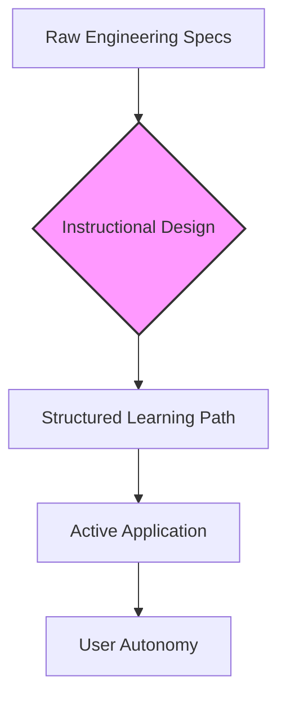

# Instructional design

> The systematic methodology of creating educational content and structured pathways to help users master complex technical systems

---

## What is instructional design?

Instructional design is the practice of engineering educational experiences to make learning more efficient. Rather than just listing features, it uses cognitive frameworks to map out how a user moves from their first interaction with a system to full autonomy.

In the world of technical documentation, this discipline acts as a bridge between engineering specs and actual user onboarding. It transforms static reference manuals into goal-oriented environments. By applying these principles, writers ensure content aligns with how developers and engineers actually learn on the job—usually through trial, error, and incremental success.

---

## The value of structured learning

Documentation often fails when it becomes a disorganized repository of facts. When users face a wall of unstructured data, they experience a high cognitive load, often leading to frustration or product abandonment. 

Strategic design mitigates this by "chunking" information. By delivering only the data necessary for a specific task—a core tenet of minimalist instruction—you improve scannability and speed. For high-stakes software environments, helping a developer find and execute a command in seconds isn't just about clarity; it’s about improving the overall developer experience (DX).

---

## Core principles

Effective documentation relies on several foundational elements that ensure content remains practical and accessible under **Web Content Accessibility Guidelines (WCAG)**.

*   **Action-oriented objectives:** Replace vague goals like "understand" with measurable verbs. Users should know exactly what they can *configure*, *initialize*, or *deploy* after reading.
*   **Sequential scaffolding:** Information should flow from foundational concepts to advanced workflows. This prevents burnout by ensuring the user has the necessary context before tackling complex tasks.
*   **Active application:** Embed hands-on tasks, such as code snippets or CLI commands, directly into the narrative. This creates a feedback loop where the user confirms their comprehension through immediate action.
*   **Visual consistency:** Standardized typography and code blocks improve readability and ensure the content meets **WCAG** standards for accessibility.

### Knowledge acquisition flow

The path from raw data to user mastery is summarized in the following workflow:



---

## Design pattern: From features to tasks

Compare these two approaches to an API reference page to see how instructional design changes the user's focus.

=== "Traditional layout"

    ```text
    [ Feature-Heavy API Page ]
    --------------------------------------------------
    Overview: This endpoint authenticates your user. It uses custom 
    tokens that you must pass in your headers. Ensure you set the 
    proper environment variables first before making a POST request.
    
    Arguments:
    - token_id (string, required)
    - session_ttl (integer, optional)
    - client_ip (string, optional)
    
    If you do not set session_ttl, it defaults to 3600. If you get a 
    401 error, it means your token is invalid. You must refresh your 
    token or verify your project settings.
    ```

=== "Instructional design layout"

    ````text
    [ Task-Based Layout ]
    --------------------------------------------------
    ### Authenticating a user session
    
    Establish an active user session via the `POST /auth` endpoint.
    
    #### Prerequisites
    - [ ] Obtain an API Key from the developer console.
    - [ ] Set your `API_KEY` environment variable.
    
    #### Step 1: Execute the POST request
    Initialize a 1-hour session by running this command:
    
    ```bash
    $ curl -X POST https://api.example.com/v1/auth \
      -H "Authorization: Bearer $API_KEY" \
      -d token_id="usr_98213" \
      -d session_ttl=3600
    ```
    
    !!! note "Session default"
        The session duration defaults to 3600 seconds (1 hour).
    ````

### Why this works
The instructional pattern swaps generic headers for behavioral outcomes. By using a "Prerequisites" checklist, you provide the necessary scaffolding to prevent errors. Finally, providing an executable script instead of a list of parameters reduces friction, allowing the user to succeed immediately.

---

## Driving user success

A structured educational format shifts more than just the layout; it changes user behavior:

*   **Confidence (Self-efficacy):** Successfully running code on the first try encourages further exploration and reduces early drop-off.
*   **Retention:** Active loops move knowledge from short-term memory to long-term mastery, meaning users spend less time looking up the same basic syntax.

---

## Implementation best practices

To integrate these principles into your **Documentation Development Life Cycle (DDLC)**, consider these strategies:

*   **Analyze the persona:** Tailor the technical depth to your specific audience to avoid over-explaining basics or skipping vital context.
*   **Progressive disclosure:** Use expandable sections to hide deep-dive technical details. This keeps the primary path clean while allowing experts to dig deeper.

??? example "Configuration details for proxy environments"
    If running behind a proxy, update these headers in your environment file:
    ```bash
    PROXY_FORWARD_HOST=true
    PROXY_IP_ALLOWLIST=192.168.1.1
    ```

*   **Direct communication:** Use the active voice. Addressing the user as "you" and starting steps with imperative verbs makes instructions easier to parse.
*   **SME validation:** Maintain a feedback loop with subject matter experts during the **DDLC** to ensure educational steps match the current technical reality.
*   **Learning-focused architecture:** Organize your Information Architecture (IA) to follow the user journey, starting with installation and moving toward complex references.

---

## Common pitfalls

*   **Information dumping:** Avoid "the firehose" effect—burying the user in architectural diagrams and raw parameters on an introductory page.
*   **The "Mystery Path":** Tutorials should never ask a user to execute a command without first explaining the goal or the required prerequisites.

---

## Validation and testing

Finally, test your documentation with actual users to ensure the knowledge transfer is working. Task-based usability testing—where a user is asked to complete a goal like "Deploy a test server"—will quickly reveal where the design fails. Regular readability audits can also help catch overly complex phrasing or jargon that might block comprehension.