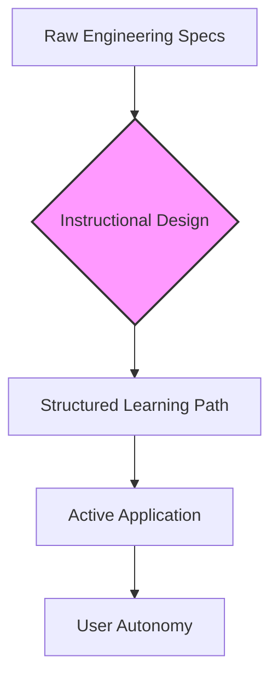

# Instructional design

> Creating educational materials and learning experiences to facilitate knowledge acquisition for complex technical users

---

## What is instructional design?

Instructional design is the systematic practice of planning, developing, and delivering educational materials to make learning efficient and engaging. Grounded in cognitive psychology, this discipline uses structured frameworks to analyze learner needs and establish clear educational pathways. It focuses on the cognitive shifts that occur when a person moves from initial exposure to a system to using it autonomously.

In technical documentation, instructional design connects engineering specifications with functional user onboarding. It moves content away from being a list of product features toward a structured learning environment. By combining information design with user experience (UX) principles, it transforms reference guides and manuals into goal-oriented pathways that match how developers and engineers learn on the job.

---

## Benefits of instructional design

Without systematic instructional design, a knowledge base often becomes a collection of unstructured facts. This leads to user frustration, high bounce rates, and increased pressure on support teams. When users encounter disorganized references, they experience a high cognitive load, which can lead to choice paralysis and product abandonment.

Integrating instructional design principles reduces cognitive load by structuring information into logical chunks. Techniques such as chunking and minimalist instruction ensure that readers receive only the information necessary to complete their immediate task. This strategy improves scannability, which is vital for software environments. By helping developers find specific commands quickly, instructional design enhances the developer experience (DX).

---

## Core principles and anatomy

To create effective documentation, build upon a foundation of structured learning elements. These principles ensure your content remains accessible, complies with the **Web Content Accessibility Guidelines (WCAG)**, and remains practical.

*   **Learning objectives:** Use actionable statements that define what the user can do after reading. Use measurable verbs such as *configure*, *initialize*, or *deploy* instead of passive concepts like *understand* or *know*.
*   **Sequential scaffolding:** Structure information logically from simple foundational concepts to advanced workflows. This prevents information overload by building on previously validated knowledge.
*   **Active application loops:** Insert immediate, hands-on tasks—such as code snippets or command executions—within the content. This encourages learning by doing and confirms comprehension.
*   **Visual consistency:** Use consistent typography, code blocks, and layout structures that adhere to **WCAG** to ensure readability.

### Knowledge acquisition flow

The following diagram illustrates the transition from raw data to autonomous usage through instructional design.



---

## Design pattern example

The following tabs show how to transform a feature-heavy API reference page into an instructionally designed learning experience.

=== "Traditional layout"

    ```text
    [ Feature-Heavy API Page ]
    --------------------------------------------------
    Overview: This endpoint authenticates your user. It uses custom 
    tokens that you must pass in your headers. Ensure you set the 
    proper environment variables first before making a POST request.
    
    Arguments:
    - token_id (string, required)
    - session_ttl (integer, optional)
    - client_ip (string, optional)
    
    If you do not set session_ttl, it defaults to 3600. If you get a 
    401 error, it means your token is invalid. You must refresh your 
    token or verify your project settings.
    ```

=== "Instructional design layout"

    ````text
    [ Task-Based Layout ]
    --------------------------------------------------
    ### Authenticating a user session
    
    This guide shows you how to establish an active user session 
    using the `POST /auth` endpoint.
    
    #### Prerequisites
    - [ ] Obtain a valid API Key from the developer console.
    - [ ] Configure your system environment variable: `API_KEY`.
    
    #### Step 1: Execute the POST request
    Run the following command in your terminal to initialize a 
    1-hour session:
    
    ```bash
    $ curl -X POST https://api.example.com/v1/auth \
      -H "Authorization: Bearer $API_KEY" \
      -d token_id="usr_98213" \
      -d session_ttl=3600
    ```
    
    !!! note "Session default"
        The session duration defaults to 3600 seconds (1 hour).
    ````

### Breakdown of the pattern

- **Task-based headings:** The instructional pattern replaces a generic "Overview" with a clear behavioral outcome: "Authenticating a user session." This tells readers exactly what they will accomplish.
- **Prerequisites checklist:** This section acts as sequential scaffolding. It ensures the user meets all requirements before attempting a task, which prevents errors.
- **Code block execution:** Rather than just listing arguments, the pattern provides an actionable script. This reduces friction and improves the developer experience.

---

## Cognitive impact and user experience

Adopting a structured educational format targets specific changes in user behavior and sentiment:

- **Increased self-efficacy:** When developers successfully execute code on their first attempt, their confidence in the tool grows. This reduces user drop-off during onboarding.
- **Improved information retention:** Active application loops help transfer knowledge from short-term to long-term memory, which reduces the need for users to repeatedly check basic syntax.

---

## Implementation best practices

Integrate these rules into your **Documentation Development Life Cycle (DDLC)**:

- **Define a user persona:** Start with an audience analysis. Identify the technical knowledge of your user persona so you do not write below or above their comprehension level.
- **Implement progressive disclosure:** Use expandable sections for deep-dive technical explanations. This keeps your main page scannable, revealing details only when the user requests them.

??? example "Click to expand configuration details"
    If you are running this service behind a proxy, configure the following headers in your environment file:
    ```bash
    PROXY_FORWARD_HOST=true
    PROXY_IP_ALLOWLIST=192.168.1.1
    ```

- **Use active voice:** Address the reader directly as "you" and start task steps with imperative, action-oriented verbs. Active voice makes instructions direct and easy to follow.
- **Collaborate with subject matter experts (SMEs):** Establish feedback loops with **SMEs** during the **DDLC** to ensure your instructional steps are technically accurate.
- **Design your information architecture (IA):** Ensure your navigation reflects a learning journey. Place installation guides, quick-starts, and conceptual references in a clear, linear flow.

---

## Common anti-patterns

Avoid these pitfalls when applying educational principles to technical content:

- **The firehose of information:** Avoid dumping all raw parameters and architectural diagrams on the introductory page. This overwhelms readers and increases cognitive load.
- **The mystery path:** Avoid writing tutorials that do not state the intended outcome or prerequisites. Users should not execute commands without understanding the goal.

---

## Validate and test usability

Validate instructional material with real readers to ensure it successfully transfers knowledge.

- **Run task-based usability testing:** Provide a test user with a specific goal, such as "Deploy a single test server." Observe where they hesitate or struggle with the layout.
- **Conduct readability audits:** Regularly analyze your content's readability scores. Use programmatic checkers to identify complex sentences, passive phrasing, or jargon that might hinder comprehension.