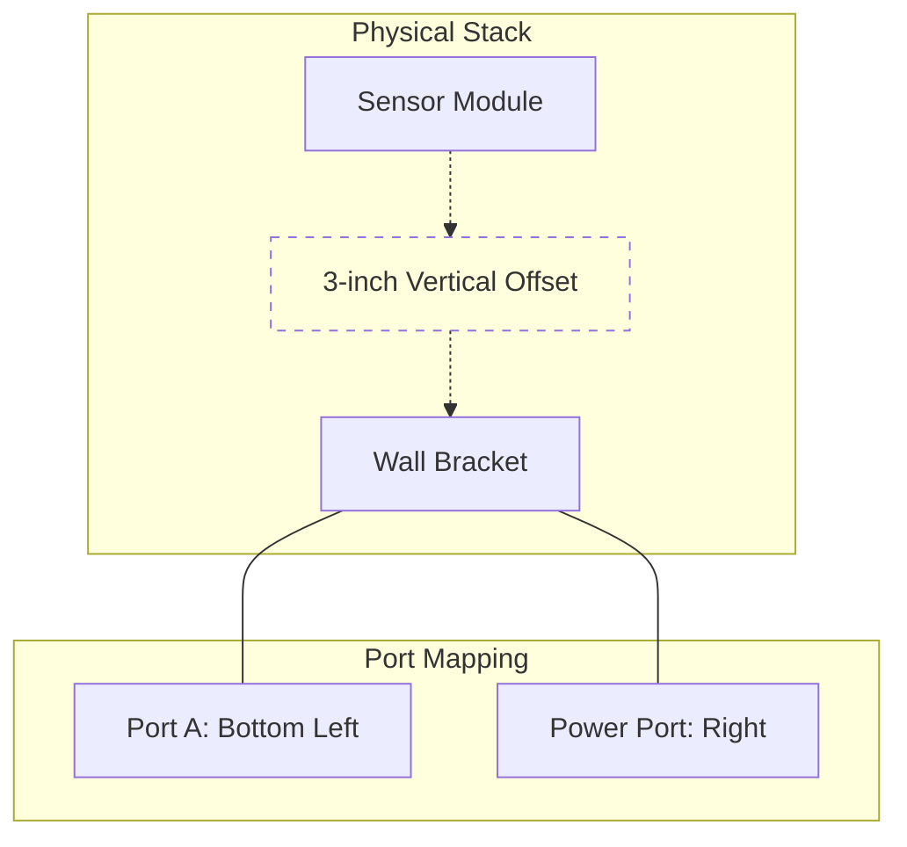

# Isometric schematic

> *A 3D technical drawing on a 2D plane that uses a 30-degree projection and 1:1:1 scaling to represent hardware and networks without perspective distortion*

---

## Defining isometric schematics

Isometric schematics use a 30-degree projection to render physical systems and multi-layered environments on a 2D canvas. Unlike perspective drawings that rely on vanishing points where parallel lines converge, isometric views keep parallel lines parallel. This constant scale, specifically an isometric drawing rather than a foreshortened projection, allows for measurements to be taken directly from any axis. This ensures that components remain undistorted regardless of their depth in the drawing.

---

## Beyond 2D layouts

Flat orthographic diagrams, such as top-down or front views, are often unable to convey the physical reality of hardware. When documentation ignores spatial relationships, readers must mentally reconstruct 3D objects from 2D lines. This process increases cognitive fatigue and leads to installation errors.

Isometric schematics connect digital instructions with physical hardware. By presenting three dimensions simultaneously, these diagrams help engineers locate sensors on a printed circuit board (PCB) or visualize server rack elevations quickly. They translate abstract technical data into a recognizable spatial context.

---

## Core anatomy

Effective isometric diagrams follow strict structural rules to maintain geometric integrity:

- 30-degree alignment: The two horizontal axes (X and Y) must be drawn at 30 degrees from the horizontal baseline. The vertical axis (Z) remains at 90 degrees.
- 1:1:1 axial scale: In technical isometric drawing, use the same scale for all three axes. Do not apply foreshortening (the approximately 82% reduction used in true isometric projection), as it interferes with the ability of the reader to measure or gauge relative size.
- Exploded views: For complex assemblies, pull components apart along the vertical (Z) or parallel (X/Y) axes. Use dashed trace lines to show the assembly path and preserve the installation order.
- Contextual anchoring: Align ports and connection points strictly to the isometric grid to ensure wiring paths and cable entries are clear.

---

## Pattern application

The following examples demonstrate how to replace narrative spatial descriptions with structured visual context.

### The problem: Narrative spatial descriptions
To install the edge hub, mount the bracket to the wall. Next, attach the sensor module directly above the bracket on the top rail, and then plug the Ethernet cable into Port A on the bottom left. Ensure the power cable plugs into the right-hand port. Note that the sensor module must sit exactly 3 inches higher than the main bracket.

### The solution: Applied spatial pattern

1. Mount the wall bracket.
2. Install the sensor module on the top rail, ensuring a 3-inch vertical offset from the bracket.
3. Connect cables to Port A (bottom left) and the power port (right).

Note: While Mermaid diagrams are topological and cannot render true 3D isometric geometry, they can represent the hierarchy of spatial components as follows:

By isolating dimensions (the 3-inch gap) and specific physical locations, such as left vs. right ports, you remove the ambiguity inherent in prose.

---

## Best practices and anti-patterns

### Implementation strategies

- Fixed vantage point: Stick to a single viewing angle, typically the near-bird's-eye view (top-front-right), throughout a document set to prevent user disorientation.
- Vector precision: Use vector formats, such as Scalable Vector Graphics (SVG), rather than raster images, such as Portable Network Graphics (PNG) or Joint Photographic Experts Group (JPG) files. This preserves line weights and ensures that labels remain legible when users zoom in on high-density port clusters.
- Layered detail: Avoid visual clutter by using detail callouts or exploded views for dense component clusters rather than crowding a single layer.

### Mistakes to avoid

- Perspective hybrids: Mixing isometric angles with perspective vanishing points creates optical illusions, such as distorted parallel lines, that make scale impossible to judge.
- Floating components: Every cable and module should anchor to the grid or be connected by trace lines. Floating elements make it unclear whether a component is in the foreground or background.

---

## Validation

To test the effectiveness of a schematic, perform a five-second comprehension test. Show the diagram to a technician. If they cannot identify the spatial relationship or port locations within five seconds, the layout is too complex. Additionally, observe a live installation to see where users hesitate. These points of friction often indicate where a schematic requires better anchoring or a clearer exploded view.