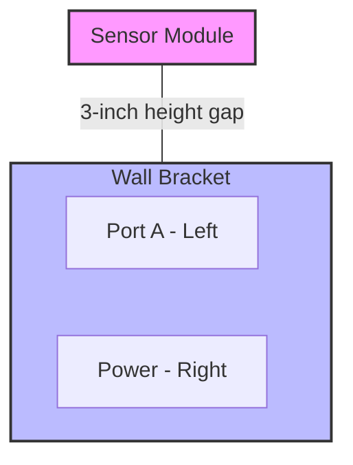

# Isometric Schematic

> A 3D technical drawing on a 2D plane that uses a 30-degree angle and equal scaling to represent hardware and networks without perspective distortion

---

## Defining isometric schematics

Isometric schematics use a 30-degree projection to render physical systems and multi-layered environments on a flat canvas. Unlike perspective drawings that rely on vanishing points, isometric views maintain equal scales for width, depth, and height. This constant scale allows for precise measurements across all axes, ensuring that components remain undistorted regardless of their position in the drawing.

---

## Beyond 2D Layouts

Flat diagrams often struggle to convey the physical reality of hardware. When documentation ignores spatial relationships, readers must mentally reconstruct 3D objects from 2D lines—a process that increases cognitive fatigue and leads to installation errors.

Isometric schematics bridge the gap between digital instructions and physical hardware. By presenting three dimensions simultaneously, these diagrams help engineers locate sensors on a PCB or visualize server rack elevations at a glance. They translate abstract technical data into a recognizable spatial context.

---

## Core Anatomy

Effective isometric diagrams follow strict structural rules to maintain clarity:

*   **30-degree alignment:** All horizontal lines must follow a 30-degree angle from the baseline, while vertical lines remain at 90 degrees.
*   **1:1:1 Axial scale:** Use the same scale for all axes. Avoid "foreshortening" distant objects, as this interferes with the reader's ability to gauge relative size.
*   **Exploded views:** For complex assemblies, pull components apart along a vertical or parallel axis. This reveals internal parts while preserving the assembly order.
*   **Contextual anchoring:** Align ports and connection points strictly to the isometric grid to ensure wiring paths are unambiguous.

---

## Pattern Application

The following examples demonstrate how to replace dense spatial descriptions with structured visual context.

### The Problem: Narrative spatial descriptions
"To install the edge hub, mount the bracket to the wall. Next, attach the sensor module directly above the bracket on the top rail, and then plug the Ethernet cable into Port A on the bottom left. Ensure the power cable plugs into the right-hand port. Note that the sensor module must sit exactly 3 inches higher than the main bracket."

### The Solution: Applied spatial pattern
1.  Mount the bracket to the wall.
2.  Attach the sensor module to the top rail, maintaining a **3-inch vertical gap** above the bracket.
3.  Connect cables to the ports as indicated in the schematic below.

By isolating dimensions (the 3-inch gap) and specific physical locations (Left vs. Right ports), you remove the ambiguity inherent in prose.

---

## Best Practices and Anti-patterns

### Implementation Strategies

*   **Fixed vantage point:** Stick to a single viewing angle—typically top-front-right—throughout a document set to prevent user disorientation.
*   **Vector precision:** Use vector formats (SVG) rather than raster images (PNG/JPG). This preserves line weights and text clarity when users zoom in on small components.
*   **Layered detail:** Avoid visual clutter by using detail callouts or exploded views for dense component clusters rather than crowding a single layer.

### Mistakes to Avoid

*   **Perspective hybrids:** Mixing isometric angles with perspective vanishing points creates optical illusions that make scale impossible to judge.
*   **Floating components:** Every cable and module should anchor to the grid. Floating elements make it unclear whether a component is connected or merely positioned nearby in the foreground.

---

## Validation

To test the effectiveness of a schematic, perform a **five-second comprehension test**. Show the diagram to a technician; if they cannot identify the spatial relationship or port locations within five seconds, the layout is too complex. Additionally, observe a live installation to see where users hesitate; these points of friction often indicate where a schematic requires better anchoring or a clearer exploded view.