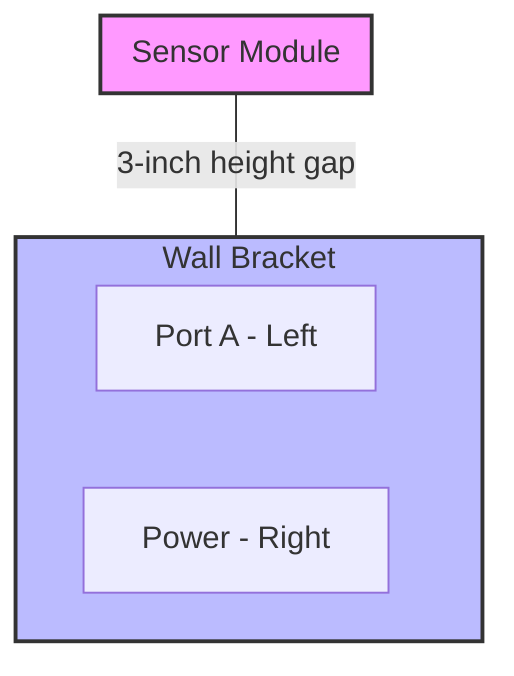

# Isometric Schematic

> A 3D technical drawing on a 2D plane that represents hardware systems and spatial relationships to reduce cognitive load

---

## What is an isometric schematic?

An isometric schematic is a visual projection used in technical communication to illustrate physical systems, spatial configurations, and multi-layered environments. Unlike perspective drawings that use vanishing points, an isometric schematic draws the width, depth, and height at equal scales. This projection uses a 30-degree angle relative to the horizontal baseline to represent three-dimensional (3D) objects on a flat, two-dimensional (2D) canvas. 

Using this style in documentation allows you to accurately measure and place components relative to each other without visual distortion because the scale remains constant across all axes. It helps readers understand complex physical systems—such as industrial machinery, server rack elevations, and [Internet of Things (IoT)](https://en.wikipedia.org/wiki/Internet_of_things){: target="_blank" rel="noopener" } ecosystems—without requiring an engineering degree.

---

## Why it matters

When you document physical hardware or multi-layered software architectures using only flat diagrams or long blocks of text, readers might find it difficult to understand. According to cognitive load theory, the human brain works harder to mentally reconstruct a 3D object from flat, 2D views. If your documentation ignores spatial relationships, your audience might experience confusion or frustration, which can lead to higher support costs.

Isometric schematics solve this challenge. By presenting height, width, and depth simultaneously, the schematic makes your content easier to scan and use. Whether a software engineer is locating a physical sensor on a hardware board or a product team is visualizing a server deployment, the schematic bridges the gap between digital instructions and physical reality.

---

## Core principles and anatomy

To create an effective isometric schematic, follow these structural rules to ensure your diagrams remain consistent and clear:

*   **30-degree alignment:** Draw all horizontal lines at 30-degree angles from the horizontal plane. Keep vertical lines at 90 degrees.
*   **Equal axial scale (1:1:1):** Draw height, width, and depth to the same scale. Do not apply perspective foreshortening to distant objects.
*   **Layered exploded views:** Pull apart complex hardware or overlapping components along a vertical or parallel axis. This exposes internal parts while maintaining the correct assembly order.
*   **Contextual anchoring:** Align physical ports, connection points, and directional flows precisely with the isometric grid so the reader can trace connections.

---

## Design pattern example

The following example shows how to transform spatial installation steps from a text block into a structured format with a visual context.

### Before: Poor pattern
To install the edge hub, mount the bracket to the wall. Next, attach the sensor module directly above the bracket on the top rail, and then plug the [Ethernet](https://en.wikipedia.org/wiki/Ethernet){: target="_blank" rel="noopener" } cable into Port A on the bottom left. Ensure the power cable plugs into the right-hand port. Note that the sensor module must sit exactly 3 inches higher than the main bracket.

### After: Applied pattern
1. Mount the bracket to the wall.
2. Attach the sensor module to the top rail, exactly 3 inches above the bracket.
3. Connect the cables using the ports shown in the following diagram.

### Breakdown of the pattern

*   **Spatial separation:** Breaking the steps into a numbered list reduces reading time and helps the installer follow steps in order.
*   **Relative positioning:** Highlighting physical dimensions (such as the 3-inch height gap) in both text and layout ensures the reader places components correctly.
*   **Port clarity:** Labeling specific physical locations (such as **Left** and **Right**) removes ambiguity during cabling.

---

## Cognitive impact and user experience

Integrating isometric schematics into your technical writing helps achieve these goals:

*   **Faster mental modeling:** Readers can quickly identify where a physical device is located, which speeds up installation.
*   **Reduced friction:** Replacing long spatial descriptions with a clear schematic lowers the effort required to process the information.

---

## Implementation best practices

Use these design and content strategies to ensure your schematics are accurate:

*   **Maintain a consistent vantage point:** Use the same viewing angle (usually top-front-right) across your documentation to prevent disorientation.
*   **Use vector graphics:** Create schematics using vector formats rather than raster formats (like .png or .jpg). This ensures lines remain sharp when users zoom in.
*   **Limit visual clutter:** Do not show every internal wire or screw on one layer. Use an exploded view or separate detail callouts for dense components.
*   **Collaborate with experts:** Work with a subject matter expert to verify that your scale, connections, and port labels are accurate.

---

## Common anti-patterns

Avoid these visual errors when designing schematics:

*   **The perspective hybrid:** Do not mix isometric projection with perspective lines (where parallel lines meet in the distance). This creates an optical illusion that confuses the reader about scale.
*   **The floating component:** Avoid placing cables or modules without anchoring them to the isometric grid. This makes it difficult for the reader to tell if a cable is plugged in or floating.

---

## How to validate and test usability

To ensure your isometric schematics work for your readers, use these strategies:

*   **Five-second comprehension test:** Show the schematic to a participant for five seconds. Ask them to describe the physical relationship between the components. If they cannot identify the spatial order, simplify the layout.
*   **Physical usability study:** Observe a user trying to install hardware using your schematic. Note where they hesitate or make errors, and update the layout to address those points of friction.