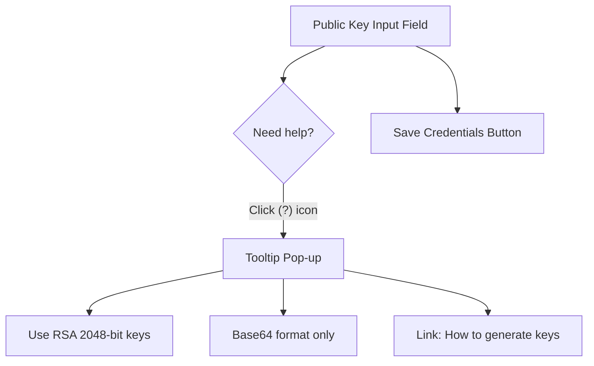

# Just-in-time (JIT) learning

> A content delivery strategy providing users with specific, actionable information at the exact moment of need during a workflow to ensure seamless task completion

---

## What is JIT learning?

In modern product development, JIT learning is a move away from "just-in-case" training models. Instead of asking you to read a manual before using an application, JIT learning provides small, precise help content directly in the user interface. This methodology is a key part of user-centered design. It makes sure that help doesn't interrupt your work but integrates into it to help you finish tasks.

This strategy focuses on minimalist instruction. You provide information only when a user asks for it or when data shows they need it. It uses context-sensitive help to provide localized explanations, so users don't have to leave the app to search a help portal. This approach prevents cognitive overload and keeps users focused on their goals.

---

## Why it matters

When documentation ignores JIT principles, the user experience suffers. Large blocks of text during setup can cause fatigue. Users who have to search external databases for simple instructions often get frustrated. This can lead to more support tickets or users giving up on the product.

When you use JIT learning, you reduce the effort required from your users. Designing for scannability helps users find information quickly without losing their place. By fixing friction points when they happen, you improve product usability. This strategy turns documentation into an active tool for user success.

---

## Core principles and anatomy

A successful JIT learning pattern uses these rules:

*   **Contextual relevance:** Match the documentation to the user's current state. The help content should change based on the screen, input field, or error.
*   **Minimalist scope:** Focus on the immediate task. Don't explain secondary features or background details that don't help with the current step.
*   **Progressive disclosure:** Show complex technical details in stages. Use a layered structure so users can read a summary first and expand the content only if they need more detail.
*   **Embedded documentation:** Build help material directly into the interface. Use inline components to prevent layout shifts or interruptions.

---

## Design pattern example

This example shows how to change a block of instructions into a context-sensitive learning pattern.



You can use this collapsible detail block in your Markdown files to let users expand technical instructions:

??? note "How to generate your public key"
    To generate an RSA key pair on your local machine, run this command in your terminal:
    
    ```bash
    ssh-keygen -t rsa -b 2048 -f my_key
    ```
    
    This command creates two files: `my_key` (private) and `my_key.pub` (public). Open `my_key.pub` and copy the text. Do not include the `ssh-rsa` prefix or the email comment at the end if the field requires only the base64 string.

### Breakdown of the pattern

- **Contextual help icon (`(?)`):** This UI element lets users open tooltips only when they are unsure of the requirements.
- **Embedded explanatory text:** The pop-up microcopy states the format requirements next to the input field.
- **Collapsible detail block:** Advanced command-line details are hidden in an expandable container. This keeps the interface clean for experienced developers while supporting learners.
- **Actionable labels:** Clear verbs on buttons guide the user to the next step.

---

## Impact on the user experience

JIT learning helps you reach these goals:

*   **Fewer interruptions:** Users don't need to switch tabs or look at PDFs, which keeps them focused on the task.
*   **Better feature adoption:** By explaining complex options as users find them, you encourage them to try advanced settings.
*   **Faster error recovery:** When an error occurs, inline documentation helps users fix mistakes immediately.

---

## Implementation best practices

To build an effective JIT learning strategy, follow these rules:

- **Analyze your audience:** Find where users are likely to have trouble. Map technical expertise levels to make sure your microcopy works for both beginners and experts.
- **Provide clear entry points:** Use visual markers, such as inline help icons or descriptive link text, so users know where to find help.
- **Keep text brief:** Use strong imperatives and direct verbs to tell the user what to do.
- **Use empty states:** When a dashboard is empty, don't leave it blank. Provide a starter template or an initial action step.

---

## Common anti-patterns

Avoid these mistakes when designing JIT help:

- **Overloaded tooltips:** Don't put an entire guide into a small hover box. It's hard to read and makes it difficult to copy code.
- **Intrusive notifications:** Don't overuse modal pop-ups or toast notifications. These block the workspace and disrupt the user.
- **Generic links:** Don't link to a home page. Link to the specific section that helps with the current task.

---

## How to test usability

Use these methods to confirm your JIT strategy works:

- **Task-based testing:** Watch participants as they try to use a complex feature. Note where they hesitate and if they use the help elements.
- **Readability tests:** Run tests on your microcopy to make sure it is easy to read.
- **Review analytics:** Track how often users click help triggers. If a specific icon is clicked often, the UI might be confusing and need better inline text.