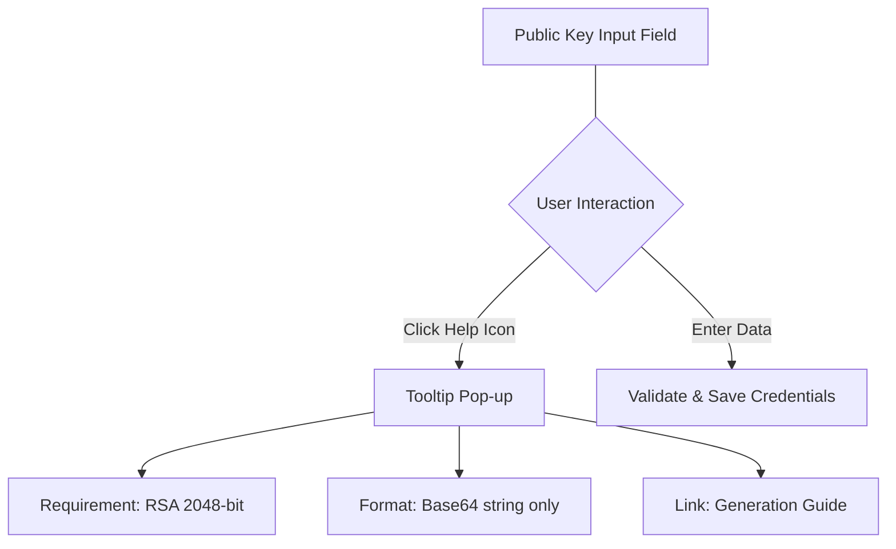

# Just-in-time (JIT) learning

> A design strategy that delivers specific, actionable, and context-sensitive information at the exact moment a user requires it to complete a task

---

## Beyond the manual: The JIT approach

Modern product design is moving away from "just-in-case" training—the traditional model of front-loading documentation before a user even opens the app. JIT learning replaces dense manuals with precise, localized help content embedded directly within the interface. By integrating guidance into the workflow, you ensure that help facilitates progress rather than interrupting it.

This minimalist methodology hinges on context. Rather than forcing a user to navigate an external help portal, JIT principles provide the right answer exactly where the question arises. This reduces the cognitive load associated with context switching, keeping the user’s focus on their immediate objective.

---

## Why context beats volume

Documentation that ignores JIT principles often results in "setup fatigue," where users are confronted with walls of text during high-friction moments like onboarding. When a user is forced to search external databases for field requirements (such as specific encryption standards or character limits), frustration builds, leading to abandoned workflows and increased support volume.

Implementing JIT learning minimizes this interaction cost. By designing for scannability and surfacing information only when triggered by user action or data-driven friction points, documentation transforms from a static reference into an active tool for user success.

---

## Core anatomy of JIT patterns

Effective JIT implementations rely on four fundamental pillars:

*   **Contextual relevance:** Content must adapt to the user’s current state—be it a specific input field, a complex dashboard view, or an error state.
*   **Minimalist scope:** Documentation should solve the immediate problem. Avoid explaining secondary features or historical background that isn't relevant to the current step.
*   **Progressive disclosure:** Complex technical details should follow a layered architecture. Present a high-level summary first, allowing users to expand deeper technical instructions only if needed.
*   **Embedded delivery:** Help should feel like a native part of the UI. Use inline components to prevent layout shifts or jarring transitions to new tabs.

---

## Design pattern example

The following pattern demonstrates how to transform a block of instructions into a responsive, context-sensitive experience.



Use collapsible detail blocks to tuck away advanced technical steps until they are requested:

??? note "How to generate your public key"
    To generate an RSA key pair on your local machine, execute the following command:
    
    ```bash
    ssh-keygen -t rsa -b 2048 -f my_key
    ```
    
    This generates `my_key` (private) and `my_key.pub` (public). To use the key in this field:
    1. Open `my_key.pub` in a text editor.
    2. The file contains three parts separated by spaces: `[algorithm] [key_string] [comment]`.
    3. Copy **only** the middle `[key_string]`. Do not include the prefix (e.g., `ssh-rsa`) or the trailing comment (e.g., `user@host`).

---

### Pattern breakdown

- **Contextual triggers:** Visual markers (like info icons) allow users to self-select help only when they encounter uncertainty.
- **Microcopy:** The pop-up provides immediate format requirements (e.g., "Base64 only") without leaving the field's focus.
- **Layered complexity:** Advanced CLI commands are hidden within an expandable container, keeping the primary interface clean for experienced users.
- **Actionable guidance:** Clear, verb-driven labels guide the user toward the next successful interaction.

---

## Measuring the impact

Shifting to a JIT model directly influences three key product metrics:

1.  **Retention of flow:** Users stay within the application, eliminating the "tab-switching" friction that leads to task abandonment.
2.  **Feature adoption:** Explaining advanced options at the moment of discovery encourages users to utilize sophisticated settings they might otherwise ignore.
3.  **Self-service recovery:** Inline documentation allows users to resolve validation errors immediately, reducing the need for manual support tickets.

---

## Strategic implementation

To build a robust JIT strategy, prioritize the following:

- **Map the friction:** Use heatmaps or session recordings to identify where users hesitate. Target these specific areas for microcopy improvements.
- **Entry point visibility:** Use consistent visual language (like info icons or tooltips) so users recognize where help is available.
- **Imperative language:** Keep text brief and action-oriented. Use strong verbs to direct the user toward a solution.
- **Actionable empty states:** Treat blank dashboards as learning opportunities. Replace "No data found" with starter templates or "Create your first..." calls to action.

---

## Anti-patterns to avoid

*   **Overcrowded tooltips:** Avoid cramming entire tutorials into a hover box. If the content requires scrolling or contains large code snippets, a side panel, drawer, or modal is more appropriate.
*   **Intrusive interrupts:** Do not rely on "auto-opening" modals. These disrupt the user's workspace and are often dismissed before being read.
*   **Dead-end links:** Never link to a general documentation homepage. Every "Learn More" link must point to a specific anchor or page relevant to the user's current task.

---

## Validating effectiveness

Confirm your JIT strategy through targeted testing:

*   **Observational testing:** Watch users interact with complex features. Note if they find and utilize the help elements when they encounter a hurdle.
*   **Analytics review:** Monitor click-through rates (CTR) on help triggers. High engagement with a specific icon may suggest that the underlying UI is non-intuitive and requires a redesign rather than just more help text.
*   **Readability auditing:** Ensure microcopy is accessible (WCAG compliant) and free of jargon that could alienate new users.