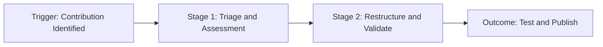

# Knowledge harvesting

> A workflow designed to identify high-traffic community contributions and systematically convert them into official, stylized documentation

---

## What is knowledge harvesting?

Knowledge harvesting is a process to capture decentralized community knowledge and turn it into official resources. In the software development life cycle (SDLC), this process occurs during the maintenance and feedback phase after a product release. While standard development focuses on shipping features, knowledge harvesting ensures that user-generated workarounds, forum solutions, and GitHub issues aren't lost. This process transforms fragmented information into structured assets within your **knowledge base** or **developer portal**.

This cross-functional workflow relies on collaboration between **developer relations (DevRel)**, **technical writing**, and **engineering** teams. Community managers use analytics to find high-impact discussions, code snippets, or tutorials. Technical writers then work with an engineering **subject matter expert (SME)** to verify the technical accuracy of the solution. This collaboration ensures that content meets editorial standards before it enters the documentation pipeline, which improves the overall **developer experience (DX)**.

---

## Why it matters

Relying only on top-down documentation planning creates organizational blind spots. Users often interact with software in ways product teams don't anticipate, often documenting custom integrations and edge-case fixes in public forums. Without a formalized knowledge harvesting pipeline, organizations accumulate **content debt**. Valuable, peer-tested solutions remain scattered across communication channels and eventually become outdated as APIs evolve. This results in a fragmented **user experience (UX)** where users must search through unverified comments to solve deployment blockers.

A formalized workflow replaces ad-hoc documentation requests with a predictable ingestion funnel. Converting validated community solutions into official documentation accelerates **support deflection** and reduces the burden on customer support teams. This process also rewards community contributors by elevating their work to official status, which fosters collaboration while keeping documentation current and secure.

---

## When to adopt this workflow

Implement a knowledge harvesting strategy when user-generated documentation outpaces your internal writing capacity. Look for these indicators to determine when to adopt this workflow:

- **High volume of decentralized support answers:** Community members or support engineers repeatedly answer the same complex questions in unstructured channels instead of referencing a source of truth.
- **Increase in unverified user workarounds:** Users publish external blog posts or scripts to bypass software limitations, which indicates a documentation gap.
- **Growing developer community:** An active base of external developers submits feedback, suggests features, or details integration patterns that lack formal documentation.

!!! tip "Recognizing friction points"
    Monitor your community platform search analytics. If you notice frequent queries with zero official results but high engagement on forum threads, you have found **friction points** for knowledge harvesting.

---

## How the workflow works

The knowledge harvesting pipeline transitions informal user solutions into authoritative guides. The following diagram shows how community knowledge moves through the cycle:



1.  **Triage and Assessment:** The workflow begins when community managers or automated tools flag a high-traffic post. The coordinator evaluates the content against quality standards and verifies if the workaround represents a common **use case**. If the content passes, the team logs it as a prioritized content gap ticket.
2.  **Restructure and Validation:** A technical writer refactors the community-sourced text to align with the **style guide**. This stage involves rewriting casual, forum-style chat into clear, task-based instructions. The writer then routes the draft to an engineering **SME** who validates the solution's safety and security in a sandbox environment.
3.  **Test and Publish:** After validation, the writer commits the content as a **pull request (PR)** to the documentation repository. The file undergoes automated **prose linting** and build checks. When the pull request merges, the continuous delivery pipeline deploys the updated guide to the user-facing site.

---

## RACI and team roles

To ensure the pipeline operates without bottlenecks, define ownership using the RACI framework:

-   **Responsible:** **Technical writers** and **DevRel managers** find high-traffic community content, refactor text into Markdown, and manage the review process.
-   **Accountable:** The **documentation lead** or **product manager** is accountable for the health of the knowledge base, prioritizes topics, and establishes quality benchmarks.
-   **Consulted:** **Engineering SMEs** verify the technical accuracy of workarounds to ensure they don't introduce security vulnerabilities.
-   **Informed:** **Customer support leads** and the **product marketing team** receive updates about newly published articles so they can route users to the official resources.

---

## Pipeline integration and tooling

An effective pipeline automates the transition from community forums to official documentation. Modern teams integrate harvesting indicators into their **version control system (VCS)** and feedback channels.

For example, you can configure your community platform to trigger a webhook when a post receives a specific reaction or is marked as an "Accepted Solution." This webhook creates an issue in a project management tool, pre-populating the issue with **metadata** like the original URL and view count.

After the technical writer restructures the Markdown file, the content moves through a **continuous integration and continuous deployment (CI/CD)** pipeline. Automated scripts run grammar and link checkers before the **static site generator (SSG)** deploys the page.

???+ info "Automating community attribution"
    You can use an automation script to parse YAML **frontmatter** to credit the original contributor. This rewards power users with a contribution badge.
    ```yaml hl_lines="4"
    ---
    title: Troubleshooting Webhook Retries
    description: Resolve common retry failures in active webhook pipelines.
    community_contributor: @dev_pioneer_99
    ---
    ```

---

## Troubleshooting common failures

Even with automation, human and technical bottlenecks can stall the pipeline.

-   **Outdated community workarounds:** A post from a previous release is harvested, but the API has changed. *Solution:* Establish an automated shelf-life check. Reject any thread that hasn't been active or validated within the last 180 days.
-   **SME validation bottleneck:** Drafts pile up because engineers prioritize code over doc reviews. *Solution:* Integrate review tasks into development sprint cycles. Set up automated **Slack** reminders for pull requests that remain unapproved for more than ++three++ days.
-   **Tone of voice mismatch:** The harvested document remains too informal. *Solution:* Use strict prose validation templates. Writers must rewrite conversational filler and ensure prose uses the active voice.

---

## Key metrics and success criteria

Track these metrics to demonstrate the business value of the knowledge harvesting pipeline:

-   **Ticket deflection rate:** Measure the decrease in support tickets for a topic after the harvested solution is published.
-   **Dwell time:** Monitor if users spend more time reading the official page than they spent searching forum threads.
-   **Time-to-publish:** Track the days required to move from identifying a post to merging the polished guide.