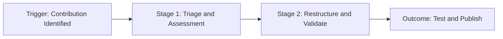

# Knowledge harvesting

> A systematic process for identifying, validating, and converting decentralized community contributions into official, verified documentation

---

## What is knowledge harvesting?

Knowledge harvesting bridges the gap between internal product knowledge and organic, decentralized insights found in forums or GitHub issues. While standard development cycles focus on shipping new features, harvesting captures the user-generated workarounds and solutions that emerge during the post-release feedback phase. By formalizing this process, organizations can transform fragmented information into structured assets within a **knowledge base** or **developer portal**.

This cross-functional effort requires alignment between **developer relations (DevRel)**, **technical writing**, and **engineering**. Community managers use analytics to pinpoint high-impact discussions or code snippets, while technical writers collaborate with an engineering **subject matter expert (SME)** to verify technical accuracy. This ensures all content meets editorial and security standards before it reaches the official documentation pipeline, directly improving the **developer experience (DX)**.

---

## Why it matters

Relying exclusively on top-down documentation planning creates organizational blind spots. Users frequently find custom integrations or edge-case fixes that product teams didn't anticipate. Without a formal harvesting pipeline, these peer-tested solutions remain scattered across Discord or Slack, eventually becoming "content debt" as APIs evolve. This results in a fragmented **user experience (UX)** where developers must hunt through unverified comments to solve critical deployment blockers.

An established workflow replaces ad-hoc doc requests with a predictable ingestion funnel. Converting validated community solutions into official guides accelerates **support deflection** and lightens the load on customer support teams. Furthermore, it rewards community contributors by elevating their work to official status, fostering a collaborative ecosystem while keeping the documentation current.

---

## When to adopt this workflow

Implement a knowledge harvesting strategy when community-led documentation consistently outpaces your internal writing capacity. Common triggers include:

- **Redundant support queries:** Community members or support engineers repeatedly provide the same complex answers in unstructured channels.
- **Unverified workarounds:** Users publish external blog posts or scripts to bypass software limitations, signaling a clear documentation gap.
- **Active developer growth:** An expanding base of external developers is submitting significant feedback and integration patterns that lack formal representation.

!!! tip "Recognizing friction points"
    Monitor your community platform search analytics. Frequent queries with zero official results—but high engagement on forum threads—are prime **friction points** for knowledge harvesting.

---

## How the workflow works

The knowledge harvesting pipeline moves informal user solutions through a cycle of verification and polishing to create authoritative guides.



1.  **Triage and Assessment:** Community managers or automated tools flag a high-traffic post. A coordinator evaluates the content against quality standards and confirms if the workaround addresses a common **use case**. If approved, the team logs the gap as a prioritized ticket.
2.  **Restructure and Validation:** Technical writers refactor casual, forum-style chat into clear, task-based instructions that align with the **style guide**. An engineering **SME** then validates the solution's safety and security within a sandbox environment.
3.  **Test and Publish:** The writer commits the finalized content as a **pull request (PR)**. Following automated **prose linting** and build checks, the continuous delivery pipeline deploys the updated guide to the production site.

---

## RACI and team roles

Define ownership early to prevent pipeline bottlenecks:

-   **Responsible:** **Technical writers** and **DevRel managers** identify content, refactor it into Markdown, and shepherd it through the review process.
-   **Accountable:** The **documentation lead** or **product manager** maintains the health of the knowledge base, sets quality benchmarks, and prioritizes topics.
-   **Consulted:** **Engineering SMEs** verify technical details to ensure workarounds do not introduce security vulnerabilities.
-   **Informed:** **Customer support** and **product marketing** receive alerts regarding new articles to help route users to the correct resources.

---

## Pipeline integration and tooling

Modern teams automate the transition from community threads to the **version control system (VCS)**. For instance, a community platform can trigger a webhook when a post is marked as an "Accepted Solution." This webhook creates an issue in a project management tool, pre-populating it with **metadata** like the original URL and engagement metrics.

Once the content is in Markdown format, it enters a **continuous integration and continuous deployment (CI/CD)** pipeline. Automated scripts handle grammar and link checks before the **static site generator (SSG)** deploys the page.

???+ info "Automating community attribution"
    Use automation scripts to parse YAML **frontmatter** and credit the original contributor. This rewards power users with visible recognition.
    ```yaml hl_lines="4"
    ---
    title: Troubleshooting Webhook Retries
    description: Resolve common retry failures in active webhook pipelines.
    community_contributor: @dev_pioneer_99
    ---
    ```

---

## Troubleshooting common failures

-   **Stale workarounds:** Harvesting a post from a legacy release where the API has since changed. *Solution:* Set an automated 180-day shelf-life check; reject any thread that hasn't been validated within that window.
-   **The SME bottleneck:** Engineers prioritizing code over documentation reviews. *Solution:* Integrate review tasks into development sprint cycles and use **Slack** reminders for pull requests unapproved after three days.
-   **Inconsistent tone:** Harvested guides remaining too conversational. *Solution:* Use strict prose validation templates to force the active voice and remove filler words.

---

## Key metrics for success

-   **Ticket deflection rate:** The decrease in support tickets for a specific topic after the harvested solution goes live.
-   **Dwell time:** A comparison of time spent on official pages versus the time users previously spent searching forum threads.
-   **Time-to-publish:** The duration between identifying a high-value post and merging the polished guide.