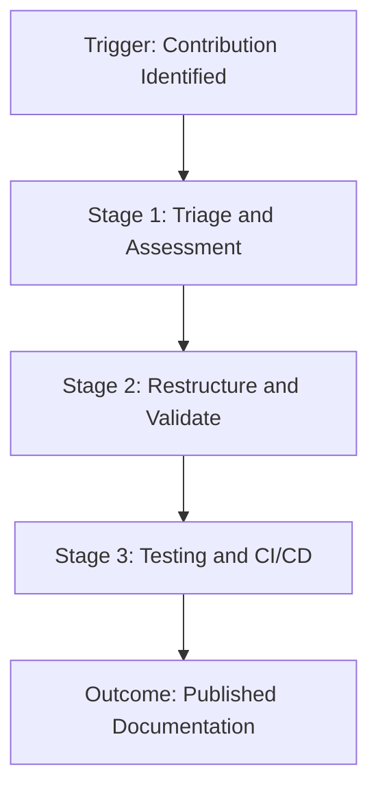

# Knowledge harvesting

> *A systematic process for identifying, validating, and converting decentralized community contributions into official, verified documentation*

---

## What is knowledge harvesting?

Knowledge harvesting bridges the gap between internal product knowledge and organic, decentralized insights found in forums, GitHub issues, or Stack Overflow. While standard development cycles focus on shipping new features, harvesting captures user-generated workarounds and solutions that emerge during the post-release feedback phase. By formalizing this process, organizations can transform fragmented information into structured assets within a knowledge base or developer portal.

This cross-functional effort requires alignment between developer relations (DevRel), technical writing, and engineering. Community managers use analytics to pinpoint high-impact discussions or code snippets, while technical writers collaborate with engineering subject matter experts (SMEs) to verify technical accuracy and security. This ensures all content meets editorial and security standards before it enters the official documentation pipeline. This process directly improves the developer experience (DX).

---

## Why it matters

Relying exclusively on top-down documentation planning creates organizational blind spots. Users frequently discover custom integrations or edge-case fixes that product teams did not anticipate. Without a formal harvesting pipeline, these peer-tested solutions remain scattered across Discord, Slack, or Discourse, and they eventually become content debt as APIs evolve. This results in a fragmented user experience (UX) where developers must navigate unverified, potentially deprecated comments to solve critical deployment blockers.

An established workflow replaces ad-hoc documentation requests with a predictable ingestion funnel. Converting validated community solutions into official guides accelerates support deflection and lightens the load on customer support teams. Furthermore, it rewards community contributors by elevating their work to official status, fostering a collaborative ecosystem while maintaining a single source of truth.

---

## When to adopt this workflow

Implement a knowledge harvesting strategy when community-led documentation consistently outpaces internal writing capacity. Common triggers include:

- Redundant support queries: Community members or support engineers provide identical complex answers across unstructured channels.
- Unverified workarounds: Users publish external repositories, Gists, or scripts to bypass software limitations, signaling a documented feature gap.
- Active developer growth: An expanding base of external developers submits significant feedback and integration patterns that lack formal representation in the documentation.

!!! tip "Recognizing friction points"
    Monitor your community platform search analytics. Frequent queries with high click-through rates on forum threads, but zero official documentation results, are prime friction points for knowledge harvesting.

---

## How the workflow works

The knowledge harvesting pipeline moves informal user solutions through a cycle of validation, security auditing, and technical writing to create authoritative guides.



1.  **Triage and Assessment:** Community managers flag a high-traffic post. A coordinator evaluates the content against quality standards and confirms if the workaround addresses a valid use case. If approved, the team logs the gap as a prioritized ticket in the documentation backlog.
2.  **Restructure and Validation:** Technical writers refactor casual, forum-style chat into clear, task-based instructions following the style guide. An engineering SME validates the solution's safety, performance impact, and security within a sandbox environment.
3.  **Testing and CI/CD:** The writer commits the content as a pull request (PR). The continuous integration (CI) pipeline runs automated prose linting, link integrity checks, and security scanning for code snippets. Once merged, the continuous delivery pipeline deploys the updated guide to the production site.

---

## RACI and team roles

Define ownership early to prevent pipeline bottlenecks:

- Responsible: Technical writers and DevRel managers identify content, refactor it into Markdown, and shepherd it through the review process.
- Accountable: The documentation lead or product manager maintains the health of the knowledge base, sets quality benchmarks, and prioritizes topics.
- Consulted: Engineering SMEs verify technical details and ensure workarounds do not introduce security vulnerabilities or breaking changes.
- Informed: Customer support and product marketing receive alerts regarding new articles to route users to verified resources.

---

## Pipeline integration and tooling

Modern teams automate the transition from community threads to the version control system (VCS). For instance, a community platform can trigger a webhook when a post is marked as an Accepted Solution. This webhook creates an issue in a project management tool, such as Jira or GitHub Issues, and pre-populates it with metadata such as the original URL, author, and engagement metrics.

Once the content is in Markdown format, it enters a continuous integration and continuous deployment (CI/CD) pipeline. Automated scripts handle grammar, style (such as Vale), and link checks before the static site generator (SSG), such as Hugo or Docusaurus, deploys the page.

???+ info "Automating community attribution"
    Use automation scripts to parse YAML frontmatter and credit the original contributor. This rewards power users with visible recognition in the UI.
    ```yaml hl_lines="4"
    ---
    title: Troubleshooting Webhook Retries
    description: Resolve common retry failures in active webhook pipelines.
    community_contributor: @dev_pioneer_99
    ---
    ```

---

## Troubleshooting common failures

- Stale workarounds: Harvesting a post from a legacy release where the API has since changed. *Solution:* Implement a `last_verified` field in the frontmatter and set an automated 180-day stale-content trigger for re-validation.
- Security vulnerabilities: Community snippets may contain insecure patterns, such as hardcoded credentials or SQL injection risks. *Solution:* Mandatory Static Application Security Testing (SAST) for all harvested code blocks during the CI phase.
- The SME bottleneck: Engineers prioritizing code over documentation reviews. *Solution:* Incorporate documentation reviews into the definition of done or development sprints, and use automated reminders for stale PRs.

---

## Key metrics for success

- Ticket deflection rate: The reduction in support tickets for a specific topic after the harvested solution is published.
- Task completion rate: The percentage of users who successfully follow the harvested guide to resolve an issue without seeking further help.
- Time-to-publish: The duration between identifying a high-value community contribution and merging the verified guide into the production branch.