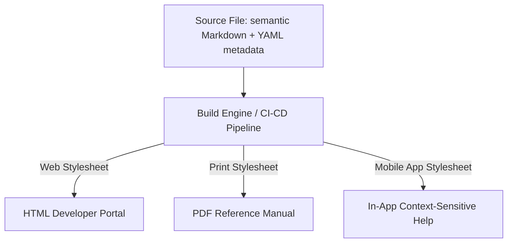

# Media independence architecture (MIA)

> An information design pattern that separates raw content from presentation, enabling platform-agnostic rendering across print, web, and mobile

---

## What is media independence architecture?

Media independence architecture (MIA) is an information design pattern that separates content substance and structure from specific output media. Based on the principle of separation of concerns, MIA treats text and media assets as ==data== that is independent of how a web browser, a mobile app, or a printed manual displays them. Instead of hardcoding layout styles into source files, you define content using neutral, semantic formats. This architecture allows a single source of information to flow into different delivery targets without manual redesign.

From a human-computer interaction (HCI) perspective, MIA recognizes that readers consume information differently depending on their environment and device. A desktop user might expect a multi-pane layout with search functionality, whereas a mobile user requires responsive, single-column reflow. A print reader requires static, paginated formatting. By implementing MIA, content teams ensure the underlying information architecture remains consistent while specialized processors transform the source data into the optimal layout for each channel.

!!! note "The Goal of Media Independence"
    MIA does not mean your content must look identical on every platform. It means your raw content remains untouched while your presentation layer adapts to each screen or format.

---

## Why it matters

Without MIA, you must format source files for a specific target, which limits publishing flexibility. For example, if you write documentation optimized only for a desktop browser, exporting that file to a PDF or EPUB often results in broken tables, missing visual hierarchy, and illegible fonts. This layout degradation increases cognitive load and can lead to users abandoning the content.

Decoupling form from function also improves discoverability and maintenance. When you store content as platform-agnostic data, search engines and internal tools can index the semantic markup accurately, which improves search engine optimization (SEO). When you need to update a layout or branding, you modify a central stylesheet or template once rather than updating inline styling across thousands of pages.

---

## Core principles and anatomy

To build a media independence architecture, follow these principles:

*   **Semantic tagging:** Use markup tags to describe what the content is (such as headings, code blocks, and steps) rather than how it looks (such as bold, italic, or specific hex colors).
*   **Media-neutral storage formats:** Author source files in flexible formats like Markdown, XML, or YAML.
*   **Metadata-driven organization:** Add machine-readable metadata (such as audience, product version, and classification tags) to source content to allow for dynamic filtering and assembly.
*   **Separated rendering pipelines:** Use independent stylesheets, scripts, or static site generator (SSG) configurations to apply the final layout during the build stage.

---

## Design pattern example

The following diagram shows how raw, media-independent content flows through separate processing channels to create optimized outputs:



Here is a comparison of a media-bound pattern versus a media-independent pattern:

```text
[ Before / Media-Bound Pattern ]
--------------------------------------------------
<div style="font-size:14px; color:#333; float:left; width:300px;">
To restart the device, press the hard reset button. Refer to the image on the right.
</div>


[ After / MIA-Compliant Pattern ]
--------------------------------------------------
# Restart the device

To restart the device, press the hard reset button.


```

To see how this pattern is applied during a build, look at these output target configurations:

=== "Web Build Target"
    ```yaml
    # Output configuration for web
    output_format: HTML
    stylesheet: main-web.css
    responsive: true
    minify: true
    ```

=== "Print Build Target"
    ```yaml
    # Output configuration for PDF
    output_format: PDF
    stylesheet: print-book.css
    page_breaks: auto
    dpi: 300
    ```

### Breakdown of the pattern

- **Semantic Markdown:** The compliant content uses lightweight markup elements (such as paragraphs and images) without defining widths, margins, or float behaviors in the source.
- **Decoupled assets:** Instead of hardcoding device-specific files like `desktop-diagram.png`, use a single generic image file (`diagram.png`) and let your build target dictate its size and alignment.
- **Target-specific styling:** By configuring separate stylesheets and variables for each target, you ensure the content displays correctly on a screen, mobile device, or print without modifying the raw source text.

---

## Cognitive impact and user experience

Structuring content with media independence directly affects the user experience:

- **Optimized scannability:** Readers consume content faster because the delivery pipeline automatically formats semantic elements into native layouts.
- **Improved navigation:** By separating layout from source data, your information architecture remains flexible. Users can navigate without struggling with awkward mobile viewports or poorly structured printable pages.

---

## Implementation best practices

Use these rules when designing your content and storage strategy:

- **Avoid inline styling:** Do not use custom inline styles, absolute image dimensions, or media-specific HTML tags in your source files. Let your template handle positioning and styles.
- **Write descriptive links:** Use descriptive links instead of platform-specific directives like "click the link in the left sidebar" or "see page 42." These instructions lose meaning when content is converted to mobile viewports or printed sheets.
- **Use the concept-task-reference (CTR) model:** Organize documentation using clear patterns, separating descriptive concepts, actionable steps, and reference data. This modular structure makes it easy for build scripts to filter or reorder content based on the target audience.
- **Use conditional rendering rules:** Implement logic in your build pipelines to include or exclude metadata-tagged blocks based on the platform. For example, you can remove command-line interface (CLI) commands from mobile formats to save space.

---

## Common anti-patterns

Avoid these mistakes in media-independent design:

- **The platform-bound manual:** Writing content that assumes a specific device shape or page length (for example, using phrases like "Turn the page to see" or "Hover your mouse over the icon"). This breaks the experience on touchscreens or printed paper.
- **Embedded layout scripts:** Putting custom scripts or complex HTML tags inside standard Markdown files to force a specific layout. This makes moving to a different version control system or content management system (CMS) difficult.

---

## How to validate and test usability

Use these strategies to ensure your media independence architecture works effectively:

- **Multi-device test:** Open your generated outputs on a desktop browser, a mobile device, and a printed PDF. Ensure that the visual hierarchy, line lengths, and spacing look natural on all three layouts.
- **Cross-platform user study:** Have testers complete a set of procedures on different devices. Track whether completion times vary between formats to help you identify friction points.
- **Responsive design simulation:** Press ++f12++ to open your browser developer tools and toggle the responsive design mode. Verify that your semantic markup reflows without clipping text or hiding information.