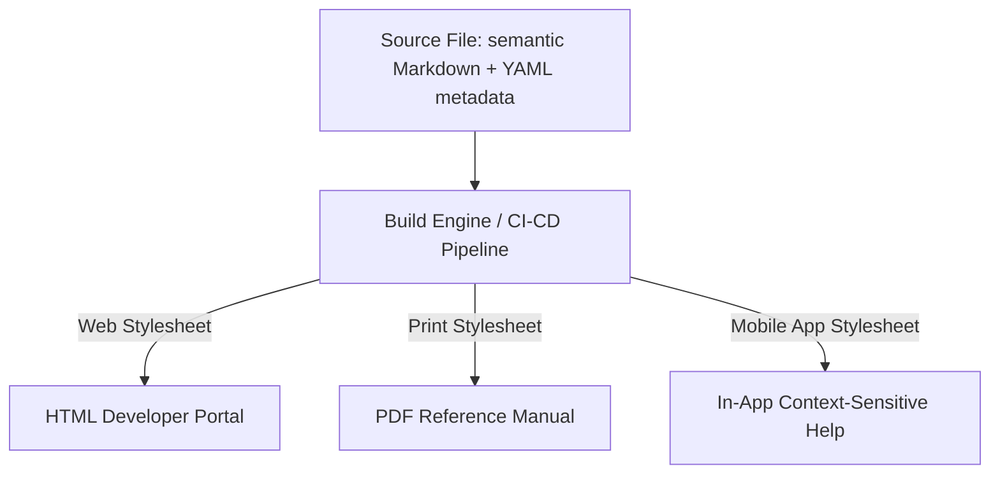

# Media independence architecture (MIA)

> An information design strategy that separates source content from its presentation layer to ensure consistent delivery across web, print, and mobile platforms

---

## Defining MIA

Modern documentation must exist everywhere—on wide desktop monitors, cramped mobile screens, and static printed pages. Media independence architecture (MIA) addresses this by treating text and media as raw data, entirely separate from the layout. By applying the principle of separation of concerns, MIA ensures that content remains neutral and semantic. Instead of hardcoding styles into source files, you define what the content *is*, allowing specialized processors to decide how it should *look* for a specific output.

---

## Breaking the link between content and layout

When source files are optimized for a single target—like a desktop browser—flexibility vanishes. Exporting these files to PDF or EPUB often breaks visual hierarchies, renders tables unreadable, and disrupts font scaling. This "layout debt" forces users to struggle with the interface rather than the information.

Decoupling form from function does more than fix broken layouts; it streamlines maintenance and discovery. Semantic markup allows search engines and internal tools to index data more accurately, improving SEO and internal findability. Furthermore, branding updates become a central task: modifying a single stylesheet or template updates thousands of pages instantly, eliminating the need to hunt down inline styles.

---

## Core principles

Successful MIA implementations rely on four pillars:

*   **Semantic tagging:** Use tags to describe intent (headings, steps, code blocks) rather than appearance (bold, 14px, blue).
*   **Neutral storage:** Maintain source files in flexible, machine-readable formats like Markdown, XML, or YAML.
*   **Metadata-driven assembly:** Use machine-readable tags (audience, version, status) to filter and assemble content dynamically.
*   **Independent rendering:** Use separate stylesheets or build configurations for each target to apply the final design during the build stage.

---

## Design pattern example

The following diagram illustrates how raw content travels through independent channels to reach its final form:



Consider the transition from a media-bound style to an MIA-compliant approach:

```text
[ Before / Media-Bound Pattern ]
--------------------------------------------------
<div style="font-size:14px; color:#333; float:left; width:300px;">
To restart the device, press the hard reset button. Refer to the image on the right.
</div>


[ After / MIA-Compliant Pattern ]
--------------------------------------------------
# Restart the device

To restart the device, press the hard reset button.


```

---

### Applying the pattern

MIA-compliant content uses lightweight markup that ignores margins, floats, and pixel widths. Assets follow the same logic; rather than hardcoding a device-specific file like `desktop-diagram.png`, a generic `diagram.png` is used, leaving the build engine to determine appropriate sizing and alignment. By configuring unique variables for each target, you ensure the content feels native to its environment without ever touching the raw source text.

=== "Web Build Target"
    ```yaml
    # Output configuration for web
    output_format: HTML
    stylesheet: main-web.css
    responsive: true
    minify: true
    ```

=== "Print Build Target"
    ```yaml
    # Output configuration for PDF
    output_format: PDF
    stylesheet: print-book.css
    page_breaks: auto
    dpi: 300
    ```

---

## Practical implementation

Building a media-independent strategy requires strict adherence to these practices:

*   **Ban inline styling:** Remove custom HTML tags and absolute image dimensions from the source. The template handles the geometry.
*   **Use environment-agnostic links:** Avoid instructions like "click the link on the left" or "see page 42." These fail when content reflows for mobile or is printed.
*   **Adopt the Concept-Task-Reference (CTR) model:** Modularizing content into distinct types makes it easier for scripts to filter or reorder data based on the audience.
*   **Leverage conditional rendering:** Use build-time logic to include or exclude blocks. For instance, CLI commands might be omitted from mobile formats to prioritize readability.

---

## Common anti-patterns to avoid

*   **The platform-bound manual:** Writing content that assumes a specific device shape or interaction method (e.g., "Hover your mouse" or "Turn the page"). This breaks the experience for touchscreen or print users.
*   **Embedded layout scripts:** Inserting complex scripts or CSS directly into Markdown files. This creates vendor lock-in and makes migrating to a new CMS or version control system nearly impossible.

---

## Validating the architecture

A robust MIA setup should be tested against multiple environments:

1.  **Multi-device audit:** Manually verify that visual hierarchy and line lengths feel natural across desktop, mobile, and PDF.
2.  **Cross-platform usability:** Observe users as they perform the same task on different devices to identify points where the layout might hinder comprehension.
3.  **Responsive simulation:** Use browser developer tools (++f12++) to ensure semantic markup reflows smoothly without clipping text or obscuring critical information.