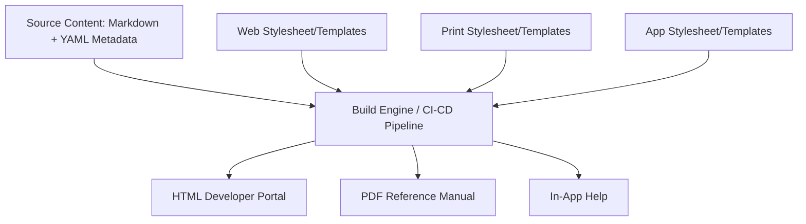

# Media independence architecture (MIA)

> An information design strategy that separates source content from its presentation layer to ensure consistent delivery across web, print, and mobile platforms

---

## Defining MIA

Modern documentation must exist across various outputs—high-resolution desktop monitors, mobile devices, and static printed pages. Media independence architecture (MIA) addresses this by treating text and media as structured data, entirely decoupled from the layout. By applying the principle of separation of concerns, MIA ensures that content remains semantic. Instead of hardcoding styles or spatial references into source files, you define the content's structure (what it *is*), allowing specialized build engines and stylesheets to determine the presentation (how it *looks*) for a specific output.

---

## Breaking the link between content and layout

When source files are optimized for a single target—such as a desktop browser—the content suffers from "layout debt." Exporting these files to fixed-layout formats like PDF or reflowable formats like EPUB often breaks visual hierarchies, renders tables unreadable, and disrupts typography scaling. 

Decoupling form from function streamlines maintenance and content discovery. Semantic markup allows search engines and programmatic tools to index data based on meaning, improving SEO and findability. Furthermore, branding updates are centralized: modifying a single global stylesheet or template updates all downstream artifacts, eliminating the need to manually edit inline styles or local overrides.

---

## Core principles

Successful MIA implementations rely on four pillars:

*   **Semantic tagging:** Use tags to describe intent (headings, steps, code blocks) rather than visual properties (bold, 14px, blue).
*   **Neutral storage:** Maintain source files in machine-readable, non-proprietary formats like Markdown, XML (DITA/DocBook), or AsciiDoc.
*   **Metadata-driven assembly:** Use attributes (audience, platform, product version) to filter and conditionalize content dynamically during the build process.
*   **Independent rendering:** Use discrete templates, transformation scripts (XSLT/CSS), or build configurations for each target to apply the final design at the generation stage.

---

## Design pattern example

The following diagram illustrates how raw content and presentation assets are combined by a build engine to produce distinct outputs:



Consider the transition from a media-bound style to an MIA-compliant approach:

```text
[ Before / Media-Bound Pattern ]
--------------------------------------------------
<div style="font-size:14px; color:#333; float:left; width:300px;">
To restart the device, press the hard reset button. Refer to the image on the right.
</div>


[ After / MIA-Compliant Pattern ]
--------------------------------------------------
# Restart the device

To restart the device, press the hard reset button.


```

---

### Applying the pattern

MIA-compliant content uses lightweight markup that avoids spatial references (e.g., "the image below") and absolute dimensions. Assets follow a similar abstraction; rather than hardcoding a device-specific file like `desktop-diagram.png`, an abstract reference or a high-resolution master asset is used. The build engine then processes, resizes, or selects the appropriate variant (SVG for web, high-DPI TIFF for print) for the target environment.

=== "Web Build Target"
    ```yaml
    # Output configuration for web
    output_format: html
    stylesheet: main-web.css
    media_queries: true
    optimization: minify_assets
    ```

=== "Print Build Target"
    ```yaml
    # Output configuration for PDF
    output_format: pdf
    stylesheet: print-book.css
    page_breaks: auto
    dpi: 300
    ```

---

## Practical implementation

Building a media-independent strategy requires strict adherence to these practices:

*   **Prohibit inline styling:** Ban HTML `style` attributes and absolute image dimensions (width/height) in the source content.
*   **Use environment-agnostic references:** Avoid spatial instructions like "click the link on the left" or "see the diagram above." These references fail when content reflows on mobile or is split across pages in a PDF.
*   **Adopt Information Typing:** Categorizing content into Concepts, Tasks, and References (the CTR model) allows build scripts to prioritize or reorder modules based on the output format.
*   **Leverage conditional processing:** Use build-time logic (e.g., `if-platform="android"`) to include or exclude specific content blocks.

---

## Common anti-patterns to avoid

*   **The platform-bound manual:** Writing content that assumes a specific input method (e.g., "Click here," "Hover your mouse," or "Tap the screen"). Use neutral terms like "Select" or "Navigate to."
*   **Embedded layout logic:** Inserting complex scripts, CSS blocks, or `<div>` wrappers directly into Markdown or XML files. This creates vendor lock-in and breaks the portability of the content.

---

## Validating the architecture

A robust MIA setup should be validated against multiple environments:

1.  **Multi-device audit:** Verify that visual hierarchy, typography, and line lengths are appropriate for desktop, mobile, and print.
2.  **Cross-platform usability:** Ensure instructions remain accurate regardless of the user's input method (touch vs. mouse) or screen size.
3.  **Responsive simulation:** Use browser developer tools (**F12**) to ensure the generated HTML reflows correctly without clipping content or breaking the navigation UI.