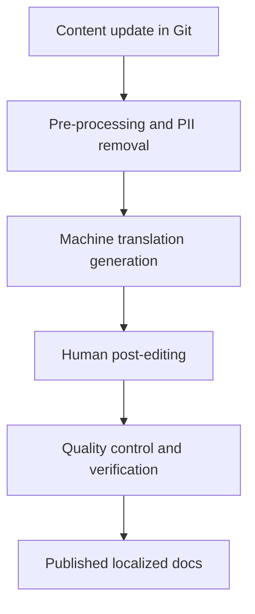

# Machine translation post-editing (MTPE)

> A workflow combining automated translation with human editing to ensure accuracy, natural tone, and quality in global software documentation

---

## What is machine translation post-editing?

Machine translation post-editing (MTPE) is a hybrid localization process. In this workflow, an editor reviews and corrects draft content generated by a machine translation (MT) engine. Instead of translating documentation manually, teams use automated engines to generate an initial draft. A bilingual editor then performs post-editing to make sure the translation meets professional standards. This approach is a key part of localization (L10n) and internationalization (I18n) strategies.

In software development, MTPE occurs during the final stages of the document development life cycle (DDLC). Technical writing teams, product managers, and quality assurance (QA) engineers work together on this process. Typically, these teams partner with a language service provider (LSP) to manage the post-editing, making sure the final output matches the technical intent and layout of the source document.

---

## Why MTPE is important

Manual translation of developer guides, APIs, and release notes is slow and expensive. This manual process often creates a documentation lag, where non-English documentation falls behind the primary codebase during rapid release cycles.

MTPE solves this problem by using automation for the initial draft, which speeds up the publication process. By shifting the human effort from writing to editing, teams reduce localization costs and increase the return on investment (ROI) of global documentation. Relying only on manual translation limits your ability to scale, which often results in outdated help centers.

---

## When to adopt this workflow 

Implementing an MTPE workflow requires preparation. Consider setting up this pipeline when your team meets the following conditions:

- **High-volume localization:** You must manage translation pipelines across multiple languages and high volumes of source files.
- **Source content standardization:** You write source documentation using a controlled language or strict formatting rules. Standardized source text increases the accuracy of translation engines, which reduces the time editors spend fixing errors.

---

## How the workflow works

The MTPE workflow automates file transport and translation while relying on human experts for quality. 

1. **Pre-processing and MT generation:** When you update source content, scripts automatically scan the files to remove sensitive information, such as personally identifiable information (PII). The clean source files go to a translation engine, which generates a raw draft.
2. **Human post-editing:** Professional editors review the machine-translated text. Depending on your quality requirements, editors perform either light or full editing.

??? note "Light vs. full post-editing"
    * **Light post-editing:** Focuses on accuracy, grammar, and spelling. The goal is to make the text understandable, even if the tone is unnatural.
    * **Full post-editing:** Focuses on style, readability, and terminology. The final output must sound as if a native speaker wrote it.

3. **Validation and quality control:** The edited files undergo programmatic checks. The technical writing team conducts quality control (QC) to verify that formatting, code blocks, and active voice remain intact before merging the files into the production repository.

---

## RACI and team roles

To keep the translation pipeline moving, establish clear ownership across your teams:

- **Responsible:** Technical writers (prepare source content), language service providers (perform post-editing)
- **Accountable:** Localization lead, product manager
- **Consulted:** Subject matter experts (SMEs), software engineers
- **Informed:** QA team, DevOps engineers

---

## Pipeline integration and tooling

To keep pace with release schedules, integrate the MTPE process into your continuous integration and continuous deployment (CI/CD) pipeline.

When a technical writer merges a pull request, a webhook triggers a file export from the repository. The files are uploaded automatically to a translation environment. Once post-editing is complete, the localization platform commits the translated files back to the repository. This automated workflow integrates with documentation portals to keep localized sites updated in near real-time.

---

## Troubleshooting common issues

Automated translation workflows can encounter predictable issues. Use these strategies to resolve them:

- **Engine translation of code syntax:** Engines might accidentally translate code blocks, variables, or commands, which breaks code execution.
    * *Solution:* Configure your parser to ignore code fences, inline code, and specific HTML tags (such as `translate="no"`) before sending files to the engine.
- **Inconsistent terminology:** Different editors might use different terms for the same feature, which confuses the user.
    * *Solution:* Maintain a product glossary. Make sure the translation engine enforces these glossary rules on the raw draft before the human editor reviews the text.

---

## Metrics and success criteria

To measure the effectiveness of your MTPE workflow, track these performance indicators:

- **Post-editing distance:** The percentage of words a human editor changes to make the translation acceptable. A lower distance indicates high engine accuracy.
- **Turnaround time reduction:** The decrease in time required to publish translated documentation compared to manual translation.
- **Localization cost savings:** The reduction in spending achieved by moving to the MTPE model.