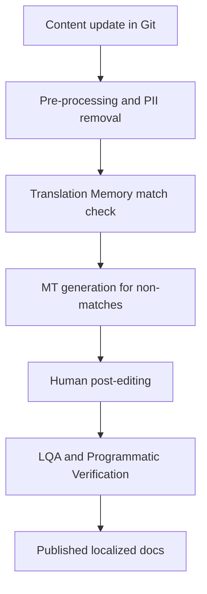

# Machine translation post-editing (MTPE)

> A localization workflow where human linguists refine machine-generated drafts to ensure technical accuracy, linguistic naturalness, and brand consistency

---

## What is MTPE?

Machine translation post-editing (MTPE) bridges the gap between raw artificial intelligence and professional-grade documentation. In this hybrid model, a machine translation (MT) engine produces the initial draft, which a bilingual editor then polishes to meet specific quality bars. By moving the human role from "generator" to "refiner," organizations can scale their localization (L10n) efforts without the linear cost increases of traditional manual translation.

In a software environment, MTPE typically sits within the final stages of the document development life cycle (DDLC). Technical writers and localization engineers coordinate with language service providers (LSPs) to ensure the final output preserves the source document's technical nuance and structural integrity.

---

## Strategic advantages

Manual translation for high-velocity content like API references or release notes is often prohibitively slow. This lag causes non-English documentation to drift from the primary codebase, frustrating global users. MTPE mitigates this by front-loading the effort with automation. Shifting human labor to the editing phase accelerates publication cycles and improves the ROI of global documentation efforts. Without this scalability, help centers frequently fall out of sync with rapid release schedules.

---

## Implementation readiness

Transitioning to an MTPE pipeline is most effective when documentation teams meet specific criteria:

*   **High-volume throughput:** Managing extensive file libraries across multiple locales makes manual intervention a bottleneck.
*   **Source content standardization:** Using controlled language or Simplified Technical English (STE) significantly improves MT engine output (BLEU/TER scores), leaving fewer errors for editors to fix.
*   **Robust Internationalization (I18n):** The codebase must already support multi-byte characters and dynamic string lengths to prevent UI breakage during the L10n phase.

---

## The MTPE workflow

The process prioritizes automated file transport and Translation Memory (TM) leverage while reserving human expertise for nuanced quality checks.



1.  **Drafting and Scrubbing:** Automated scripts scan source updates to strip sensitive data (PII) and protect "non-translatable" segments.
2.  **TM Leveraging:** The system checks the Translation Memory for existing matches. Only new or modified segments are sent to the MT engine to ensure consistency and reduce costs.
3.  **Linguistic Refinement:** Professional editors intervene to adjust the text. The depth of this review depends on the target quality tier:
    *   **Light post-editing (LPE):** Focuses on core accuracy, legibility, and syntax. The goal is utility; stylistic nuances may be ignored.
    *   **Full post-editing (FPE):** A deeper dive into style, tone, and terminology. The final text must be indistinguishable from a native-authored document.
4.  **Programmatic Validation:** Before merging into production, automated tools verify that code blocks, markdown/HTML tags, and hyperlinks remain intact and functional.

---

## Roles and ownership

Clear ownership prevents bottlenecks in the pipeline:

| Role | Responsibility |
| :--- | :--- |
| **Responsible** | Technical writers (source prep), Localization Engineers (pipeline/tools), LSPs (post-editing) |
| **Accountable** | Localization leads, Product managers |
| **Consulted** | Subject matter experts (SMEs), Software engineers |
| **Informed** | QA and DevOps teams |

---

## CI/CD integration

Modern MTPE thrives when integrated directly into the development pipeline. When a pull request merges, webhooks trigger file exports to the Translation Management System (TMS). Once the human editor commits their changes, the localized files are pushed back to the repository via an automated PR. This automation allows documentation portals to reflect updates across all languages in near real-time.

---

## Resolving technical friction

*   **Code syntax corruption:** Translation engines may inadvertently localize variables or commands. To prevent broken code, configure parsers to ignore code fences (e.g., ` ``` `) or use `translate="no"` HTML attributes and regex-based "non-translatable" (NT) rules.
*   **Terminology drift:** Inconsistent naming conventions confuse users. Enforcing a termbase (TB) or product glossary at the engine level (via MT training or glossaries) ensures the human editor starts with a draft that respects core terminology.

---

## Performance indicators

Track these metrics to evaluate the health of the MTPE pipeline:

*   **Edit distance:** Measured via Levenshtein distance, this tracks the volume of changes a human editor makes. High distance suggests the MT engine requires retraining or the source text is poor.
*   **MT Leverage:** The percentage of the final word count generated by MT versus TM matches or manual entry.
*   **Velocity:** The "words per hour" (WPH) throughput of editors compared to a manual translation baseline.
*   **Cost per word:** The total expenditure reduction (typically 30–60%) realized by moving to the hybrid model.