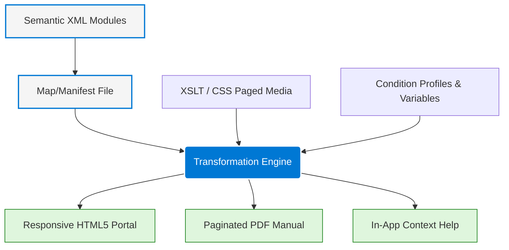

# Multi-channel publishing model

> A documentation architecture that transforms semantic XML source modules into various formats (PDF, Web, EPUB) through target-specific configuration, conditional profiling, and layout processing

---

## Technical framework

The multi-channel publishing model decouples raw content (semantics) from visual presentation (format). In this system, authors manage text and media as modular, schema-compliant XML files—such as DITA or DocBook—which are then processed into distinct layouts. This architecture eliminates manual duplication across deliverables. Instead of maintaining separate drafts for a web portal and a printed manual, a technical writer uses a transformation engine (e.g., DITA Open Toolkit) to generate multiple outputs from a single source of truth.

This approach addresses the reality that documentation requirements shift based on the medium. A developer troubleshooting an API requires a searchable, responsive web portal, while a field technician may require a paginated, offline PDF. By using a transformation engine to parse source modules and apply format-specific XSLT or CSS Paged Media rules, organizations deliver tailored user experiences without the overhead of duplicate authoring.

---

## Strategic advantages

Single-sourcing eliminates maintenance debt and "documentation lag," where updates to a web guide fail to reach the downloadable manual. Standardizing the compilation pipeline also reduces cognitive load; because style rules are applied programmatically during the build, the information architecture and visual hierarchy remain consistent across every platform. This ensures that terminology and navigation patterns remain synchronized across the entire product ecosystem.

---

## Core components

Five structural pillars govern the transition from raw content to finished deliverable:

- **Modular Sourcing:** Content is authored in self-contained units (concepts, tasks, or references) using semantic tags, devoid of presentational markup.
- **Hierarchical Mapping:** A map or manifest file defines the organization and sequence of modules for a specific publication.
- **Conditional Profiling:** Metadata attributes allow the engine to include, exclude, or flag content blocks based on target parameters (e.g., `audience="admin"` or `product="pro"`).
- **Target Configuration:** Parameters define variables (e.g., version numbers) and output-specific settings (e.g., search indexing for web vs. bookmarks for PDF).
- **Presentation Decoupling:** Typography and layout are handled by external stylesheets (CSS for Web, XSL-FO or CSS Paged Media for PDF) applied during the transformation.

---

## Design pattern example

The following pipeline illustrates how semantic modules, maps, and styling rules integrate to generate specific delivery channels.

### Execution logic

The transformation engine ingests semantic modules according to the hierarchy defined in a **Map File**. It resolves **Condition Profiles**, which act as a logic filter to include or exclude specific data nodes.

When a build is triggered (e.g., via a CI/CD pipeline using Ant or Maven), the engine processes these inputs to construct unique outputs. A web target receives responsive CSS and JavaScript-based search indexes. A PDF target undergoes a second processing pass (via a PDF renderer like Antenna House or Apache FOP) to convert the XML into paginated layouts with dynamic headers and cross-reference page numbering.

---

## User experience impact

- **Consistency across device handoffs:** Identical terminology and structure across media prevent disorientation when users switch from mobile setup guides to desktop interfaces.
- **Contextual density:** The model allows the same text block to adapt to different media—utilizing progressive disclosure (expandable sections) on the web while rendering fully expanded text in print.

---

## Implementation best practices

- **Enforce semantic markup:** Authors must use tags based on their structural role (e.g., `<step>`, `<codeph>`) rather than visual intent. The engine relies on these tags to map elements to the correct layout styles.
- **Maintain format-agnostic source files:** Avoid media-specific phrases like "Click the button below" or "See page 4." Use neutral phrasing such as "Select the Next button" and use semantic cross-references that the engine can resolve to either hyperlinks or page numbers.
- **Automate validation:** Use Schematron and build-time testing to ensure hyperlinks resolve and metadata attributes remain within the allowed values across all targets.

---

## Common anti-patterns

- **Presentational Tagging:** Manually forcing line breaks or font changes within the XML source bypasses the engine, leading to layout breaks in non-web targets.
- **Over-segmentation:** Fragmenting content into excessively small modules (e.g., one paragraph per file) creates "link rot" and complicates the hierarchical map management.

---

## Validation and testing

- **Cross-output regression testing:** Compare target outputs to ensure visual weight and hierarchy remain balanced across both fluid web layouts and fixed-page PDFs.
- **Link resolution audits:** Confirm that interactive elements (breadcrumbs, related links) function in digital formats and correctly translate to static references (e.g., "See 'Safety' on page 12") in print.