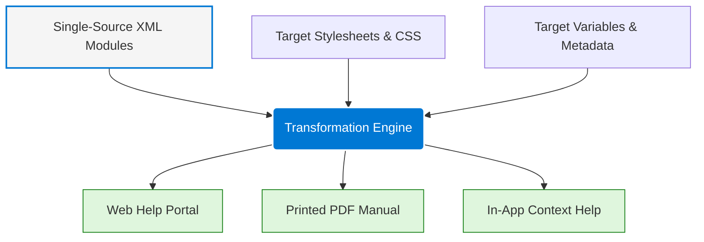

# Multi-channel compilation model

> An architecture where single-sourced XML or XHTML modules are compiled into diverse outputs like Web, PDF, and EPUB using target-specific configurations

---

## What is the multichannel compilation model?

The multichannel compilation model is a system design in technical communication. It allows authors to manage text and media assets as independent, modular source files—typically written in XML—and compile them into different layouts, formats, and channels. By separating raw content from visual presentation, this architecture enables teams to achieve efficient single-sourcing and content reuse across a product suite. Instead of manually copying and pasting information for a website, a mobile app, or a printed manual, writers compile one set of master files using a help authoring tool (HAT).

This model acknowledges that readers consume information differently depending on the medium. A software engineer troubleshooting an API requires a searchable, interactive developer portal. A hardware technician in the field might need a paginated, offline PDF file. The compilation model uses a transformation engine to parse source modules, apply styling rules, and resolve conditional text parameters. This ensures that each output is optimized for its environment, which preserves usability and delivers a tailored user experience without duplicating authoring efforts.

---

## Why it matters

In software and engineering environments, documentation exists across many touchpoints. Without a multichannel compilation model, technical writing teams face documentation lag and high maintenance overhead because they must manually update duplicate copies of the same information across multiple formats. This duplication leads to inconsistencies where a web guide contradicts a downloadable manual, which confuses users and erodes trust in the product.

A unified compilation model reduces the reader's cognitive load. When you compile content through a standardized pipeline, the system applies style rules programmatically. This ensures a consistent information architecture, vocabulary, and visual hierarchy across all delivery platforms. This predictability helps users find information and improves search relevance because users do not have to relearn how to navigate documentation when they switch from an in-app help panel to a web-based knowledge base. If you ignore this principle, your organization risks delivering unstructured "walls of text" or poorly formatted documents that increase customer support costs.

---

## Core principles and anatomy

To implement this model, you must understand the structural rules that govern how raw content transforms into finished deliverables.

- **Source modularity:** Authors write content in small, self-contained units that represent single concepts, tasks, or references. These modules do not contain inline visual styling.
- **Target configuration:** Technical teams define output destinations by applying unique variable sets, stylesheets, and compile-time conditions to the source files.
- **Separation of presentation:** Design elements (such as layout, typography, and color schemes) are decoupled from the source files. The system applies these styles during the build process.
- **Variable filtering:** The compilation system uses metadata attributes to include, exclude, or replace specific text blocks, which generates custom versions of a document from a single master file.

---

## Design pattern example

The following diagram shows the structural flow of a multichannel compilation pipeline. It demonstrates how raw modules merge with styling rules and target metadata to construct distinct delivery channels.

### Breakdown of the pattern

The architecture demonstrates how the compilation process transforms raw, single-source content into multiple channels. The source modules hold only semantic text and structure. They contain no embedded fonts, colors, or page geometries.

When you run a build (for example, by pressing ++ctrl+b++ in your development environment), the compilation engine ingests the raw source modules along with two critical inputs: 

1. **Target stylesheets:** These dictate the visual design for each medium.
2. **Target metadata:** These resolve variables, product names, and version numbers.

The engine processes these inputs to construct separate outputs. The web help target receives responsive styles, interactive navigation, and search scripts. The PDF target receives static headers, dynamic page numbers, and print-optimized page breaks.

---

## Cognitive impact and user experience

This strategy targets specific user-behavior goals:

- **Reduced friction in multidevice workflows:** Users often switch devices, such as viewing a setup guide on a smartphone while configuring a physical server. Maintaining identical terminology and structural flow across different media prevents user disorientation.
- **Optimized content density:** A web interface benefits from expandable sections and progressive disclosure, while a print copy requires fully expanded details. The compilation model formats the same text block to match the scanning pattern of the specific medium.

---

## Implementation best practices

Follow these rules when applying this pattern to a content strategy or layout design:

- **Establish a strict style guide for semantic markup:** Ensure all authors use semantic tags correctly instead of relying on visual layout hacks. The compilation engine depends on pure semantic structures to map elements to the correct layout styles.
- **Keep source files agnostic of output formats:** Avoid using output-specific language in your source text. Do not write "Click the button below" or "See page 4," because those references might not exist in a mobile app or an interactive web layout. Use direction-neutral phrases instead (for example, "select the Next button").
- **Implement automated validation in the build pipeline:** Because paths and endpoints change between web hosting and local file storage, use automated testing tools in your version control system to verify that compiled hyperlinks and cross-references resolve correctly across every target.

---

## Common anti-patterns

Avoid these common mistakes when executing this model:

- **Inline styling overrides:** Authors sometimes apply local formatting changes directly in the source code, such as forcing a font change manually. This bypasses the transformation engine, which results in broken layouts and poor accessibility on compiled targets.
- **Over-segmentation of source files:** Breaking content into thousands of tiny, single-sentence files to maximize reuse creates massive maintenance overhead, ruins logical reading flow, and increases build times.

---

## How to validate and test usability

Use these testing strategies to verify that this pattern works for readers:

- **Conduct output comparison tests:** Generate all target outputs and compare key pages side-by-side. Verify that the visual weight, typography, and hierarchy are balanced on both a desktop screen and a printed page.
- **Execute end-to-end navigation audits:** Verify that interactive navigation paths, such as breadcrumbs and internal links, are functional in digital targets and translate to page numbers in PDF targets.