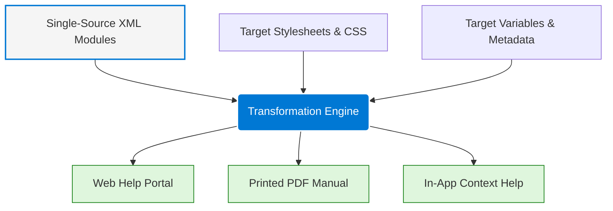

# Multi-channel compilation model

> A documentation architecture that transforms modular XML/XHTML source files into various formats (PDF, Web, EPUB) through target-specific configuration and styling

---

## Technical framework

The multichannel compilation model decouples raw content from visual presentation. In this system, authors manage text and media as independent, modular source files—usually XML—which are then processed into distinct layouts and formats. This architecture eliminates the need for manual copying and pasting across different deliverables. Instead of maintaining separate drafts for a web portal and a printed manual, a technical writer uses a help authoring tool (HAT) to build multiple outputs from a single master dataset.

This approach addresses the reality that documentation requirements shift based on the medium. A developer troubleshooting an API needs an interactive, searchable portal, while a field technician might require a paginated, offline PDF. By using a transformation engine to parse source modules and apply specific styling rules, organizations can deliver tailored user experiences without the overhead of duplicate authoring.

---

## Strategic advantages

Fragmented documentation creates maintenance debt. Without a unified compilation model, teams often struggle with "documentation lag," where updates to a web guide fail to reach the downloadable manual. These inconsistencies lead to contradictory instructions that frustrate users and drive up support costs.

Standardizing the compilation pipeline also reduces cognitive load. Because style rules are applied programmatically, the information architecture, vocabulary, and visual hierarchy remain consistent across every platform. This predictability allows users to transition seamlessly between an in-app help panel and a web-based knowledge base without having to relearn navigation patterns.

---

## Core components

Four structural rules govern the transition from raw content to finished deliverable:

- **Modular Sourcing:** Content is authored in self-contained units (concepts, tasks, or references) devoid of inline visual styling.
- **Target Configuration:** Technical parameters—including variable sets and compile-time conditions—define the specific destination of the content.
- **Presentation Decoupling:** Typography, color schemes, and layout geometries are stored in external stylesheets and applied only during the build.
- **Attribute Filtering:** Metadata tags allow the system to include, exclude, or swap text blocks, generating custom versions of a document from one source.

---

## Design pattern example

The following pipeline illustrates how raw modules integrate with styling rules and metadata to generate specific delivery channels.

### Execution logic

The compilation engine ingests semantic source modules alongside two critical inputs: **Target Stylesheets**, which dictate the visual design, and **Target Metadata**, which resolves variables like product names or version numbers.

When a build is triggered (e.g., via a CI/CD pipeline or a `Ctrl+B` shortcut), the engine processes these inputs to construct unique outputs. A web target receives responsive CSS and search scripts, while a PDF target receives static headers and print-optimized page breaks—all derived from the same source text.

---

## User experience impact

- **Consistency across device handoffs:** Users often view setup guides on mobile while configuring hardware. Identical terminology and structure across media prevent disorientation during these transitions.
- **Contextual density:** The model allows the same text block to adapt to the scanning patterns of different media—utilizing progressive disclosure (expandable sections) on the web while providing fully expanded details in print.

---

## Implementation best practices

- **Enforce semantic markup:** Authors must use tags for their structural meaning rather than visual effect. The engine relies on pure semantic structures to map elements to layout styles correctly.
- **Maintain format-agnostic source files:** Avoid language like "Click the button below" or "See page 4," as these references break in non-linear or mobile layouts. Use neutral phrasing such as "Select the Next button."
- **Automate validation:** Use build-time testing to ensure that hyperlinks and cross-references resolve correctly across all targets, accounting for the differences between web-hosted and local file systems.

---

## Common anti-patterns

- **Inline styling overrides:** Manually forcing font changes or colors within the source code bypasses the transformation engine, leading to broken layouts and accessibility failures.
- **Over-segmentation:** Fragmenting content into excessively small files (e.g., single-sentence modules) creates massive maintenance overhead and destroys the natural reading flow.

---

## Validation and testing

- **Side-by-side output audits:** Compare target outputs to ensure visual weight and hierarchy remain balanced across both desktop screens and printed pages.
- **End-to-end navigation checks:** Confirm that interactive elements like breadcrumbs function in digital formats and correctly translate to static page references in PDFs.