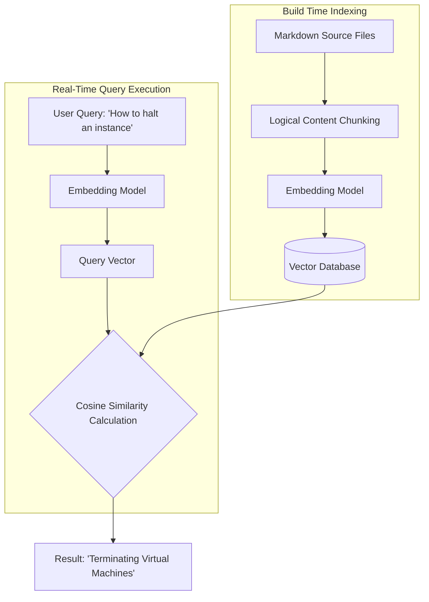

# Neural Search

> An information retrieval method using machine learning and vector embeddings to match user queries with content based on semantic intent rather than keywords

---

## What is Neural Search?

Neural search shifts information retrieval from literal string matching to semantic understanding. While traditional lexical engines rely on exact keywords and complex indexing, neural search converts documentation and queries into dense mathematical representations known as vector embeddings. Because these embeddings capture the underlying context of language, the system can surface relevant results even when the searcher’s vocabulary doesn't match the source text.

Mapping documentation to a semantic vector space aligns the search interface with the user's mental model. This transitions the search experience from a frustrating keyword-guessing game into an intent-driven discovery process, making it significantly easier to navigate dense technical libraries.

---

## The problem with lexical search

Traditional keyword-based systems often fail when users don't know the exact industry terms used by technical writers. Entering a slightly off-target synonym often results in zero hits, forcing users into "pogo-sticking"—the repetitive cycle of clicking back and forth between irrelevant results before eventually abandoning the portal.

Neural search solves this "vocabulary mismatch" by calculating the mathematical distance between vectors. For example, it can successfully link a query like "stop a container" with a document titled "Terminating active processes." For developers, this leads to faster integration; for support teams, it significantly reduces ticket volume by enabling better self-service.

---

## Core components

A functional neural search architecture requires three primary elements to process and index documentation:

*   **Dense vector embeddings:** Text chunks transformed into numerical arrays that encode meaning, syntax, and context.
*   **Vector databases:** Specialized storage systems that use approximate nearest neighbor (ANN) algorithms to calculate similarity distances rather than standard B-tree indexing.
*   **Bi-encoder query pipeline:** A workflow where the same embedding model processes both the static documentation (at build time) and the user query (in real time) to ensure they share the same coordinate space.

---

## Design pattern example

The system generates a unique numerical vector for every text chunk during the indexing phase. When a user queries "How to halt an instance," the system converts that input into a vector and performs a cosine similarity calculation against the database. The most relevant match—"Terminating Virtual Machines"—is returned despite the lack of shared keywords.

---

## Implementation best practices

Effective neural search requires more than just an embedding model; it requires thoughtful content engineering.

*   **Granular chunking:** Do not index entire pages as single vectors. Break articles into semantic blocks, such as specific task-based procedures or descriptive paragraphs. This allows the engine to point users to the exact section they need.
*   **Hybrid search strategies:** Always combine semantic vector search with traditional keyword queries. This ensures that specific technical markers, such as error codes, function names (e.g., `#!python os.path.join()`), or system parameters, remain discoverable.
*   **Metadata enrichment:** Use YAML front matter to categorize content by target audience or product version. Filtering results by metadata before calculating similarity prevents the system from surfacing irrelevant "semantically similar" content from the wrong product version.

---

## Validation and maintenance

To ensure the system remains effective, monitor and audit the search experience:

*   **Concept audits:** Test informal queries (e.g., "get started on Mac" or "clean up old builds") to confirm the engine correctly maps them to the appropriate installation and maintenance guides.
*   **Zero-result logging:** Track queries that fail to return results. This data identifies gaps in your documentation or areas where the embedding model’s vocabulary mapping requires adjustment.