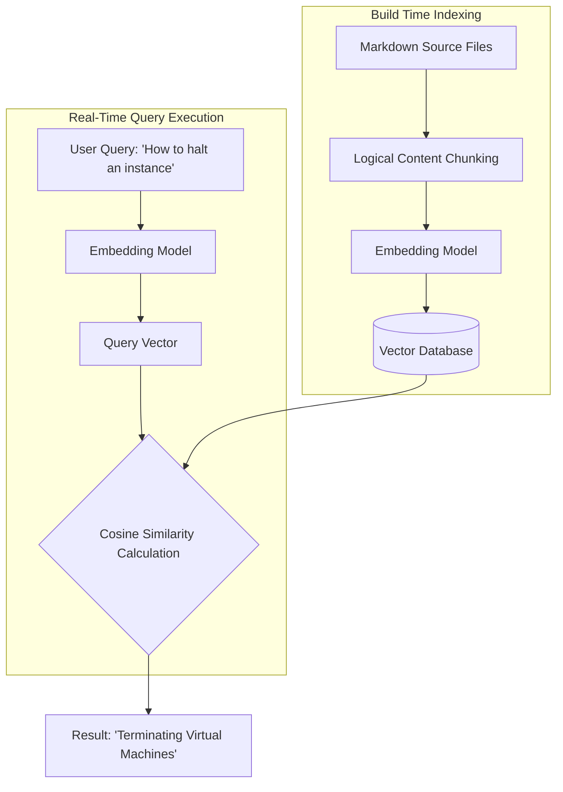

# Neural Search

> An architectural search pattern using high-dimensional vector spaces to retrieve technical documentation based on conceptual intent rather than literal matches

---

## What is neural search?

Neural search is an information retrieval method that uses machine learning to understand the meaning behind user queries. Unlike traditional lexical search engines that rely on exact string matches, synonyms, and complex keyword indexing, neural search translates documentation and user queries into dense mathematical representations called vector embeddings. Because these embeddings capture the conceptual relationships between words, the system can retrieve relevant results even when the user query does not share words with the source documentation.

This approach aligns with how humans organize knowledge through associative memory, connecting concepts based on context and meaning. By mapping documentation to a semantic vector space, neural search aligns the search interface with the user's mental model. This makes it easier to navigate complex technical materials, transforming search from a keyword-matching exercise into an intent-driven experience.

---

## Why neural search matters

Traditional keyword-based search often increases cognitive load. When you search for a solution, you might not know the exact industry terms used by the technical writers who authored the documentation. In a lexical system, entering a slightly incorrect synonym can result in no search results. This forces you to try multiple queries, leading to "pogo-sticking" (clicking back and forth between irrelevant results) and eventual abandonment of the documentation portal.

Implementing neural search improves findability and self-service support. By calculating the mathematical distance between vectors, the search engine matches queries like "stop a container" with documentation titled "Terminating active processes." For software engineers, this means faster integration. For product teams, it reduces the volume of support tickets, which improves product adoption and customer satisfaction.

---

## Core components

A production-ready neural search architecture consists of several components that process, index, and retrieve documentation:

- **Dense vector embeddings:** Chunks of text transformed by an embedding model into high-dimensional numerical arrays. These arrays capture semantic meaning, syntax, and context.
- **Vector databases:** Specialized databases designed to store and query embeddings. Instead of using traditional B-trees, they organize data using approximate nearest neighbor (ANN) algorithms to calculate similarity distances.
- **Bi-encoder query pipeline:** A system where an embedding model encodes the static documentation content during the build process, and the same model (or a compatible one) processes the user's search query in real time. Both are converted into the same coordinate space for comparison.

---

## Design pattern example

This diagram illustrates how a neural search system processes static documentation source files and a real-time user query to locate relevant technical information:

### How the pattern works

The system operates in two phases:

1. **Build-time indexing:** The system breaks static files into small, logical text chunks. Each chunk passes through an embedding model to generate a unique numerical vector. These vectors are then indexed and saved in a vector database.
2. **Real-time query execution:** When a user enters a query like "How to halt an instance," the system converts the query into a vector using the same embedding model. The vector database performs a mathematical cosine similarity calculation to find the documentation vectors closest to the query vector. The system then returns the most relevant article, such as "Terminating Virtual Machines," even if there are no keyword matches.

---

## Cognitive impact and user experience

Neural search architectures improve how users interact with content by targeting specific behavioral outcomes:

- **Reduced search friction:** Users find answers on their first attempt without needing to learn complex syntax, command-line flags, or specific product taxonomy.
- **Context-aware discovery:** The search engine respects sentence structure and intent, preventing users from landing on irrelevant pages that share a common keyword.

---

## Implementation best practices

To deploy neural search across your documentation site, follow these technical and editorial rules:

- **Chunk content to preserve context:** Do not index entire pages as a single vector. Break articles into logical semantic blocks, such as single task-based procedures or descriptive paragraphs. This allows the search engine to point users to the exact section they need.
- **Use a hybrid search model:** Combine semantic vector search with traditional keyword queries. This ensures that when users search for specific error codes, code snippets, or system parameters, the search engine still delivers precise lexical matches.
- **Enrich content with metadata:** Use YAML front matter to provide additional context, such as target audience, product version, and content type. This helps filter search results before the system calculates similarity.

---

## Common anti-patterns

Avoid these mistakes when designing and maintaining a neural search system:

- **Relying only on vector matching:** If your system abandons lexical matching, users will struggle to find specific technical markers, such as function names like `#!python os.path.join()` or error output strings.
- **Indexing unstructured data:** Passing large, unorganized files to your embedding model dilutes the semantic signal, leading to inaccurate similarity calculations and irrelevant search results.

---

## How to validate usability

Verify that your search portal is effective for readers by using these techniques:

- **Run synonym and concept audits:** Compile a list of common user goals described in informal language (for example, "get started on Mac" or "clean up old builds") and test them in your search bar. Ensure the relevant installation and maintenance pages appear first.
- **Monitor queries with no results:** Keep a log of queries that return no results. Use this data to determine if you need to create new content or adjust your embedding model's vocabulary mapping.