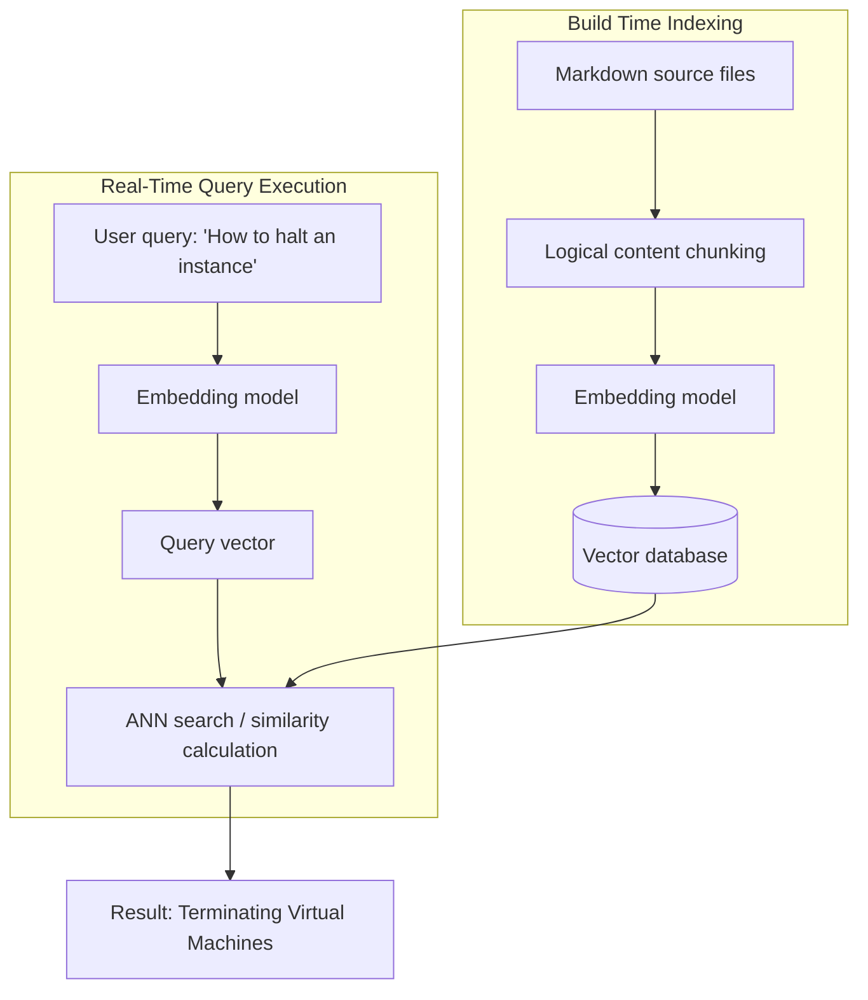

# Neural search

> *An information retrieval method using machine learning and vector embeddings to match user queries with content based on semantic intent rather than keywords*

---

## What is neural search?

Neural search shifts information retrieval from literal string matching to semantic understanding. While traditional lexical engines rely on exact keyword matches and inverted indices, neural search converts documentation and queries into dense mathematical representations known as vector embeddings. Since these embeddings capture the linguistic context and relationships within a high-dimensional space, the system can surface relevant results even when the searcher’s vocabulary does not explicitly overlap with the source text.

Mapping documentation to a semantic vector space aligns the search interface with the user mental model. This transitions the search experience from a keyword-guessing game into an intent-driven discovery process, facilitating navigation through dense technical libraries.

---

## The problem with lexical search

Traditional keyword-based systems, using algorithms such as term frequency-inverse document frequency (TF-IDF) or best matching 25 (BM25), often fail when users do not use the specific terminology established in the documentation. A query containing synonyms or related concepts may return zero hits, leading to an inefficient cycle of clicking through irrelevant results and returning to the search bar.

Neural search addresses this vocabulary mismatch by calculating the distance, or similarity, between vectors in a latent space. For example, a bi-encoder model can place the query "stop a container" and the document "Terminating active processes" in close proximity within the vector space. For developers, this accelerates integration; for support teams, it increases the deflection rate by enabling effective self-service.

---

## Core components

A functional neural search architecture requires three primary elements to process and index documentation:

- **Dense vector embeddings:** Text segments transformed into fixed-length numerical arrays by a transformer-based model, such as Bidirectional Encoder Representations from Transformers (BERT), Robustly Optimized BERT Pretraining Approach (RoBERTa), or Ada. These arrays encode semantic, syntactic, and contextual information.
- **Vector databases:** Specialized storage systems designed for high-dimensional vectors. They use specialized indexing structures, such as hierarchical navigable small world (HNSW) or inverted file index (IVF), to perform approximate nearest neighbor (ANN) searches, which are significantly more efficient than exhaustive linear scans.
- **Bi-encoder query pipeline:** An architecture where the embedding model, the encoder, processes documentation at index time and the user query at inference time independently. This ensures both inputs are mapped to the same coordinate space for comparison.

---

## Design pattern example

The system generates a unique numerical vector for every text chunk during the indexing phase and stores it within a specialized vector index. When a user queries "How to halt an instance," the system encodes the input into a vector and performs an approximate nearest neighbor (ANN) search, often using cosine similarity or dot product, against the indexed vectors. The most mathematically proximal match, Terminating Virtual Machines, is returned despite the lack of shared keywords.

---

## Implementation best practices

Effective neural search requires more than just an embedding model; it requires thoughtful content engineering.

- **Granular chunking:** Do not index entire pages as single vectors, as this dilutes the semantic signal. Break articles into logical blocks, for example, 256–512 tokens, such as specific procedures or descriptive paragraphs. Use overlapping windows to maintain context between chunks.
- **Hybrid search strategies:** Combine semantic vector search with traditional lexical search using reciprocal rank fusion. This ensures that specific technical tokens, such as error codes (404), specific function names (for example, `#!python os.path.join()`), or unique identifiers, remain discoverable, as vector models can sometimes smooth over these critical literal details.
- **Metadata enrichment and prefiltering:** Use YAML front matter to categorize content, such as `product_version`, `language`, or `platform`. Applying these as hard filters before performing vector similarity prevents relevance errors from unrelated product versions or documentation sets.

---

## Validation and maintenance

To ensure the system remains effective, monitor and audit the search experience:

- **Concept audits:** Test out-of-vocabulary queries, for example, "warm start" versus "initialization," to confirm the model’s latent space correctly clusters these concepts.
- **Zero-result logging:** Monitor queries that fail to return results in the lexical layer but return high-confidence matches in the semantic layer, and vice versa. This identifies whether the embedding model requires fine-tuning or if the documentation has literal gaps.