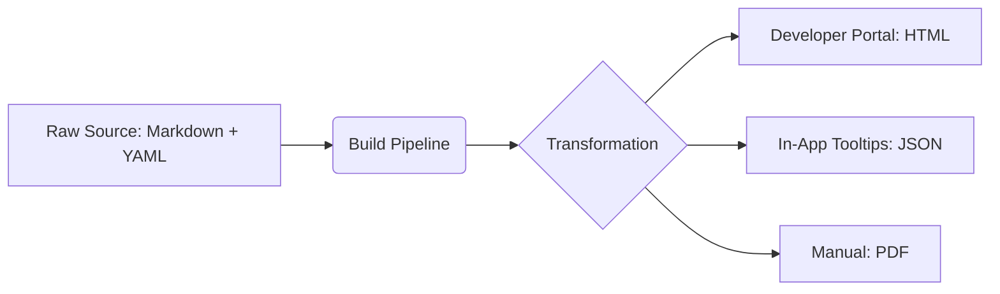

# Omnichannel delivery

> A content strategy that provides a consistent and unified documentation experience across all digital and physical user touchpoints

---

## What is omnichannel delivery?

In modern software development, users rarely rely on a single source for help. They might search for an error code in a mobile app, read a troubleshooting article on a phone, query a chatbot, or review API references on a developer portal. 

Omnichannel delivery is an architectural design pattern that ensures the core message, structure, and tone of technical information remain identical across all these channels. Unlike legacy publishing methods that treat each channel as a separate project, an omnichannel strategy treats content as a decoupled, raw asset that flows dynamically to wherever the user is.

This approach helps users build mental models of how a product works. When technical content is fragmented—for example, if an in-app tooltip uses different terminology than the help website—the user becomes confused. By using structured content and semantic tags, organizations can render the same source files into different layouts without rewriting them.

---

## Why omnichannel delivery matters

When teams ignore omnichannel principles, the user experience becomes fragmented. A developer might find one code example on a website but a conflicting version in a PDF or embedded API documentation. This inconsistency forces users to spend time verifying which resource is correct, which leads to frustration and more support tickets.

Strategically, maintaining manual copies of the same information across several platforms creates technical debt. It makes updates slow and increases the risk of errors because corrections might not reach every channel. By delivering content dynamically, you improve search engine optimization (SEO), ensure real-time accuracy, and simplify translation for international markets.

---

## Core principles and anatomy

A successful omnichannel system separates the writing process from visual styling. Treat your text as raw data that you can query, filter, and style as needed.

*   **Decoupled architecture:** Authors write content in a neutral, plain-text format and store it in a centralized repository, separate from design or layout files.
*   **Granular structure:** Documents are broken down into small, self-contained topics rather than long files. This design allows you to reuse individual sections in different contexts.
*   **Rich semantic metadata:** Every chunk of text is tagged with metadata. This data tells delivery systems who the content is for, which product version it applies to, and where to display it.
*   **Format independence:** Source files use lightweight languages like [Markdown](https://daringfireball.net/projects/markdown/){: target="_blank" rel="noopener" } or [XML](https://www.w3.org/XML/){: target="_blank" rel="noopener" }, which automated pipelines can transform into [HTML](https://html.spec.whatwg.org/){: target="_blank" rel="noopener" }, [JSON](https://www.json.org/json-en.html){: target="_blank" rel="noopener" }, or [PDF](https://www.adobe.com/acrobat/about-adobe-pdf.html){: target="_blank" rel="noopener" }.

---

## Design pattern example

The following diagram shows how an automated system processes a single source file and distributes it to different channels based on metadata tags.



### How the pattern works

In this design, a writer creates one Markdown file that includes a [YAML](https://yaml.org/){: target="_blank" rel="noopener" } front-matter block. The build pipeline processes the file and metadata to split the content into different formats:

1.  The pipeline publishes the full article to the developer portal.
2.  A script extracts only the troubleshooting steps and serves them as a JSON payload to the software application.
3.  A generator compiles the library into a PDF for offline use or compliance.

??? note "Technical details: JSON payload example"
    This example shows how a system translates a Markdown file into a JSON structure for in-app delivery:
    ```json
    {
      "id": "err-code-404",
      "category": "troubleshooting",
      "audience": "developer",
      "content": "Make sure your API token is in the authorization header. Use the 'Bearer' format to authenticate your request."
    }
    ```

---

## Impact on user experience

By creating a unified path for technical content, you help your audience learn your product more efficiently.

*   **Faster information retrieval:** Users find answers in their immediate workspace, so they don't have to switch between the app and a browser.
*   **Consistent patterns:** Identical terminology and navigation across all channels help users process information faster.

---

## Implementation best practices

To build a reliable omnichannel system, focus on standardizing your data and workflows.

*   **Establish a central taxonomy:** Before writing, create a standard list of product terms, user roles, and categories. Use this taxonomy in your metadata so automated systems route content correctly.
*   **Use single sourcing:** Don't copy and paste text. Use content reuse features to reference one file in multiple locations.
*   **Prioritize plain-text formats:** Use open formats like Markdown. This makes your documentation compatible with modern build tools and scripts.
*   **Analyze user behavior:** Research where your users look for help. Ensure your build pipelines target those specific digital and physical spaces.

---

## Common anti-patterns

Avoid these mistakes when setting up your distribution system:

*   **Manual duplication:** Copying text into different platforms creates "content drift," where different channels show conflicting instructions.
*   **Layout-dependent language:** Avoid phrases like "click the blue button on the right." This language fails when content is delivered via a voice interface, a mobile app, or a command-line tool.

---

## How to validate usability

You can measure the success of your delivery strategy using these methods:

*   **Cross-channel testing:** Ask a volunteer to start a task on a mobile device and finish it on a desktop. Note where they get confused by changes in language or structure.
*   **Search and ticket audits:** Compare search queries on your help website with customer support tickets. If the terms don't match, update your metadata and taxonomy to bridge the gap.