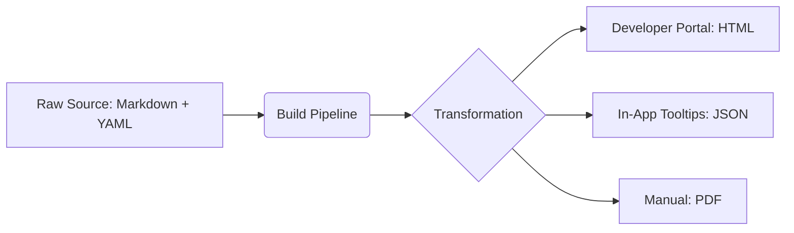

# Omnichannel delivery

> A content strategy that serves structured documentation as decoupled data, ensuring a consistent experience across all digital and physical user touchpoints

---

## Technical architecture

Users rarely encounter a product through a single interface. They might troubleshoot via a mobile app, query a chatbot, or review deep-link API references within a developer portal. Omnichannel delivery treats technical information as a decoupled, raw asset rather than a finished page. This design pattern ensures that the core logic, structure, and tone remain identical regardless of the delivery mechanism.

Unlike legacy publishing—where each channel is treated as a separate silo—an omnichannel approach relies on a "single source of truth." When content is fragmented (e.g., an in-app tooltip using different terminology than the help site), the user's mental model of the product breaks. Using structured content and semantic tags allows organizations to render the same source files into various layouts without manual rewriting.

---

## The cost of fragmentation

Ignoring omnichannel principles leads to "content drift." When a developer finds one code example on a website but a conflicting version in a PDF, they spend more time verifying the resource than using the product. This inconsistency drives up support tickets and erodes user trust.

From an operational standpoint, maintaining manual copies across platforms creates technical debt. Updates become sluggish, and the risk of stale data increases. By delivering content dynamically through a centralized pipeline, you improve SEO, ensure real-time accuracy, and simplify localization efforts for international markets.

---

## Core components

A functional omnichannel system requires the strict separation of content from presentation. You must treat text as queryable data.

*   **Decoupled Source:** Content lives in a neutral, plain-text format (like Markdown or XML) in a centralized repository, entirely independent of design files.
*   **Granular Topic Design:** Long documents are broken into small, self-contained modules. This atomicity allows a single paragraph to serve as a tooltip, a chatbot response, or a section in a manual.
*   **Semantic Metadata:** Every chunk is tagged with metadata that defines the audience, product version, and intent. This data acts as the "routing instructions" for delivery systems.
*   **Format Agnosticism:** Automated pipelines transform the source into HTML for the web, JSON for applications, or PDF for offline compliance.

---

## Design pattern example

The diagram below illustrates the flow from a single source file to diverse end-user channels.



### Execution

A writer creates a single Markdown file containing a [YAML](https://yaml.org/){: target="_blank" rel="noopener" } front-matter block. The build pipeline then executes three distinct tasks:

1.  **Full Render:** The complete article is published to the documentation site.
2.  **Specific Extraction:** A script pulls only the "troubleshooting" steps, serving them as a JSON payload to the software’s UI.
3.  **Static Generation:** The system compiles the library into a PDF for regulatory requirements.

??? note "Technical details: JSON payload example"
    This shows how a pipeline converts Markdown into a structured JSON object for in-app integration:
    ```json
    {
      "id": "err-code-404",
      "category": "troubleshooting",
      "audience": "developer",
      "content": "Make sure your API token is in the authorization header. Use the 'Bearer' format to authenticate your request."
    }
    ```

---

## Strategic implementation

To move beyond static documentation, focus on standardizing the underlying data layers.

*   **Central Taxonomy:** Before writing a single word, define a standard list of product terms and user roles. This ensures metadata-driven routing is accurate and predictable.
*   **Single Sourcing:** Replace "copy-paste" workflows with content reuse features. Reference a single file in multiple locations to ensure that a fix in the source updates every channel simultaneously.
*   **Format Agnosticism:** Prioritize open formats like [Markdown](https://daringfireball.net/projects/markdown/){: target="_blank" rel="noopener" }. This avoids vendor lock-in and ensures compatibility with modern CI/CD tools.
*   **Format-Agnostic Language:** Avoid layout-dependent instructions like "click the button on the right." Such language fails when content is delivered via voice interface or a command-line tool.

---

## Measuring success

A successful delivery strategy is validated by cross-channel consistency. Conduct "pathway audits" where a volunteer starts a task on a mobile device and finishes it on a desktop; if they are confused by shifts in language, the taxonomy needs refinement. Additionally, compare help site search queries against support tickets. A mismatch between these two datasets often reveals a failure in the metadata layer.