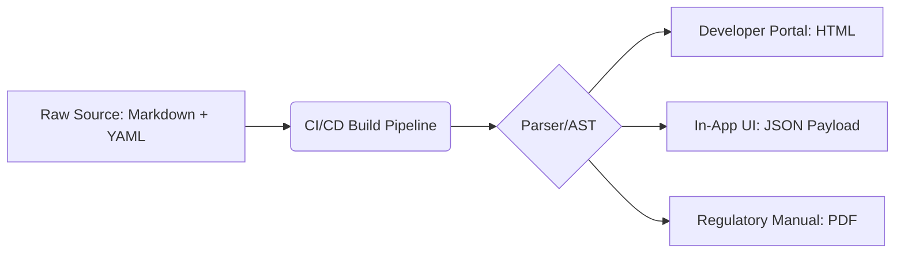

# Omnichannel delivery

> A content strategy that serves structured documentation as decoupled data, ensuring a consistent experience across all digital and physical user touchpoints

---

## Technical architecture

Users rarely encounter a product through a single interface. They might troubleshoot via a mobile app, query a chatbot, or review deep-linked API references within a developer portal. Omnichannel delivery treats technical information as a decoupled, raw asset—typically stored as a structured data object or an Abstract Syntax Tree (AST)—rather than a pre-rendered page. This design pattern ensures that the core logic, structure, and taxonomy remain identical regardless of the delivery mechanism.

Unlike legacy multi-channel publishing—where each channel is treated as a separate silo—an omnichannel approach relies on a "single source of truth" accessed via APIs or automated build pipelines. Using structured content and semantic metadata allows organizations to render the same source files into various layouts and formats without manual duplication.

---

## The impact of fragmentation

Ignoring omnichannel principles leads to "content drift." When a developer finds a code example on a marketing site that conflicts with a version in the technical documentation, the resulting ambiguity increases time-to-resolution. This inconsistency drives up support volume and erodes user trust.

From an operational standpoint, maintaining manual copies across platforms creates technical debt and synchronization overhead. By delivering content through a centralized CI/CD pipeline, you ensure real-time accuracy and simplify localization. Furthermore, structured content enables the injection of Schema.org metadata (JSON-LD), which significantly improves SEO and discoverability compared to unstructured blobs of text.

---

## Core components

A functional omnichannel system requires the strict separation of content (data), structure (schema), and presentation (layer). You must treat text as queryable data.

*   **Decoupled Source:** Content lives in a neutral format (such as Markdown with custom attributes, XML, or JSON) in a centralized repository, entirely independent of the presentation layer.
*   **Granular Topic Design (Atomicity):** Long documents are decomposed into small, self-contained modules or "content chunks." This allows a single paragraph or procedure to be transcluded into a tooltip, a chatbot response, or a section in a manual.
*   **Semantic Metadata:** Every chunk is tagged with metadata defining attributes like `audience`, `product_version`, and `intent`. This metadata acts as the routing logic for the delivery API.
*   **Format Agnosticism:** Automated pipelines use parsers and generators to transform the source into HTML for the web, JSON for application UI, or PDF/UA for accessibility and regulatory compliance.

---

## Design pattern example

The diagram below illustrates the flow from a single source file to diverse end-user channels via a transformation engine.



### Execution

A writer creates a single Markdown file containing a [YAML](https://yaml.org/){: target="_blank" rel="noopener" } front-matter block. The build pipeline then executes three distinct tasks based on the file's semantic structure:

1.  **Full Render:** A static site generator (SSG) processes the Markdown into an HTML page for the documentation portal.
2.  **Semantic Extraction:** A script parses the file’s AST to extract specific nodes (e.g., a tagged `troubleshooting` block) and serves them as a JSON payload to the product’s UI.
3.  **Standardized Compilation:** A tool like Pandoc or an XML-FO processor converts the source into a tagged PDF for compliance.

??? note "Technical details: JSON payload example"
    This shows how a pipeline converts semantically tagged Markdown into a structured JSON object for in-app integration:
    ```json
    {
      "id": "err-code-404",
      "metadata": {
        "category": "troubleshooting",
        "audience": "developer",
        "version": "2.1.0"
      },
      "body": "Ensure your API token is included in the authorization header using the 'Bearer' scheme."
    }
    ```

---

## Strategic implementation

To move beyond static documentation, focus on standardizing the underlying data layers.

*   **Central Taxonomy:** Define a controlled vocabulary and a standard list of user roles. This ensures that metadata-driven filtering is predictable across all consuming applications.
*   **Single Sourcing (Transclusion):** Replace "copy-paste" workflows with content reuse mechanisms. Use pointers or "includes" to reference a single source fragment in multiple locations, ensuring updates propagate globally.
*   **Format Agnosticism:** Prioritize formats that can be easily parsed into a machine-readable AST. This avoids vendor lock-in and ensures compatibility with modern CI/CD tools.
*   **Context-Independent Language:** Avoid layout-dependent instructions such as "click the button on the right" or "refer to the image below." Use action-oriented language that remains valid for voice interfaces, screen readers, or command-line tools.

---

## Measuring success

A successful delivery strategy is validated by cross-channel consistency and data integrity. Conduct "pathway audits" to ensure the user experience is seamless when transitioning between devices. Additionally, monitor the "Search-to-Ticket" ratio; a mismatch between help site search intent and support ticket categories often reveals a failure in the metadata layer or the taxonomy used by the delivery API.