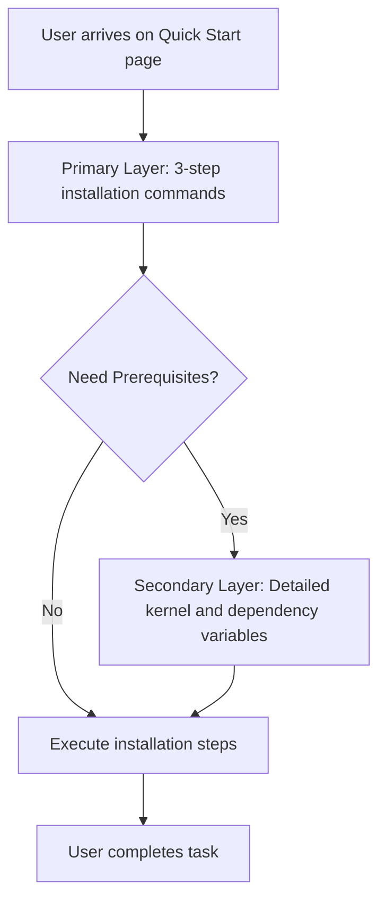

# Progressive disclosure

> A design technique that sequences information across multiple layers, presenting complex details only when needed to reduce cognitive load

---

## The logic of layered information

Progressive disclosure sequences information across multiple screens, steps, or layers. Rather than bombarding a user with every available technical detail, you surface essential data first and defer granular or rarely used information to secondary layers, such as expandable sections (accordions), subpages, or modals.

This approach acknowledges the limits of human cognitive load. When information architecture (IA) mirrors a user's workflow, it transforms an overwhelming data dump into a guided narrative. By analyzing your audience, you can separate the "must-know" (functional requirements) from the "nice-to-know" (optimization parameters), ensuring advanced procedures don't obstruct the critical path.

---

## The cost of the "Wall of Text"

Ignoring this principle creates friction for both User Experience (UX) and Developer Experience (DX). Documentation fails when it forces installation steps, configuration variables, API schemas, and troubleshooting tips onto a single, flat hierarchy. This lack of prioritization obscures critical commands and leads to "choice paralysis," where users abandon a product because they cannot identify the entry point.

Integrating progressive disclosure lowers the barrier to entry. It allows new users to onboard via streamlined instructions while keeping advanced configurations accessible via toggles or deep links for power users.

!!! danger "The cost of information overload"
    Overwhelmed users often miss critical instructions. When information density is too high, the signal-to-noise ratio drops, leading to increased integration failures and a higher volume of support tickets.

---

## Core components

Tiered structures manage information density by categorizing content into three functional parts:

*   **Primary layer:** The default view. It contains high-level summaries and standard use cases that satisfy the "80% use case."
*   **Disclosure trigger:** Interactive UI elements—such as "Advanced" toggles, "Details" tags, or "Read More" links—that signal the presence of deeper content.
*   **Secondary layer:** The deferred content, including comprehensive reference tables, edge cases, or low-level parameters revealed only upon user interaction.

---

## Design pattern example

The following diagram illustrates the logic flow of a user navigating a Quick Start guide with nested prerequisites.



Compare these two approaches to configuration blocks:

=== "Before (No disclosure)"
    To configure the application, edit the `config.yaml` file. You must specify your basic connection settings. You can also configure the advanced TLS handshake timeout, the maximum connection retries, and the custom path to your local Certificate Authority (CA) bundle. 

    ```yaml
    # Essential Settings
    host: "api.example.com"
    port: 443

    # Advanced Settings (Rarely modified)
    tls_handshake_timeout: 10
    max_retries: 5
    ca_bundle_path: "/etc/ssl/certs/ca-certificates.crt"
    ```

=== "After (With progressive disclosure)"
    To configure the application, edit the `config.yaml` file to specify your host and port.

    ```yaml
    host: "api.example.com"
    port: 443
    ```

    ??? note "Show advanced TLS and security settings"
        Append these parameters to your `config.yaml` only if you are operating within a restricted corporate network or a custom private cloud.
        
        ```yaml
        # Timeouts are in seconds
        tls_handshake_timeout: 10
        max_retries: 5
        ca_bundle_path: "/etc/ssl/certs/ca-certificates.crt"
        ```

### Impact on readability
The improved example reduces the visual "weight" of the initial setup. By moving secondary parameters into an expandable container, the standard user can complete the task without parsing variables irrelevant to their environment.

---

## Implementation best practices

*   **Target the 80th percentile:** Design the primary layer for the vast majority of users. Use telemetry or usability data to confirm which details are essential for the initial "Aha!" moment.
*   **Write descriptive triggers:** Avoid generic "More info" labels. Use action-oriented text such as "View advanced configuration variables" or "Check system requirements."
*   **Maintain local context:** Use UI controls like tabs or accordions to reveal information in-place. Redirecting a user to a new page for a single variable adds unnecessary interaction cost and breaks their workflow.
*   **Maintain Searchability:** Ensure that content hidden within disclosure elements remains indexable by site search and SEO crawlers.

---

## Common anti-patterns

*   **The hide-and-seek setup:** Never hide mandatory steps or "breaking change" warnings behind a toggle. If a user cannot succeed without the information, it is primary content.
*   **The empty disclosure:** Avoid forcing a click for low-value content. If a container holds only a single line of text, the interaction cost outweighs the benefit of hiding it.
*   **Deep Nesting:** Avoid "Inception-style" disclosure (toggles within toggles). This obscures information so deeply that users lose their orientation within the documentation.

---

## Validation and testing

*   **Cognitive walkthroughs:** Ask a participant to complete a task and observe whether they naturally find the disclosure triggers or if they overlook secondary details critical to their specific environment.
*   **Heatmap Analysis:** Use tools to see if users are actually clicking your "Show More" triggers. If the interaction rate is near zero, the content may be redundant; if it is 100%, the content belongs in the primary layer.