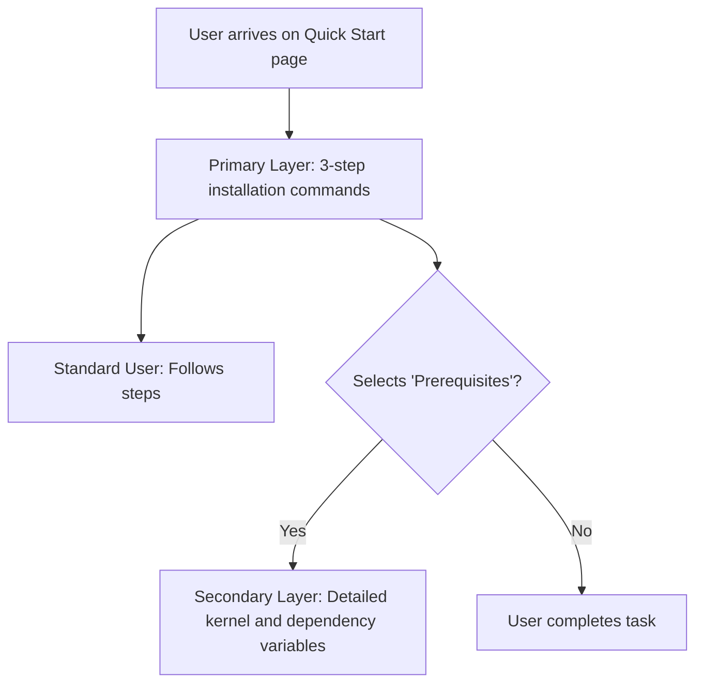

# Progressive disclosure

> An interaction design technique that presents complex or detailed information only when needed to prevent user cognitive load and improve focus

---

## What is progressive disclosure?

Progressive disclosure is a technique in interaction and information design that sequences information across multiple screens, steps, or layers. By presenting only essential details at the start, you help users focus on their immediate tasks. You can defer technical details or rarely used information to a secondary layer, such as an expandable section, a subpage, or a tooltip.

This pattern follows cognitive load theory, which recognizes that the human brain can process only a limited amount of information at one time. When you apply this to information architecture and content strategy, you transform the user experience from an overwhelming data dump into a guided journey. Through audience analysis, you can categorize information based on what users need to know immediately versus what they need to know only for advanced procedures.

---

## Why it matters

When technical documentation ignores this principle, it harms both the product experience (PX) and the developer experience (DX). A common failure is the "wall of text," where a page contains installation steps, configuration variables, API schemas, and troubleshooting tips all at once. This lack of hierarchy leads to poor readability and makes it harder for users to find specific commands.

Without progressive disclosure, users might experience choice paralysis, which often leads them to abandon the product. Integrating this pattern increases content scannability and lowers the barrier to entry. New users can onboard quickly with streamlined instructions, while experienced users can still access advanced configurations through toggles or links.

!!! danger "The cost of information overload"
    When users are overwhelmed by too much information on a single page, they might miss critical instructions. This leads to errors, integration failures, and more support tickets.

---

## Core principles

A successful progressive disclosure pattern relies on a tiered structure that respects user intent and task complexity.

*   **Primary layer:** The default view. It contains high-level summaries, essential steps, or standard use cases that address the needs of most users.
*   **Disclosure trigger:** An interactive UI element—such as a link, tab, button, or expandable section—that indicates more information is available.
*   **Secondary layer:** Detailed content, advanced options, reference tables, or edge cases revealed only when the user interacts with the trigger.

---

## Design pattern example

The following diagram shows how progressive disclosure manages information density. The primary layer shows a three-step quick start, while advanced system prerequisites are deferred to an expandable container.



To see this pattern in technical writing, compare the following tabs to see how a dense configuration block becomes a task-focused layout.

=== "Before (No disclosure)"
    To configure the application, edit the `config.yaml` file. You must specify your basic connection settings. You can also configure the advanced TLS handshake timeout, the maximum connection retries, and the custom path to your local Certificate Authority (CA) bundle. 

    ```yaml
    # Essential Settings
    host: "api.example.com"
    port: 443

    # Advanced Settings (Rarely modified)
    tls_handshake_timeout: 10
    max_retries: 5
    ca_bundle_path: "/etc/ssl/certs/ca-certificates.crt"
    ```

=== "After (With progressive disclosure)"
    To configure the application, edit the `config.yaml` file to specify your host and port.

    ```yaml
    host: "api.example.com"
    port: 443
    ```

    ??? note "Show advanced TLS and security settings"
        Only modify these parameters if you are operating within a restricted corporate network or a custom private cloud.
        
        ```yaml
        # Timeouts are in seconds
        tls_handshake_timeout: 10
        max_retries: 5
        ca_bundle_path: "/etc/ssl/certs/ca-certificates.crt"
        ```

### Pattern breakdown

In the improved example, a standard user sees only the two lines of configuration needed to run the software. The advanced options are inside a collapsible block. This preserves scannability and ensures that advanced options do not distract the reader.

---

## Cognitive impact and user experience

By sequencing information, you design for specific user goals:

- **Enhanced focus on primary workflows:** Users complete basic onboarding tasks without distraction from edge cases, resulting in faster time-to-value.
- **Improved retention of technical steps:** Presenting information in bite-sized, contextual steps makes it easier for users to absorb and remember complex procedures.

---

## Implementation best practices

Apply these rules when designing layouts or writing content:

- **Identify the audience majority:** Design the primary layer to satisfy at least 80 percent of your readers. Use usability testing to confirm what information is essential.
- **Use descriptive triggers:** Do not label a trigger "More info" or "Click here." Instead, use specific, action-oriented labels like `==Show TLS configuration variables==` or `^^Review database prerequisites^^`.
- **Follow minimalist instruction guidelines:** Write short, action-focused steps for the main path. Move long conceptual explanations to external reference pages or collapsible sidebars.
- **Maintain local context:** When disclosing secondary information, keep the user on the same page using UI controls like tabs or expandable blocks rather than redirecting them to a new page.

---

## Common anti-patterns

Avoid these mistakes when structuring your content:

- **The hide-and-seek setup:** Do not hide critical, mandatory installation steps behind a toggle. If a user needs the information to succeed, it belongs in the primary layer.
- **The empty disclosure:** Do not force users to click or expand a container to find only a single sentence or low-value content. This introduces unnecessary friction.

---

## How to validate and test usability

Use these strategies to verify that your progressive disclosure patterns are effective:

- **Run a cognitive walkthrough:** Ask a participant to complete a standard procedure. Observe whether they naturally interact with your disclosure triggers or if they miss secondary details.
- **Conduct a think-aloud study:** Have users read through a page and talk through their thought process. If they feel overwhelmed or confused by too many options, increase the level of progressive disclosure.