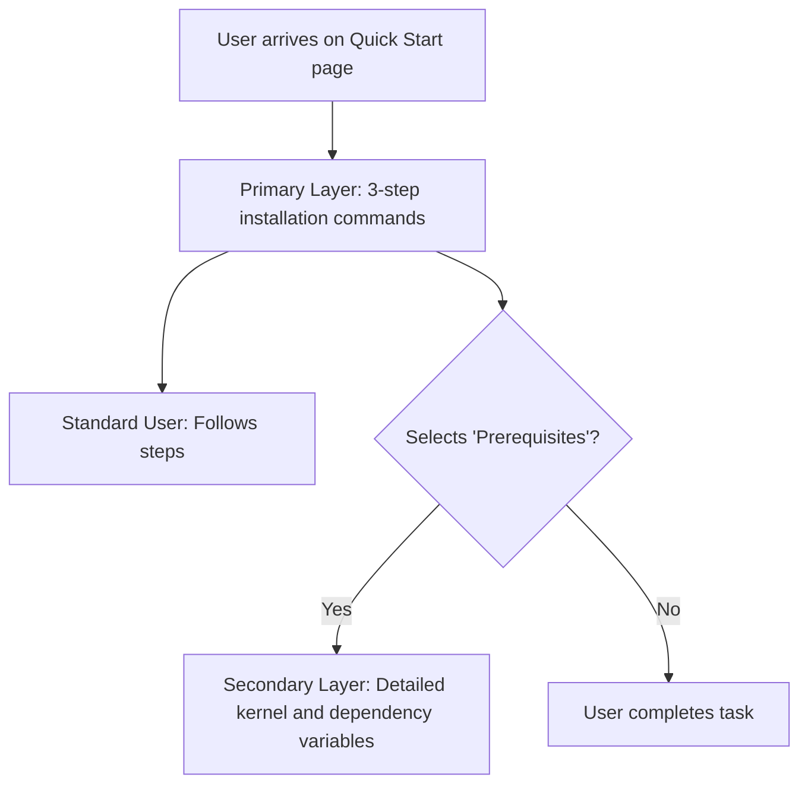

# Progressive disclosure

> A design technique that sequences information across multiple layers, presenting complex details only when needed to reduce cognitive load

---

## The logic of layered information

Progressive disclosure sequences information across multiple screens, steps, or layers. Rather than bombarding a user with every available technical detail, you surface essential data first and defer granular or rarely used information to secondary layers, such as expandable sections, subpages, or tooltips.

This approach acknowledges the limits of human cognitive load. When information architecture mirrors a user's actual workflow, it transforms an overwhelming data dump into a guided narrative. By analyzing your audience, you can separate the "need to know" from the "nice to know," ensuring advanced procedures don't obstruct basic tasks.

---

## The cost of the "Wall of Text"

Ignoring this principle creates friction for both Product Experience (PX) and Developer Experience (DX). Documentation often fails when it forces installation steps, configuration variables, API schemas, and troubleshooting tips onto a single, flat page. This lack of hierarchy obscures critical commands and leads to "choice paralysis," where users abandon a product because they cannot find a clear starting point.

Integrating progressive disclosure lowers the barrier to entry. It allows new users to onboard via streamlined instructions while keeping advanced configurations accessible via toggles or deep links for power users.

!!! danger "The cost of information overload"
    Overwhelmed users often miss critical instructions. When information density is too high, errors and integration failures increase, leading to a higher volume of support tickets.

---

## Core components

Tiered structures allow for manageable information density by categorizing content into three distinct parts:

*   **Primary layer:** The default view. It contains high-level summaries and standard use cases that satisfy the majority of readers.
*   **Disclosure trigger:** Interactive UI elements—links, tabs, or buttons—that signal the presence of deeper content.
*   **Secondary layer:** The "hidden" content, including reference tables, edge cases, or advanced parameters revealed only upon interaction.

---

## Design pattern example

This diagram illustrates how to manage density by deferring system-level prerequisites to an expandable container.



Compare these two approaches to configuration blocks:

=== "Before (No disclosure)"
    To configure the application, edit the `config.yaml` file. You must specify your basic connection settings. You can also configure the advanced TLS handshake timeout, the maximum connection retries, and the custom path to your local Certificate Authority (CA) bundle. 

    ```yaml
    # Essential Settings
    host: "api.example.com"
    port: 443

    # Advanced Settings (Rarely modified)
    tls_handshake_timeout: 10
    max_retries: 5
    ca_bundle_path: "/etc/ssl/certs/ca-certificates.crt"
    ```

=== "After (With progressive disclosure)"
    To configure the application, edit the `config.yaml` file to specify your host and port.

    ```yaml
    host: "api.example.com"
    port: 443
    ```

    ??? note "Show advanced TLS and security settings"
        Only modify these parameters if you are operating within a restricted corporate network or a custom private cloud.
        
        ```yaml
        # Timeouts are in seconds
        tls_handshake_timeout: 10
        max_retries: 5
        ca_bundle_path: "/etc/ssl/certs/ca-certificates.crt"
        ```

### Impact on readability
The improved example hides complexity from the standard user, preserving the scannability of the main configuration path. Advanced options remain available but do not distract from immediate onboarding.

---

## Implementation best practices

Effective disclosure requires intentional content placement and clear signaling:

*   **Target the 80th percentile:** Design the primary layer for the vast majority of users. Use usability data to confirm which details are truly essential for the initial "Aha!" moment.
*   **Write descriptive triggers:** Avoid generic "More info" labels. Use action-oriented text like `==Show TLS configuration variables==` or `^^Review database prerequisites^^`.
*   **Be brief on the main path:** Move long conceptual explanations or edge-case warnings to sidebars or external reference pages.
*   **Maintain local context:** Use UI controls like tabs or accordions to reveal information in-place. Redirecting a user to a new page to find a single variable breaks their workflow.

---

## Common anti-patterns

*   **The hide-and-seek setup:** Never hide mandatory installation steps behind a toggle. If a user cannot succeed without the information, it belongs in the primary layer.
*   **The empty disclosure:** Avoid forcing a click for low-value content. If a container holds only one or two sentences, the friction of the interaction outweighs the benefit of hiding it.

---

## Validation and testing

To verify your disclosure patterns, observe how users interact with your triggers:

*   **Cognitive walkthroughs:** Ask a participant to complete a task and observe whether they naturally find the disclosure triggers or if they overlook secondary details critical to their success.
*   **Think-aloud studies:** If a user expresses feeling "overwhelmed" despite the use of toggles, your primary layer is likely still too dense.