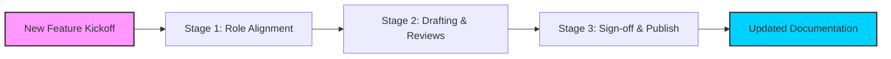

# RACI matrix

> A responsibility assignment framework mapping who is Responsible, Accountable, Consulted, and Informed across the documentation lifecycle

---

## What is a RACI matrix?

A RACI matrix is a table used to clarify project roles and responsibilities. In technical communication, you can use it to map tasks across the document development lifecycle (DDLC). The acronym represents four levels of involvement:

*   **Responsible:** The person who performs the work.
*   **Accountable:** The person with final approval authority and the one who ensures the task is completed.
*   **Consulted:** Subject matter experts (SMEs) who provide input and specialized knowledge.
*   **Informed:** Stakeholders who need updates on progress or completion but don't contribute to the task.

This framework helps coordinate work between product management, engineering, and content teams. While technical writers usually manage the matrix to improve workflows, its success depends on participation from developers, QA engineers, and release managers. Using a RACI matrix ensures that documentation stays synchronized with software releases.

---

## Why a RACI matrix matters

Using a RACI matrix adds structure to document production. Without clear ownership, documentation often lags behind software releases. A defined matrix helps you avoid "review paralysis," where too many stakeholders try to approve a single page, or "ownership gaps," where everyone assumes someone else is editing the draft. Formalizing who provides input and who holds final sign-off authority helps teams publish faster and maintain a consistent release cadence.

Manual workflows are often prone to error. An SME might ignore a review request if they don't realize they are the "Consulted" party. Likewise, a product manager might unintentionally delay a release if they don't know they are "Accountable" for the final guide. Implementing this framework establishes clear boundaries and turns document production into a predictable process.

---

## When to adopt this workflow 

As a product grows, informal communication often becomes insufficient. Implement a RACI matrix if your team faces these challenges:

- **Bottlenecked release cycles:** Software launches without user guides because the review process is slow or lacks clear ownership.
- **Content debt:** Documentation becomes outdated because no one is responsible for scheduling updates.
- **SME fatigue:** Engineers ignore requests because they receive too many unnecessary review invitations.
- **Unclear ownership:** Multiple writers or developers duplicate efforts on shared developer portals or API references.

---

## How the workflow works

This workflow organizes the lifecycle of a document from the initial scope to the final published state.

1. **Stage 1: Role alignment:** During a software release kickoff, the documentation manager creates a matrix for the upcoming deliverables. They assign engineers as **Consulted** for technical accuracy and product leaders as **Accountable** for business alignment.
2. **Stage 2: Drafting and reviews:** Technical writers (**Responsible**) draft the content. They perform a peer review and then ask the assigned SME to perform a technical review. The reviewer provides feedback in a collaborative editor or via a pull request in a version control system like [GitHub](https://github.com/){: target="_blank" rel="noopener" }.
3. **Stage 3: Sign-off and publishing:** After the technical review, the draft goes to the **Accountable** stakeholder for final sign-off. Once approved, the writer publishes the content. Automated webhooks then alert **Informed** parties, such as support or customer success teams.

??? note "Deep Dive: The RASCI Alternative"
    Some organizations use **RASCI**. The **S** stands for **Supportive**, representing team members who assist the **Responsible** party. If your team frequently uses co-authoring or collaborative editing, a Supportive role can help distribute the workload.

---

## RACI and team roles

To keep documentation pipelines moving, divide roles intentionally:

- **Responsible:** Technical writers or content engineers. They drive the DDLC, research topics, write copy, and format the output.
- **Accountable:** Documentation leads or product owners. Only one person is accountable per task. This person ensures quality and accuracy before publication.
- **Consulted:** SMEs, software engineers, and QA analysts. They provide technical source material and review drafts for correctness.
- **Informed:** Support agents, marketing specialists, and end users. They need to know when documentation is live but do not edit the content.

---

## Pipeline integration and tooling

You can automate a RACI matrix by embedding it into your software pipeline. For example, you can configure [Jira](https://www.atlassian.com/software/jira){: target="_blank" rel="noopener" } or [Asana](https://asana.com/){: target="_blank" rel="noopener" } to automatically assign roles based on the document type.

In a docs-as-code environment, use pull request templates in your version control system to enforce review guidelines. The system can block a pull request from merging until it receives an approval from the specific person mapped as **Consulted** or **Accountable**.

Additionally, use [Slack](https://slack.com/){: target="_blank" rel="noopener" } or [Microsoft Teams](https://www.microsoft.com/en-us/microsoft-teams/group-chat-software){: target="_blank" rel="noopener" } to update **Informed** stakeholders. When a document merges into the main branch, a CI/CD pipeline can trigger a webhook that notifies the relevant channels.

---

## Troubleshooting common issues

- **The "Too Many Cooks" bottleneck:** Multiple stakeholders try to act as **Accountable**, leading to conflicting feedback.  
    *Solution:* Strictly ensure only one person is **Accountable** per document. Move others to **Consulted**.
- **Ignored review requests:** SMEs ignore requests because of notification fatigue.  
    *Solution:* Use targeted alerts that tag the reviewer directly. Establish a service level agreement (SLA) for reviews and track these metrics.
- **Role decay:** The matrix becomes obsolete as people change roles or leave the company.  
    *Solution:* Store your RACI charts in a shared space like [Confluence](https://www.atlassian.com/software/confluence){: target="_blank" rel="noopener" } or [Notion](https://www.notion.so/){: target="_blank" rel="noopener" }. Review the matrix at the start of every product cycle.

---

## Key metrics for success

- **Time-to-publish:** The average time from draft completion to publication. A successful RACI implementation should reduce this time.
- **Documentation lag:** The days between a software launch and its documentation release. The goal is zero lag.
- **SME response SLA:** The percentage of technical reviews completed within the agreed timeframe (for example, 48 hours).