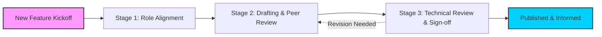

# RACI matrix

> A responsibility assignment framework mapping who is Responsible, Accountable, Consulted, and Informed across the documentation lifecycle

---

## Defining the framework

A RACI matrix clarifies project roles by mapping tasks to personnel based on four distinct involvement levels. In technical communication, this framework streamlines the document development lifecycle (DDLC) by defining the following roles:

*   **Responsible:** The individual(s) who perform the work to complete the task (e.g., writing the draft, updating the Markdown files).
*   **Accountable:** The person with final decision-making authority and sign-off. **Only one** person must be accountable for each task to ensure clear ownership.
*   **Consulted:** Subject matter experts (SMEs) whose opinions are sought; this is a two-way communication channel (e.g., developers providing technical verification).
*   **Informed:** Stakeholders who are kept up-to-date on progress or completion but do not contribute to the work; this is a one-way communication channel.

Success depends on active participation from across the organization—including engineering, QA, and product management—to keep documentation synchronized with software releases.

---

## Why ownership matters

Documentation frequently lags behind software updates when ownership is ambiguous. A defined RACI matrix prevents "review paralysis," where too many stakeholders attempt to approve the same page, and "ownership gaps," where critical drafts go unedited because everyone assumes someone else is handling them. 

By designating a developer as **Consulted** and a product manager as **Accountable**, you formalize expectations. This reduces friction in the review pipeline, ensuring that SMEs know they are providing technical accuracy while the Accountable party ensures business alignment.

---

## Signs your team needs a RACI workflow

As product complexity increases, informal check-ins often fail. Consider implementing a matrix if you recognize these symptoms:

- **Launch bottlenecks:** Software is ready for production, but user guides are stuck in a review cycle with no clear "final" approver.
- **Content debt:** Documentation becomes stale because no specific owner is tasked with the maintenance phase of the DDLC.
- **Notification fatigue:** Engineers ignore Jira tickets or pull requests because they are tagged on items where they should only be **Informed**, not **Consulted**.
- **Duplicated effort:** Multiple writers or developers unknowingly work on the same API reference because the **Responsible** party was not defined.

---

## Implementing the lifecycle

This workflow tracks a document from initial scoping to its final published state.

1. **Stage 1: Role alignment:** During kickoff, the documentation manager assigns roles. Engineers are tagged as **Consulted** for technical precision, while product leaders are **Accountable** for the accuracy of the value proposition.
2. **Stage 2: Drafting and reviews:** Technical writers (**Responsible**) draft content and initiate peer reviews. They then request a technical review from the assigned SME (**Consulted**).
3. **Stage 3: Sign-off and publishing:** Once the technical review is complete, the **Accountable** stakeholder provides the final sign-off. Following publication, automated webhooks notify **Informed** parties—such as support or marketing—that the content is live.

??? note "Variation: The RASCI Alternative"
    The **RASCI** model adds a **Supportive** (S) role. This identifies team members who assist the **Responsible** party in performing the task. This is useful for co-authoring or when a junior writer requires mentorship.

---

## Automation and pipeline integration

Embedding the RACI matrix into your toolchain prevents the framework from becoming "shelfware." 

In a docs-as-code environment, use **CODEOWNERS** files in your Git repository to enforce these roles. For example, a repository can be configured to block a PR from merging until it receives an approval from the specific person or team designated as **Accountable**. 

*   **Jira/Asana:** Automatically assign ticket owners (**Responsible**) and watchers (**Informed**) based on document type.
*   **GitHub/GitLab:** Use PR templates to list the **Consulted** SMEs and require a sign-off from the **Accountable** lead before merging.
*   **CI/CD:** Pipelines can trigger notifications to **Slack** or **Microsoft Teams** to notify the **Informed** group automatically upon a successful build and deploy.

---

## Troubleshooting

*   **The "Too Many Cooks" bottleneck:** When multiple stakeholders claim Accountability, feedback often conflicts. Ensure only one person is Accountable; reassign others to Consulted.
*   **Reviewer silence:** If **Consulted** parties ignore tags, establish a Service Level Agreement (SLA) for reviews (e.g., 48-hour turnaround) and track response metrics.
*   **Role decay:** Centralize RACI documentation in **Confluence** or **Notion** and review assignments at the start of every product cycle to account for personnel changes.

---

## Performance metrics

*   **Time-to-publish:** Total duration from initial draft to live site.
*   **Documentation lag:** The gap (in days) between a feature release and its corresponding documentation update.
*   **SME response rate:** The percentage of technical reviews (**Consulted**) completed within the agreed SLA.