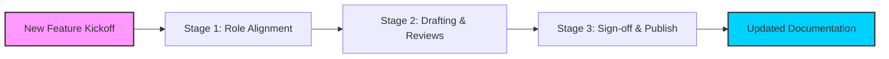

# RACI matrix

> A responsibility assignment framework mapping who is Responsible, Accountable, Consulted, and Informed across the documentation lifecycle

---

## Defining the framework

A RACI matrix clarifies project roles by mapping specific tasks to personnel based on four distinct involvement levels. In technical communication, this framework streamlines the document development lifecycle (DDLC) by ensuring every stakeholder knows their specific contribution:

*   **Responsible:** The individual(s) performing the work or writing the content.
*   **Accountable:** The owner with final sign-off authority; only one person can hold this role per task.
*   **Consulted:** Subject matter experts (SMEs) providing technical input or specialized knowledge.
*   **Informed:** Stakeholders who receive progress updates but do not participate in the drafting process.

Success depends on active participation from across the organization—including engineering, QA, and product management—to keep documentation synchronized with software releases.

---

## Why ownership matters

Documentation frequently lags behind software updates when ownership is ambiguous. A defined RACI matrix prevents "review paralysis," where too many stakeholders attempt to approve the same page, and "ownership gaps," where critical drafts go unedited because everyone assumes someone else is handling them. Formalizing these boundaries turns document production into a predictable, scalable process rather than an ad-hoc effort.

SMEs often ignore review requests when they lack a clear mandate. By designating a developer as "Consulted" and a product manager as "Accountable," you assign specific expectations to their time, reducing friction and ensuring a consistent release cadence.

---

## Signs your team needs a RACI workflow

As product complexity increases, informal check-ins through chat or email often fail. Consider implementing a matrix if you recognize these symptoms:

- **Launch bottlenecks:** Software is ready for production, but user guides are stuck in an undefined review cycle.
- **Content debt:** Documentation becomes stale because no specific owner is tasked with maintenance.
- **Notification fatigue:** Engineers ignore Jira tickets or pull requests because they receive too many irrelevant review invitations.
- **Duplicated effort:** Multiple writers or developers unknowingly work on the same API reference or portal page.

---

## Implementing the lifecycle

This workflow tracks a document from initial scoping to its final published state.

1. **Stage 1: Role alignment:** During kickoff, the documentation manager assigns roles for specific deliverables. Engineers are tagged as **Consulted** for technical precision, while product leaders are **Accountable** for business accuracy.
2. **Stage 2: Drafting and reviews:** Technical writers (**Responsible**) draft the content and initiate peer reviews. They then request a technical review from the assigned SME, often via a pull request in a system like [GitHub](https://github.com/){: target="_blank" rel="noopener" }.
3. **Stage 3: Sign-off and publishing:** Once the technical review is complete, the **Accountable** stakeholder provides the final "green light." Following publication, automated webhooks notify **Informed** parties—such as support or marketing—that the new content is live.

??? note "Variation: The RASCI Alternative"
    The **RASCI** model adds a **Supportive** (S) role. This identifies team members who assist the **Responsible** party. This is particularly useful in co-authoring environments or when a junior writer requires mentorship from a senior lead.

---

## Automation and pipeline integration

Embedding the RACI matrix into your existing toolchain prevents the framework from becoming "shelfware." Project management tools like [Jira](https://www.atlassian.com/software/jira){: target="_blank" rel="noopener" } or [Asana](https://asana.com/){: target="_blank" rel="noopener" } can automatically assign ticket owners based on document type.

In a docs-as-code environment, use pull request (PR) templates to enforce these roles. For example, a repository can be configured to block a PR from merging until it receives an approval from the specific person designated as "Accountable." Once merged, CI/CD pipelines can trigger notifications to [Slack](https://slack.com/){: target="_blank" rel="noopener" } or [Microsoft Teams](https://www.microsoft.com/en-us/microsoft-teams/group-chat-software) to keep the "Informed" group updated without manual emails.

---

## Troubleshooting

*   **The "Too Many Cooks" bottleneck:** When multiple stakeholders try to claim Accountability, feedback often conflicts. Ensure only one person is Accountable; reassign others to Consulted.
*   **Reviewer silence:** If SMEs ignore tags, establish a Service Level Agreement (SLA) for reviews (e.g., 48-hour turnaround) and track these metrics in your sprint reports.
*   **Role decay:** Charts become obsolete as staff members move. Centralize RACI documentation in [Confluence](https://www.atlassian.com/software/confluence){: target="_blank" rel="noopener" } or [Notion](https://www.notion.so/){: target="_blank" rel="noopener" } and review assignments at the start of every product cycle.

---

## Performance metrics

*   **Time-to-publish:** The duration from initial draft to live site.
*   **Documentation lag:** The gap (in days) between a feature release and its corresponding documentation update.
*   **SME response rate:** The percentage of technical reviews completed within the agreed SLA.