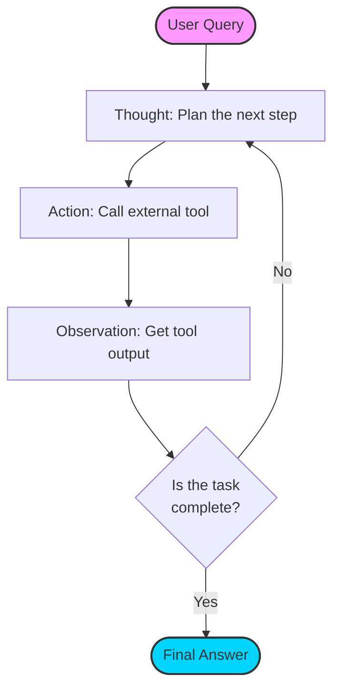

# ReAct Pattern

> A design framework that helps large language models solve complex problems by combining step-by-step reasoning with external actions

---

The ReAct (Reasoning and Acting) pattern forces large language models (LLMs) to alternate between generating explicit reasoning traces and executing discrete actions. While traditional prompting relies on a model's internal weights to generate a response in a single pass, ReAct allows the model to interact with external environments—such as APIs, databases, or search engines—to retrieve live data or perform computations before finalizing an answer.

This iterative loop solves two primary issues in LLM deployment: logical "hallucinations" and information staleness. By requiring the model to "think" before it "acts," the pattern creates a transparent execution log that helps developers debug why a model chose a specific path.

---

## Mechanics of the ReAct loop

The framework operates as a cycle that continues until the model determines the user's request is satisfied.

*   **Thought:** The model documents its internal logic, analyzes the current state of the problem, and plans the next necessary move. This step ensures the model doesn't skip logical jumps.
*   **Action:** The model calls a predefined tool (e.g., a SQL query or a web search) using specific parameters.
*   **Observation:** The system feeds the output of the tool back into the prompt context. The model then evaluates this new information to decide if it needs to loop again or provide a final answer.

---

## Design pattern example

The following diagram illustrates the flow from initial query to final resolution.

### Execution trace breakdown

In this example, an agent verifies system status rather than guessing based on its training data:

**User Input:** Verify if the API endpoint `/v1/users` is currently active.

**Thought 1:** I need to check the system configuration database to verify the status of `/v1/users`.
**Action 1:** `database_lookup("/v1/users")`
**Observation 1:** `{"status": "deprecated", "replacement": "/v2/users", "active": false}`

**Thought 2:** The database shows `/v1/users` is deprecated. To be helpful, I should check if the replacement, `/v2/users`, is functional.
**Action 2:** `endpoint_validator("/v2/users")`
**Observation 2:** `{"status_code": 200, "response_time": "45ms", "active": true}`

**Thought 3:** I have confirmed the status of both the requested and the replacement endpoints.
**Final Answer:** The endpoint `/v1/users` is inactive and deprecated. It has been replaced by `/v2/users`, which is currently operational (Status 200).

??? note "Prompting Requirements"
    To implement this, the system prompt must include a strict schema for tools and a few-shot example showing the `Thought / Action / Observation` format. Without explicit formatting instructions, models often merge these steps, breaking the parser.

---

## Implementation best practices

Effective ReAct implementation requires more than just a loop; it needs guardrails to prevent high latency or cost.

- **Strict Tool Schemas:** Use clear, unambiguous descriptions for every tool. If the model doesn't understand the tool's purpose, it will choose the wrong one or hallucinate parameters.
- **Loop Termination:** Implement a hard limit on iterations (e.g., 5 loops). Without this, an agent might enter an infinite loop if a tool returns an error or a recursive result.
- **Parser Guards:** Models occasionally hallucinate the action format (e.g., forgetting a closing bracket). Use a robust parser to catch these errors and prompt the model for a correction rather than failing the execution.

---

## Common anti-patterns

- **The Infinite Reasoner:** Forcing unnecessary reasoning for simple tasks. If a query is direct, the model should be allowed to jump to the final answer to save tokens.
- **Blind Action Execution:** Skipping the "Thought" step. Omitting the reasoning trace makes it nearly impossible to audit the model's logic when it selects an incorrect tool.

---

## Validation and usability

When testing a ReAct-powered agent, prioritize the **latency-to-value ratio**. Every tool call adds time and cost. If an agent takes four iterations to answer a simple question, the tool descriptions likely need better clarity. For the end-user, consider hiding the "Thought" and "Observation" logs behind an expandable UI element to provide transparency without cluttering the final output.