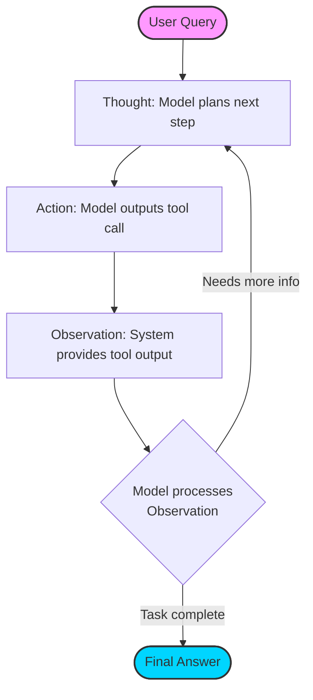

# ReAct Pattern

> A design framework that helps large language models solve complex problems by combining step-by-step reasoning with external actions

---

The ReAct (Reasoning and Acting) pattern enables large language models (LLMs) to alternate between generating explicit reasoning traces and executing discrete actions. While traditional prompting relies on a model's internal weights to generate a response in a single pass, ReAct allows the model to interact with external environments—such as APIs, databases, or search engines—to retrieve live data or perform computations.

This iterative loop mitigates two primary issues in LLM deployment: logical "hallucinations" (by grounding reasoning in facts) and information staleness (by accessing real-time data). By requiring the model to "think" before it "acts," the pattern creates a transparent execution log that helps developers audit the model's decision-making process.

---

## Mechanics of the ReAct loop

The framework operates as a cycle where the model's output is parsed to trigger external execution, the results of which are fed back into the prompt context.

*   **Thought:** The model generates a reasoning trace documenting its internal logic, analyzing the current state, and planning the next action.
*   **Action:** The model outputs a specific command or function call (e.g., a JSON-formatted tool call or a string like `Search[query]`) intended for an external executor.
*   **Observation:** The external system executes the action and appends the result back into the model's context window. The model then processes this observation to determine the next step.

---

## Design pattern example

The following diagram illustrates the iterative flow. Note that the "Decision" logic resides within the LLM's next generation cycle after receiving an observation.

### Execution trace breakdown

In this example, an agent verifies system status using a database and a validation tool:

**User Input:** Verify if the API endpoint `/v1/users` is currently active.

**Thought 1:** I need to check the system configuration database to verify the status of `/v1/users`.
**Action 1:** `database_lookup(endpoint="/v1/users")`
**Observation 1:** `{"status": "deprecated", "replacement": "/v2/users", "active": false}`

**Thought 2:** The database indicates `/v1/users` is inactive and deprecated. I should now check if the replacement, `/v2/users`, is functional to provide a complete answer.
**Action 2:** `endpoint_validator(endpoint="/v2/users")`
**Observation 2:** `{"status_code": 200, "response_time": "45ms", "active": true}`

**Thought 3:** I have confirmed that `/v1/users` is inactive and its replacement `/v2/users` is active. I can now provide the final response.
**Final Answer:** The endpoint `/v1/users` is inactive and deprecated. It has been replaced by `/v2/users`, which is currently operational (Status 200).

??? note "Prompting Requirements"
    ReAct requires a system prompt that defines a strict execution grammar (e.g., `Thought:`, `Action:`, `Observation:`, `Final Answer:`). It often utilizes few-shot prompting to demonstrate the interleaved format. Modern models with native "Function Calling" capabilities effectively implement a structured version of the Action/Observation loop.

---

## Implementation best practices

- **Strict Tool Schemas:** Use JSON Schema or similar structured definitions. Clear descriptions prevent the model from hallucinating non-existent parameters or selecting the wrong tool for the task.
- **Maximum Iteration Limit:** Implement a hard "kill-switch" (e.g., 5–10 loops). This prevents infinite loops and runaway costs if the model encounters recursive logic or a tool consistently returns errors.
- **Context Window Management:** Every ReAct loop appends new `Thought`, `Action`, and `Observation` text to the prompt. For long-running tasks, implement a strategy to prune or summarize earlier steps to stay within token limits.
- **Robust Parsing:** Use regex or structured output parsing to extract the `Action` from the model's text. If the model fails the format, feed the parsing error back into the loop as an `Observation` so the model can self-correct.

---

## Common anti-patterns

- **The Infinite Reasoner:** Forcing complex reasoning for trivial queries (e.g., "Hello"). Allow the model to bypass the loop and provide a `Final Answer` immediately if no action is required.
- **The Observation Gap:** Failing to handle empty or error-heavy observations. If a tool returns no data, the model may hallucinate a result unless the prompt instructs it on how to handle "null" observations.

---

## Validation and usability

When testing a ReAct-powered agent, prioritize the **cost-to-resolution ratio**. Every iteration incurs LLM inference costs and adds latency. If an agent consistently requires multiple "Thoughts" to reach an obvious conclusion, the system prompt or tool descriptions likely need refinement to reduce ambiguity.