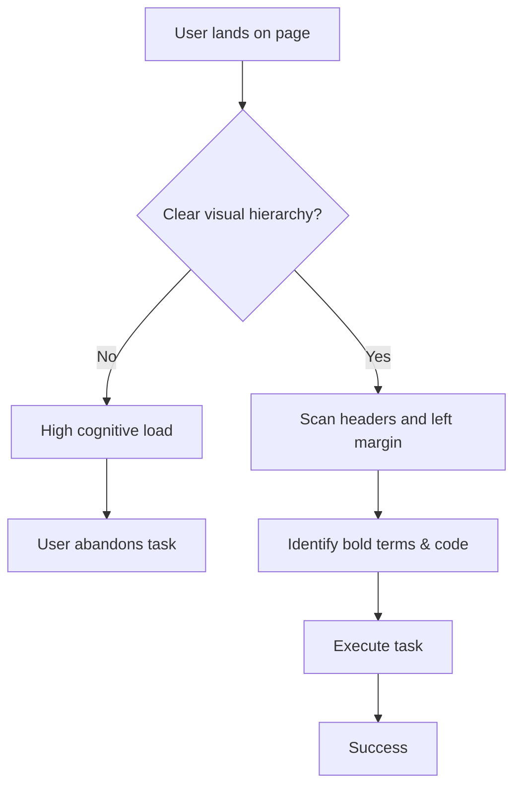

# Scannability

> *The strategic arrangement of text and visuals to help readers quickly identify, filter, and extract key information from digital content*

---

## Understanding scannability

Scannability determines how effectively a reader can evaluate the relevance of a document in seconds. Unlike the linear progression of printed media, digital reading is selective. Users, particularly engineers and product teams, do not read manuals from beginning to end. They search for specific keywords, application programming interface (API) parameters, or code snippets to complete a task. 

This behavior is rooted in [cognitive load theory](https://en.wikipedia.org/wiki/Cognitive_load){: target="_blank" rel="noopener" }. Working memory is finite; therefore, large blocks of text force the brain to expend energy filtering noise. Content design manages this fatigue by using a visual hierarchy to prioritize details before the reader processes a single sentence.

---

## Why it matters

Dense text reduces usability. When information is difficult to find, users experience cognitive fatigue, which can lead to skipped steps, abandoned integrations, or unnecessary support tickets. 

Prioritizing scannability demonstrates respect for the audience. It acknowledges that some users require a comprehensive tutorial while others only need a quick syntax reminder. A logical structure and generous white space accommodate both. By using active-voice instructions and concise paragraphs, you lower the barrier to entry and build trust through efficiency.

---

## Core components

Effective scannability relies on four structural pillars:

-   **Heading hierarchy:** Sequential levels (H2, H3, H4) provide a visual roadmap. To maintain accessibility for screen readers, do not skip heading levels. For example, do not jump from H2 to H4.
-   **Information chunking:** Breaking concepts into modular units or bulleted lists (ideally three to seven items) prevents cognitive overload.
-   **Visual semantic markers:** Use **bold** for user interface (UI) elements, such as buttons and menus, and `inline code` for technical parameters, file names, or paths. Use callouts for high-priority tips or warnings.
-   **Intentional white space:** Proper margins and padding guide the eye and prevent visual congestion.

---

## Design patterns

Transforming a dense block into scannable steps improves task completion rates.

=== "Before (Unscannable)"
    To configure the authentication system, you must first locate the config directory in your project root, open the config.json file, and add your secret API key to the "auth_key" field, but make sure you do not commit this file to your public repository because exposing your key is a security risk that could compromise your infrastructure.

=== "After (Scannable)"
    **To configure authentication:**

    1. Locate the `config/` directory in your project root.
    2. Open `config.json`.
    3. Add your secret API key to the `auth_key` field.

    !!! danger "Security Risk"
        **Do not commit this file to a public repository.** Exposed keys can compromise your infrastructure.

### The scanning path

The diagram below illustrates the decision logic a user follows based on content structure.

The scannable example works because it isolates actions from risks. A user who is scanning the content might overlook a warning at the end of a long sentence, but they are unlikely to miss a styled danger callout.

---

## Implementation strategy

Use these tactics to refine your content:

-   **Front-load keywords:** Start headings and list items with the most important nouns or verbs. For example, use "Configuring Webhooks" instead of "How to make sure your webhooks are configured."
-   **The three-sentence rule:** Aim for paragraphs no longer than three or four sentences to maintain white space.
-   **Contextual link text:** Avoid "click here." Use descriptive labels that explain the destination, such as "See the Authentication API reference."
-   **Avoid excessive bolding:** Highlight only the most critical terms. Too much bolding creates visual noise that defeats the purpose of highlighting.

---

## Common anti-patterns

-   **Large blocks of text:** Unbroken sections that require linear reading.
-   **Visual clutter:** Too many callouts, colors, or highlights competing for attention. If every element is emphasized, the emphasis loses its effectiveness.
-   **Vague headings:** Using generic headers such as "Overview" or "Next Steps" repeatedly without context.

---

## Testing for clarity

-   **The five-second squint test:** Squint until the text blurs. If you can still distinguish the headers and callouts, the layout is effective.
-   **Timed navigation:** Challenge a user to find a specific error code or parameter within 10 seconds. If they must read the body text to find it, the scannability is insufficient.