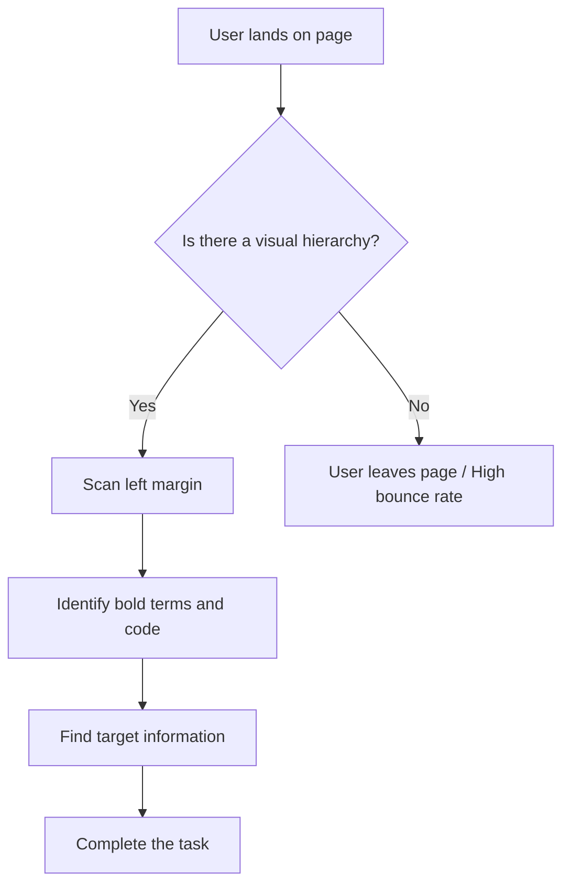

# Scannability

> The practice of organizing digital content so users can quickly locate key information without reading every word on the page

---

## What is scannability?

Scannability is how you arrange text and visuals to help readers evaluate a document's relevance in seconds. Unlike printed media, where people often read linearly, digital readers browse selectively. 

In technical documentation, software engineers and product teams rarely read a manual from start to finish. Instead, they scan for keywords, API parameters, or code snippets to solve an immediate problem. When you prioritize scannability, you align content with how the brain processes digital layouts, making your documentation more efficient.

This approach is based on [cognitive load theory](https://en.wikipedia.org/wiki/Cognitive_load){: target="_blank" rel="noopener" }. The human brain has a limited amount of working memory to process information. A "wall of text" forces the reader to exert significant mental effort to find key concepts. Content design reduces this burden by using a clear visual hierarchy to help the brain filter and prioritize details before the reader begins to process the text.

---

## Why scannability matters

Poor scannability reduces usability. If readers face dense blocks of text, they experience cognitive fatigue and often stop reading. If a developer cannot find an integration step quickly, they might abandon your product, file a support ticket, or look for a competitor’s solution.

Designing for scannability is a key part of audience analysis. It recognizes that users have different goals: some need a quick reference, while others need a tutorial. Scannability serves both. Using a logical heading structure and whitespace respects the reader's time. Clear, active-voice instructions and brief paragraphs keep content easy to scan, which helps lower support costs and build trust in your brand.

---

## Core principles and anatomy

To create scannable documentation, use the following structural elements:

*   **Heading hierarchy:** Use sequential heading levels (H2, H3, H4) to create a visual roadmap and show how sections relate to each other.
*   **Information chunking:** Break long paragraphs into smaller, modular units. Use bulleted lists of three to five items to reduce cognitive fatigue.
*   **Visual highlights:** Use **bold** for UI elements and `inline code` for file names or parameters. Use callouts (admonitions) to highlight warnings or tips.
*   **Whitespace:** Use margins and padding between elements to separate ideas and guide the eye.

---

## Design pattern example

The following example shows how scannability principles transform a dense paragraph into clear instructions.

=== "Before (Unscannable)"
    To configure the authentication system, you must first locate the config directory in your project root, open the config.json file, and add your secret API key to the "auth_key" field, but make sure you do not commit this file to your public repository because exposing your key is a major security risk that could compromise your infrastructure.

=== "After (Scannable)"
    To configure the authentication system, follow these steps:

    1. Locate the `/config` directory in your project root.
    2. Open the `config.json` file.
    3. Add your secret API key to the `auth_key` field.

    !!! danger "Security Risk"
        **Do not commit this file to a public repository.** Exposing your secret API key can compromise your infrastructure.

### User interaction flow

The following diagram illustrates how a user interacts with a scannable page compared to an unscannable one.

### Breakdown of the pattern

The unscannable example hides key actions and a safety warning in a complex sentence. A reader skimming the page will likely miss the warning.

The scannable version uses these design choices:
*   A clear, bold heading introduces the task.
*   A numbered list establishes the sequence of events.
*   `Inline code` formatting distinguishes system assets from the rest of the text.
*   A danger callout makes the security warning impossible to miss.

---

## Impact on user experience

Designing for scannability helps users achieve these goals:

*   **Fast evaluation:** Readers can determine within seconds if a page has the information they need.
*   **Task-based navigation:** Readers can skip irrelevant sections and go directly to the steps they need.
*   **Improved retention:** Separating core concepts from details helps users remember information.

---

## Implementation best practices

To apply these patterns to your content strategy, follow these guidelines:

*   **Front-load key terms:** Place critical verbs and technical keywords at the start of headings and list items.
*   **Keep paragraphs short:** Use no more than three or four sentences per paragraph.
*   **Use descriptive link text:** Avoid "click here." Use text that describes the link's destination.
*   **Use bolding sparingly:** Highlight only the most important UI elements or terms. Too much bolding creates visual noise.

---

## Common anti-patterns

Avoid these common mistakes:

*   **The wall of text:** Long, unbroken paragraphs that force linear reading.
*   **Visual over-saturation:** Too many highlights, bold words, and callouts on one page. This hides information rather than highlighting it.

---

## How to test usability

Verify your design using these strategies:

*   **The 5-second squint test:** Squint at your page until the text is blurry. If the headers, bold words, and code blocks still stand out, your layout is effective.
*   **Task-based testing:** Ask a user to find a specific parameter on the page within 10 seconds. Observe if they go directly to the information or get lost in the text.