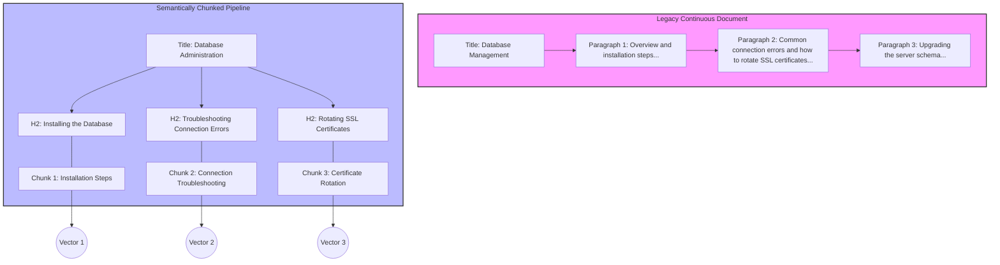

# Semantic chunking

> The practice of dividing technical documentation into standalone, context-rich units to improve readability for humans and vector retrieval for AI

---

## What is semantic chunking?

Semantic chunking is the process of dividing a long document into smaller, self-contained sections based on shifts in meaning. Unlike traditional methods that use arbitrary limits—such as word counts, page breaks, or layout constraints—semantic chunking focuses on conceptual boundaries. This approach aligns with how the human brain processes complex information by grouping individual pieces of data into cohesive, memorable units. For technical writers, this strategy transforms dense text into organized layouts that reduce a reader’s cognitive load.

As AI and semantic search systems become standard, semantic chunking serves a dual audience. Traditional documents rely on visual cues for people, but modern retrieval systems require logical separation so a **large language model (LLM)** can process information accurately. When an AI search engine indexes a document, it converts the text into mathematical representations called **vector embeddings**. If a paragraph covers multiple unrelated topics, its embedding becomes "noisy," making it harder to find. Semantic chunking ensures that each block of text retains a specific context, allowing search systems to retrieve the exact section that answers a user's query.

---

## Why semantic chunking matters

Poorly organized content creates friction for both people and automated systems. For readers, long walls of text cause fatigue and make it difficult to scan for information. When a specific command or setting is buried in a long narrative, the user experience (UX) suffers, and trust in the documentation decreases.

For programmatic systems, poorly divided documents cause search degradation. If your files are parsed using rigid character limits rather than logical shifts in meaning, the system might split critical context in half. For example, a troubleshooting step might be separated from its prerequisite warning. This separation leaves the AI model with incomplete information, leading to retrieval errors or fabricated answers (hallucinations). By organizing pages into discrete units, you optimize your content for modern **search engine optimization (SEO)** and automated agents.

---

## Core principles and anatomy

A semantically chunked document uses a predictable structure where every unit is modular and self-explanatory. Each unit must follow these principles:

*   **Single-mindedness:** A chunk must focus on one core concept, task, or argument. If a section starts discussing an unrelated workflow, move that information to its own chunk.
*   **Self-sufficiency:** Each unit must contain the context required to understand it. Use precise nouns and explicit terminology. Avoid relative pronouns, such as "this," "it," or "the previously mentioned system," which rely on context from earlier paragraphs.
*   **Explicit boundaries:** Use standard **Markdown** formatting, such as headers (H2, H3), to mark boundaries. These markers create a hierarchy that both readers and automated parser scripts can navigate.

---

## Design pattern example

The following diagram shows how to transform a continuous troubleshooting document into self-contained semantic units.

### Breakdown of the pattern

In the legacy document model, unrelated workflows like "network connection errors" and "rotating SSL certificates" are combined. An AI search system indexing this page would generate a single, "muddy" vector embedding. This makes it difficult for a search engine to find precise answers. 

When you apply semantic chunking, each subtopic becomes a distinct H2 header. The text under each header is rewritten to stand alone:

*   **Chunk 1** contains only installation instructions.
*   **Chunk 2** contains connection errors and explicitly names the database service.
*   **Chunk 3** details the security workflow with independent steps.

This structure allows the documentation processor to generate three distinct vector embeddings. When a user asks, "How do I update my database certificates?" the search agent retrieves exactly Chunk 3 and skips the unrelated installation steps.

---

## Cognitive impact and user experience

Structuring documentation this way helps you achieve the following goals:

- **Reduce search frustration:** Readers find exact answers immediately, which reduces support ticket submissions.
- **Improve task accuracy:** Readers can focus on the current action without being distracted by tangential notes or unrelated settings.

---

## Implementation best practices

To apply semantic chunking to your content, follow these rules:

- **Write descriptive, action-oriented headers:** Ensure every heading describes the content beneath it. Use active verbs for task sections (such as `## Configure authentication keys`) and nouns for conceptual sections (such as `## Authentication lifecycle`).
- **Eliminate pronoun anchors:** Scan your text for phrases like "as mentioned above" or "use this tool." Replace these with the actual name of the product or tool so the paragraph is coherent if read in isolation.
- **Use visual signposts:** Use Markdown elements like whitespace and horizontal rules to separate chunks for the human eye.
- **Keep sections modular:** Avoid combining multiple tasks. If a procedure requires a prerequisite, link to that prerequisite’s page instead of drafting the steps inline.

---

## Common anti-patterns

Watch out for these errors when designing your document structure:

- **The chronological trap:** Writing a guide as one continuous narrative timeline. While workflows have an order, flattening every step into a single, long page destroys modularity.
- **Arbitrary character splitting:** Do not rely on automated tools to split your pages at strict 500-character increments. This practice can divide paragraphs mid-sentence and cut off crucial context.

---

## How to validate and test usability

Use these methods to verify that your chunking strategy is effective:

- **The standalone isolation test:** Copy a single H2 section into a blank window and show it to a subject matter expert (SME). If they can complete the task without looking at the rest of the page, the chunk is semantically complete.
- **The visual squint test:** Open your page in a browser and squint until the text blurs. If you can still identify distinct blocks of information separated by a clear hierarchy, your layout successfully manages cognitive load.