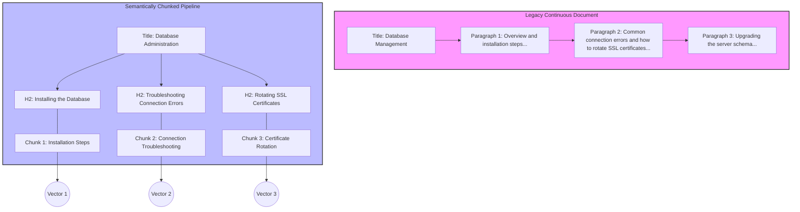

# Semantic chunking

> A documentation strategy that divides text into self-contained, meaningful units to optimize human comprehension and AI vector retrieval accuracy

---

## The logic of semantic chunking

Semantic chunking breaks long-form documentation into smaller, self-contained sections based on shifts in conceptual meaning rather than arbitrary word counts or layout constraints. This approach mirrors how the human brain processes complex data—by grouping information into cohesive, memorable units—reducing the cognitive load required to navigate dense technical instructions.

Beyond human readability, this strategy is foundational for modern retrieval-augmented generation (RAG) and semantic search. While humans rely on visual headers, AI search systems require logical separation to process information accurately. When a document is indexed, text is converted into **vector embeddings** (mathematical representations of meaning). If a single paragraph spans three unrelated topics, its embedding becomes "noisy," diluting the relevance of search results. Semantic chunking ensures every block of text maintains a singular context, allowing AI agents to retrieve the exact section that answers a specific query without returning irrelevant filler.

---

## Impact on search and UX

Poorly organized content creates friction for both people and machines. For readers, "walls of text" cause fatigue and obscure critical information like commands or warnings. When these details are buried, user trust in the documentation drops.

For programmatic systems, the stakes are equally high. Rigid character-based splitting often severs a troubleshooting step from its prerequisite warning. This leaves an AI model with incomplete data, leading to **hallucinations**—where the model fabricates answers because it lacks the full context. Organizing documentation into discrete, logical units ensures that search engines and automated agents deliver accurate, high-utility results.

---

## Core principles of a modular unit

A semantically chunked document follows a predictable, modular structure. To be effective, every unit must meet three criteria:

*   **Singular Focus:** A chunk should address one core concept or task. If a section pivots to an unrelated workflow, that transition marks the start of a new chunk.
*   **Contextual Independence:** Each unit must stand alone. Use precise nouns and explicit terminology. Avoid relative pronouns like "this system" or "the aforementioned tool," which break down when a chunk is retrieved in isolation.
*   **Structural Signposting:** Use standard **Markdown** headers (H2, H3) to define boundaries. These markers provide a navigational hierarchy for humans and act as natural anchors for automated parser scripts.

---

## Design pattern: From legacy to modular

The diagram below illustrates the transformation of a continuous troubleshooting guide into distinct semantic units.

In the legacy model, unrelated workflows like "connection errors" and "SSL rotation" are merged. This produces a "muddy" vector embedding that confuses search engines. By applying semantic chunking, each subtopic receives its own H2 header. The text is rewritten to ensure Chunk 2 explicitly names the service, and Chunk 3 details the security workflow independently. This allow a search agent to bypass installation steps and surface the exact certificate rotation steps a user requested.

---

## Implementation best practices

Effective semantic chunking requires a shift in how content is drafted:

- **Action-oriented headers:** Headings should describe the specific content beneath them. Use active verbs for tasks (e.g., `## Configure authentication keys`) and clear nouns for concepts (e.g., `## Authentication lifecycle`).
- **Remove pronoun anchors:** Replace "as mentioned above" or "use this tool" with specific names. A paragraph should remain coherent even if read out of context.
- **Maintain modularity:** Don't bundle prerequisites. If a procedure requires a previous step, link to it rather than re-writing it inline.
- **Avoid the chronological trap:** Don't write guides as a single, unbroken narrative. Even if a workflow has a sequence, each step should be a discrete unit to preserve modularity.
- **Reject arbitrary limits:** Never rely on automated tools that split text at strict character counts (e.g., every 500 characters). This practice destroys context by cutting sentences mid-thought.

---

## Validating chunk integrity

To test if a section is truly "semantic," try the **isolation test**: Copy a single H2 section into a blank document. If a subject matter expert can complete the task or understand the concept without seeing the rest of the page, the chunk is semantically complete. Additionally, use the **visual hierarchy test**: If you can identify distinct blocks of information while quickly scrolling, the layout is successfully managing the reader's cognitive load.