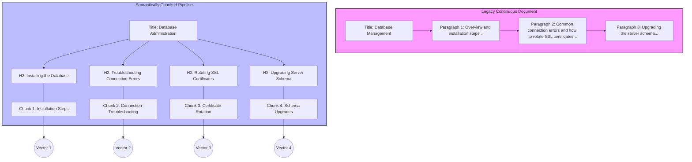

# Semantic chunking

> *A documentation strategy that divides text into self-contained, meaningful units to optimize human comprehension and AI vector retrieval accuracy*

---

## The logic of semantic chunking

Semantic chunking breaks long-form documentation into smaller, self-contained sections based on shifts in conceptual meaning rather than arbitrary word counts or layout constraints. This approach mirrors how the human brain processes complex data by grouping information into cohesive, chunked units. This method reduces the cognitive load required to navigate dense technical instructions.

In the context of retrieval-augmented generation (RAG) and semantic search, semantic chunking is a method of splitting text where the boundaries are determined by shifts in the embedding space. When a document is indexed, text is converted into vector embeddings, which are high-dimensional mathematical representations of meaning. If a single chunk spans multiple unrelated topics, its vector representation becomes a centroid of those disparate concepts, diluting its similarity score against specific queries. By ensuring each chunk maintains a singular semantic focus, developers improve the precision and recall of the retrieval pipeline, which ensures AI agents surface the most relevant context.

---

## Impact on search and user experience

Poorly organized content creates friction for both people and machines. For readers, large blocks of text cause fatigue and obscure critical information such as commands or warnings. When these details are buried, user trust in the documentation drops.

For programmatic systems, the impact is equally significant. Recursive character splitting, which involves splitting at fixed intervals, often severs a troubleshooting step from its prerequisite warning. This results in context fragmentation, which leads to model hallucinations. Hallucinations occur when a large language model (LLM) fabricates answers because the retrieved context is incomplete or lacks the necessary qualifying information. Organizing documentation into discrete, logical units ensures that search engines and LLM-based agents deliver high-fidelity results.

---

## Core principles of a modular unit

A semantically chunked document follows a modular structure where chunks are optimized for standalone utility. To be effective, every unit must meet three criteria:

- Singular Focus: A chunk should address one core concept or task. In algorithmic semantic chunking, this is often identified by monitoring the cosine distance between sentence embeddings; a spike in distance indicates a topic shift and a natural break point.
- Contextual Independence: Each unit must stand alone. Use precise nouns and explicit terminology. Avoid anaphoric references, such as "this system" or "the previously mentioned tool," which lose their referents when a chunk is retrieved in isolation.
- Structural Signposting: Use standard Markdown headers (H2, H3) to define boundaries. While AI models can use semantic similarity to split text, explicit headers provide structural hints to parsers and help humans navigate the document hierarchy.

---

## Design pattern: From legacy to modular

The diagram below illustrates the transformation of a continuous troubleshooting guide into distinct semantic units that map to individual vectors.

In the legacy model, unrelated workflows such as connection errors and Secure Sockets Layer (SSL) rotation are merged into a single paragraph. This produces a noisy vector embedding that sits between both topics, potentially failing to reach the similarity threshold for either search query. By applying semantic chunking, each subtopic is isolated. This allows a search agent to retrieve only the Certificate Rotation chunk, providing the LLM with a clean, relevant context window.

---

## Implementation best practices

Effective semantic chunking requires a shift in how content is authored and processed:

- Action-oriented headers: Headings should describe the specific content beneath them. Use active verbs for tasks, such as `## Configure authentication keys`, and clear nouns for concepts, such as `## Authentication lifecycle`.
- Resolve pronoun anchors: Replace relative pronouns with specific names. A paragraph should remain coherent even if read out of context.
- Maintain modularity: Link to prerequisites rather than assuming they are present in the context window.
- Prefer semantic over character limits: Do not rely on naive chunking, which splits at strict character counts. Use semantic splitting tools that analyze the meaning of sentences to find the optimal breakpoint.
- Metadata enrichment: Attach the document title and H1 context to each chunk metadata to preserve global context within local segments.

---

## Validating chunk integrity

To test if a section is truly semantic, apply the following:

1. The Isolation Test: Copy a single H2 section into a blank document. If a reader can complete the task without the surrounding text, the chunk is semantically complete.
2. The Cosine Similarity Check (Technical): Use an embedding model to compare sentences within a chunk. If the similarity score drops significantly at a specific point, that point likely requires a new header or a split.
3. Visual Hierarchy Test: Ensure that headers clearly delineate the start of new conceptual vectors.