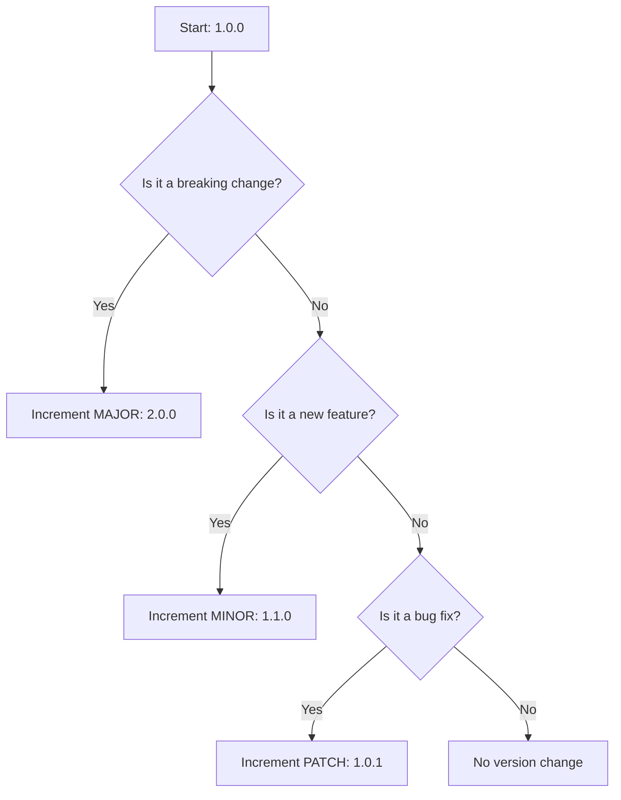

# Semantic versioning (SemVer)

> A software versioning standard using a three-part number (MAJOR.MINOR.PATCH) to communicate the impact of code changes on backwards compatibility

---

## What is semantic versioning?

[Semantic Versioning (SemVer)](https://semver.org/){: target="_blank" rel="noopener" } provides a consistent logic for numbering software releases. Developed by GitHub co-founder Tom Preston-Werner, the standard uses a three-part number—`MAJOR.MINOR.PATCH`—to tell users exactly what kind of changes a release contains. 

This system moves versioning away from arbitrary "vanity" numbers toward a functional contract. When software libraries or APIs update, dependency managers use these numbers to decide whether an update is safe to install automatically. For technical writers and developers, SemVer acts as a roadmap for documentation: a major version signals a need for a full audit of the guides, while a patch might only require a quick note in the changelog.



---

## Why semantic versioning matters

Ambiguous versioning leads to "dependency hell." If a minor update secretly changes an API endpoint's behavior, every downstream application relying on that endpoint will break. By adopting SemVer, you make your software ecosystem predictable. Automated tools can safely fetch bug fixes and performance improvements (patches) or new features (minor versions) without the risk of crashing the entire codebase. 

---

## Syntax and structure

The format consists of three non-negative integers. You can also include suffixes for pre-release versions or specific build data.

*   **MAJOR:** Incremented for incompatible API changes.
*   **MINOR:** Incremented for adding functionality that doesn't break existing integrations.
*   **PATCH:** Incremented for backwards-compatible bug fixes.
*   **Pre-release:** An optional hyphenated string (e.g., `-alpha.1`) indicating the version is not yet stable.
*   **Build metadata:** An optional string preceded by a plus sign (e.g., `+build.104`) for internal tracking.

Developers use range specifiers to manage these updates automatically:

=== "Caret (^)"
    Permits any update that does not modify the leftmost non-zero digit. For instance, `^1.2.3` allows anything up to `2.0.0`.
=== "Tilde (~)"
    Limits updates to the patch level. For instance, `~1.2.3` allows `1.2.4` and `1.2.9`, but stops at `1.3.0`.

---

## Code example

This JSON snippet demonstrates how an SDK configuration might define its own version and its requirements for other dependencies.

```json
{
  "name": "enterprise-api-client",
  "version": "3.1.2-beta.1+build.104",
  "private": false,
  "dependencies": {
    "auth-module": "^2.4.0",
    "logger": "~1.1.0"
  }
}
```

### Breakdown
*   **`3.1.2-beta.1+build.104`**: This is a beta version of the third major release. It includes one minor feature set and two patches since the major launch.
*   **`^2.4.0`**: The system will accept any version from `2.4.0` up to, but excluding, `3.0.0`.
*   **`~1.1.0`**: This restricts the environment to patch-level fixes only, preventing an automatic jump to `1.2.0`.

---

## Common pitfalls

Even with a standard, manual versioning is prone to oversight.

### "Silent" breaking changes
The most frequent error occurs when a developer fixes a bug but inadvertently changes the expected output or a variable name. Even if the intent is a "fix," any change that breaks existing user code must be labeled as a MAJOR release. Automated integration tests are the only reliable way to catch these regressions before they are tagged as a PATCH.

### Undefined public APIs
SemVer is meaningless if users don't know what parts of the code are "public." Without a clear definition of the public API, users may depend on internal helper functions that change frequently. Explicitly defining the stable boundary of your software ensures users know which parts of the system are covered by the SemVer contract.

---

## Tooling and ecosystem

Most modern development environments include built-in support for SemVer:

*   **Package Managers:** [npm](https://www.npmjs.com/), [Cargo](https://doc.rust-lang.org/cargo/), and [NuGet](https://www.nuget.org/) rely on SemVer to resolve conflicts during builds.
*   **Release Automation:** Tools like `semantic-release` analyze commit messages to automatically determine and assign the next version number, removing human error from the release process.

---

## Best practices

To maintain a stable release cycle:

- **Document the public API:** Clearly state which endpoints and methods are stable.
- **Automate increments:** Use CI/CD tools to calculate version numbers based on PR metadata.
- **Maintain a changelog:** Provide a human-readable [changelog](https://keepachangelog.com/en/1.1.0/) alongside the version numbers.
- **Deprecate before breaking:** Use console warnings to alert users of upcoming changes several minor versions before the major release that removes the feature.