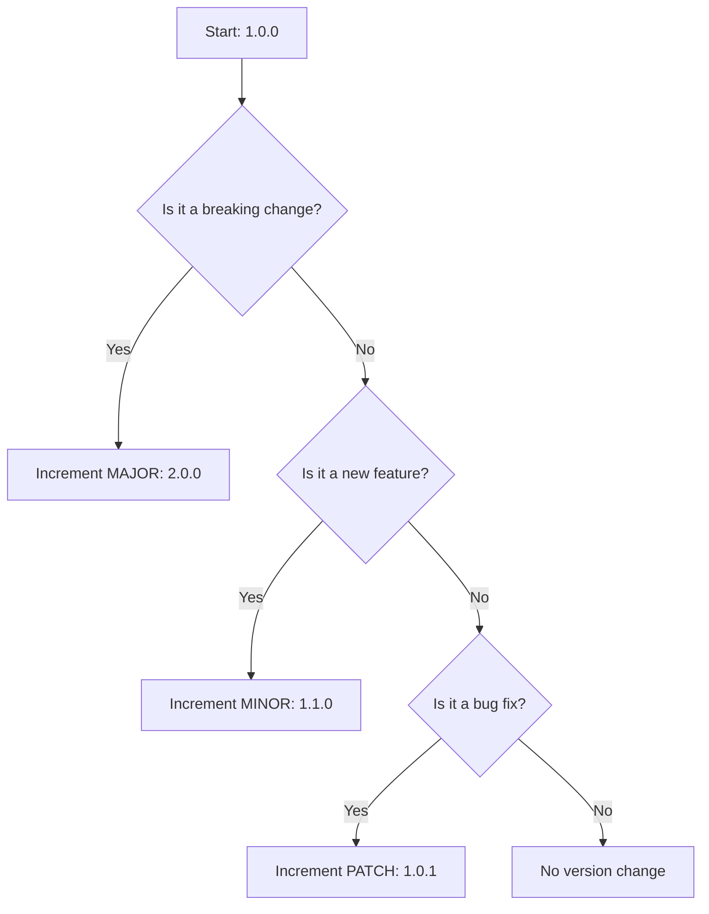

# Semantic versioning (SemVer)

> A formal software versioning specification using a MAJOR.MINOR.PATCH format to communicate breaking changes, new features, and backwards-compatible bug fixes

---

## What is semantic versioning?

[Semantic Versioning (SemVer)](https://semver.org/){: target="_blank" rel="noopener" } is a universal specification for numbering software releases. Created by Tom Preston-Werner, the co-founder of [GitHub](https://github.com/){: target="_blank" rel="noopener" }, the standard establishes a three-part version number: `MAJOR.MINOR.PATCH`. Each increment signals a specific type of change in the code, helping developers, product managers, and technical writers communicate software changes clearly.

SemVer communicates how code modifications affect consumer expectations. When software tools, libraries, or an application programming interface (API) change, dependency managers read these version numbers to determine if they can safely update the software. Technical writers use this structure to organize API references and plan documentation updates, ensuring users can predict the impact of updating an integration.



---

## Why semantic versioning matters

Without a shared versioning standard, software integrations often face dependency conflicts. If a team changes an API endpoint in a minor update without signaling a breaking change, downstream applications will fail. This failure degrades the developer experience (DX) and makes your software less reliable.

Adopting SemVer makes software ecosystems more predictable. When your team follows this standard, automated dependency managers can safely retrieve improvements and bug fixes without breaking the codebase. For technical writers, this structure defines the pace of documentation updates. You can align minor updates with minor version increments and prepare major documentation revisions for major version releases.

---

## Syntax and structure

The core SemVer format consists of three non-negative integers separated by periods. You can also append pre-release identifiers and build metadata.

*   **MAJOR version:** Increment this number when you make incompatible or breaking changes to the public contract or API.
*   **MINOR version:** Increment this number when you add functionality in a backwards-compatible manner or when you deprecate public features.
*   **PATCH version:** Increment this number when you apply backwards-compatible bug fixes.
*   **Pre-release identifier:** An optional hyphen followed by a series of dot-separated identifiers (such as `-alpha.1` or `-beta.3`) that signals the release is not yet stable.
*   **Build metadata:** An optional plus sign followed by dot-separated alphanumeric identifiers (such as `+build.12a`) that specifies compilation details.

To handle dependency updates efficiently, developers use range specifiers. Modern documentation frameworks allow you to display these ranges using tabbed blocks:

=== "Caret (^)"
    Allows changes that do not modify the leftmost non-zero element. For example, `^1.2.3` allows updates to `1.3.0` and `1.9.9`, but blocks `2.0.0`.
=== "Tilde (~)"
    Allows patch-level changes if you specify a minor version. For example, `~1.2.3` allows updates to `1.2.4` and `1.2.9`, but blocks `1.3.0`.

---

## Code example

The following JSON example shows a configuration file for a software development kit (SDK) package.

```json
{
  "name": "enterprise-api-client",
  "version": "3.1.2-beta.1+build.104",
  "private": false,
  "dependencies": {
    "auth-module": "^2.4.0",
    "logger": "~1.1.0"
  }
}
```

### Read the example

*   `"version": "3.1.2-beta.1+build.104"`: This indicates major version 3, minor version 1, and patch version 2. The `-beta.1` suffix indicates a pre-release version, and the `+build.104` suffix provides build-specific metadata.
*   `"auth-module": "^2.4.0"`: This instructs the system to accept any version from `2.4.0` up to, but not including, `3.0.0`.
*   `"logger": "~1.1.0"`: This restricts updates to patch releases only, allowing `1.1.1` or `1.1.9` but preventing an update to `1.2.0`.

---

## Common pitfalls

Managing software versions manually often introduces errors. Avoid these common mistakes when implementing SemVer.

### Breaking a PATCH release
A developer might modify an existing behavior or change a variable name to resolve a bug. Although intended as a fix, this modification breaks downstream integrations that rely on the original behavior. To prevent this, run automated integration tests to confirm that every patch preserves existing functionality.

### Missing public API definitions
Teams sometimes apply SemVer rules without declaring which functions, endpoints, or modules are public. If you do not explicitly define the public boundary in your preface or developer guides, users might assume all code is public. This leads to unexpected breaking changes when internal code is modified.

---

## Tooling and ecosystem

You can integrate several tools into your workflow to enforce the SemVer specification automatically:

*   **Parsers and engines:** Modern package managers such as [npm](https://www.npmjs.com/){: target="_blank" rel="noopener" }, [Cargo](https://doc.rust-lang.org/cargo/){: target="_blank" rel="noopener" }, and [NuGet](https://www.nuget.org/){: target="_blank" rel="noopener" } use SemVer parsers to resolve dependencies during the build process.
*   **Linters and validators:** Tools like [semver-cli](https://github.com/npm/node-semver){: target="_blank" rel="noopener" } validate version strings. Automated release tools can also analyze git history to increment version numbers based on standard commit messages.

---

## Best practices and validation

Use this checklist in your continuous integration and continuous deployment (CI/CD) pipeline to maintain stable releases:

- [ ] **Define the public API:** Clearly document which endpoints and methods are public and which are internal.
- [ ] **Automate version increments:** Use tools that evaluate commits in a pull request (PR) to calculate the next SemVer number.
- [ ] **Coordinate the changelog:** Maintain a clear [changelog](https://keepachangelog.com/en/1.1.0/){: target="_blank" rel="noopener" } that details what changed in every release.
- [ ] **Communicate early:** Print alerts in the console when users access deprecated features to give them time to adjust before a major release.

!!! note "Pro Tip"
    If you manage a software as a service (SaaS) application where users interact only with cloud-hosted endpoints, you might not need to expose SemVer to end users. However, use SemVer internally for the microservices and libraries that power your platform.