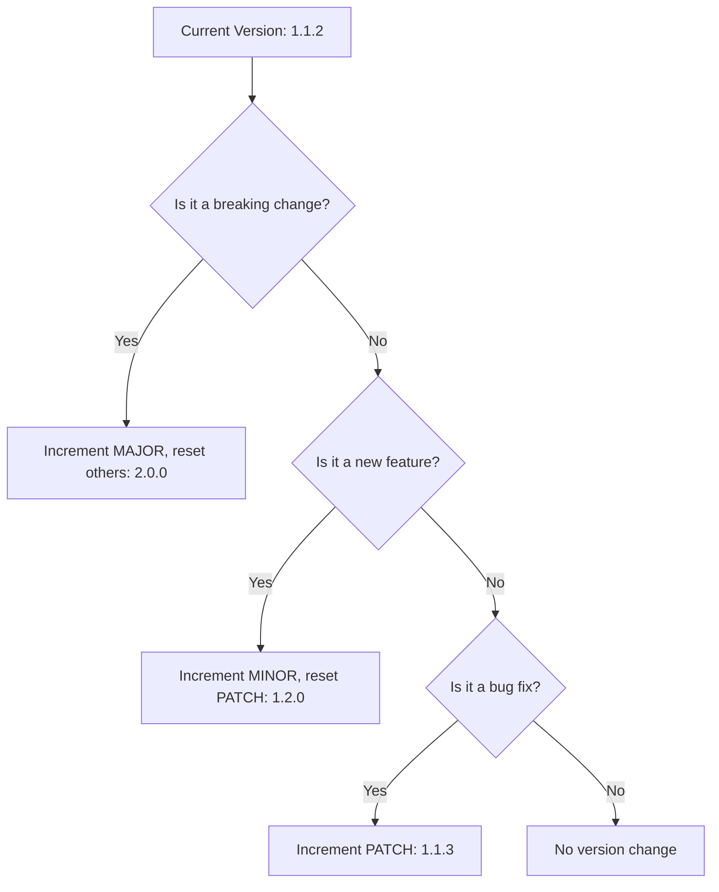

# Semantic versioning (SemVer)

> A software versioning standard using a three-part number (MAJOR.MINOR.PATCH) to communicate the impact of code changes on backwards compatibility

---

## What is semantic versioning?

[Semantic Versioning (SemVer)](https://semver.org/){: target="_blank" rel="noopener" } provides a consistent logic for numbering software releases. Developed by GitHub co-founder Tom Preston-Werner, the standard uses a three-part number—`MAJOR.MINOR.PATCH`—to tell users exactly what kind of changes a release contains. 

This system moves versioning away from arbitrary "vanity" numbers toward a functional contract. When software libraries or APIs update, dependency managers use these numbers to decide whether an update is safe to install automatically. 

**The fundamental rules of incrementing:**
1.  **MAJOR**: Reset MINOR and PATCH to 0.
2.  **MINOR**: Reset PATCH to 0.
3.  **PATCH**: Increment only the third digit.



---

## Why semantic versioning matters

Ambiguous versioning leads to "dependency hell." If a minor update secretly changes an API endpoint's behavior, every downstream application relying on that endpoint will break. By adopting SemVer, you make your software ecosystem predictable. Automated tools can safely fetch bug fixes and performance improvements (patches) or new features (minor versions) without the risk of crashing the entire codebase. 

---

## Syntax and structure

The format consists of three non-negative integers. You can also include suffixes for pre-release versions or specific build data.

*   **MAJOR:** Incremented for incompatible API changes.
*   **MINOR:** Incremented for adding functionality in a backwards-compatible manner.
*   **PATCH:** Incremented for backwards-compatible bug fixes.
*   **Pre-release:** An optional hyphenated string (e.g., `-alpha.1`). **Note:** Pre-release versions have a lower precedence than the associated normal version (e.g., `1.0.0-alpha` < `1.0.0`).
*   **Build metadata:** An optional string preceded by a plus sign (e.g., `+build.104`). This is ignored when determining version precedence.

**Major Version Zero:** Versions in the `0.y.z` format are for initial development. In this phase, the public API is not considered stable, and breaking changes may occur at any time without a MAJOR increment.

Developers use range specifiers to manage these updates automatically:

=== "Caret (^)"
    Permits any update that does not modify the leftmost non-zero digit. `^1.2.3` allows versions up to, but not including, `2.0.0`. `^0.2.3` allows versions up to, but not including, `0.3.0`.
=== "Tilde (~)"
    Limits updates to the patch level. For instance, `~1.2.3` allows `1.2.4` and `1.2.9`, but excludes `1.3.0`.

---

## Code example

This JSON snippet demonstrates how an SDK configuration might define its own version and its requirements for other dependencies.

```json
{
  "name": "enterprise-api-client",
  "version": "3.1.2-beta.1+build.104",
  "private": false,
  "dependencies": {
    "auth-module": "^2.4.0",
    "logger": "~1.1.0"
  }
}
```

### Breakdown
*   **`3.1.2-beta.1+build.104`**: This is a pre-release version of the `3.1.2` release. It indicates the software is working toward the state of `3.1.2` but is not yet stable. The build metadata (`+build.104`) is used for internal tracking and does not affect version comparison.
*   **`^2.4.0`**: The system will accept any version from `2.4.0` up to, but excluding, `3.0.0`.
*   **`~1.1.0`**: This restricts the environment to patch-level fixes only, allowing `1.1.1`, `1.1.2`, etc., but preventing an automatic jump to `1.2.0`.

---

## Common pitfalls

### "Silent" breaking changes
The most frequent error occurs when a developer fixes a bug but inadvertently changes the expected output or a variable name. Even if the intent is a "fix," any change that breaks existing user code **must** be labeled as a MAJOR release (unless the MAJOR version is 0).

### Undefined public APIs
SemVer is meaningless if users don't know what parts of the code are "public." Explicitly defining the stable boundary of your software ensures users know which parts of the system are covered by the SemVer contract.

---

## Tooling and ecosystem

*   **Package Managers:** [npm](https://www.npmjs.com/), [Cargo](https://doc.rust-lang.org/cargo/), and [NuGet](https://www.nuget.org/) rely on SemVer to resolve conflicts.
*   **Release Automation:** Tools like `semantic-release` analyze commit messages (following the Conventional Commits specification) to automatically determine the next version number.

---

## Best practices

- **Document the public API:** Clearly state which endpoints and methods are stable.
- **Automate increments:** Use CI/CD tools to calculate version numbers based on PR metadata.
- **Maintain a changelog:** Provide a human-readable [changelog](https://keepachangelog.com/en/1.1.0/).
- **Deprecate before breaking:** Use console warnings to alert users of upcoming changes several minor versions before the major release that removes the feature.