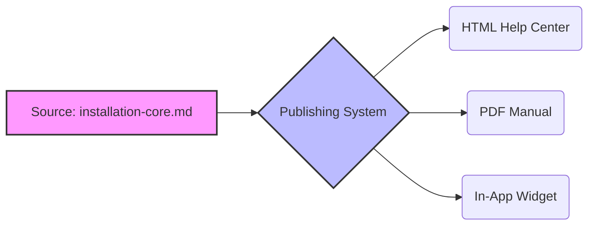

# Single sourcing

> A documentation strategy for creating and managing content in a single location to be published across multiple formats, ensuring consistency and efficiency

---

## What is single sourcing?

Single sourcing is a strategy where information is managed in one central location but deployed to various platforms. Rather than copy-pasting text across different guides, writers build modular blocks of information that dynamically populate specific outputs. This follows the "Don't Repeat Yourself" (DRY) principle common in software engineering, creating a lean [information architecture](https://en.wikipedia.org/wiki/Information_architecture){: target="_blank" rel="noopener" }.

Beyond efficiency, this approach reduces the cognitive load for users. By using structured modules, procedures and concepts stay identical wherever they appear. When users move between a web portal and a PDF manual, consistent phrasing helps them recognize patterns and complete tasks without the friction of conflicting instructions.

---

## The risk of content rot

Without a single source, documentation inevitably decays. When technical details change—like an API endpoint or a system requirement—manual updates across manuals, quick start guides, and UI tooltips are prone to human error. Missing just one instance leads to contradictory information that erodes user trust and drives up support volume.

Centralizing your "source of truth" prevents these silos. It also benefits search engine optimization (SEO) by eliminating duplicate content, ensuring search engines point users to the most authoritative version of a topic.

---

## Core components

*   **Modular topics:** Short, self-contained units of information focused on one task or concept.
*   **Variables:** Dynamic placeholders for values like product names or version numbers. Change the value in the configuration file, and it updates everywhere.
*   **Conditional text:** Metadata tags that include or exclude specific content blocks based on the target output (e.g., "Admin Only" content).
*   **Reusable snippets:** Block-level partials—such as a standard safety warning—referenced inside larger files to maintain word-for-word accuracy.

---

## Design pattern: From source to output



### How the pattern functions

The diagram illustrates the flow from a single source file through a publishing engine. Using metadata rules, you can generate customized versions of the same file. For example, a single source can produce a user manual showing GUI steps and an administrator guide highlighting CLI commands simultaneously. When a procedure changes, a single edit propagates to every output format during the next build.

To implement this, you first define variables in a central configuration:

```yaml
# variables.yaml
product_name: "CloudScale Engine"
release_version: "2.4.1"
```

Then, reference these placeholders in your markdown (using [Liquid](https://shopify.github.io/liquid/){: target="_blank" rel="noopener" } or [Mustache](https://mustache.github.io/){: target="_blank" rel="noopener" } syntax):

```markdown
To install the {{product_name}} application, run the installer for version {{release_version}}.
```

The compiled output reads naturally:  
`To install the CloudScale Engine application, run the installer for version 2.4.1.`

??? note "Developer-centric workflows"
    Single sourcing is a pillar of "docs as code." It treats documentation with the same modular discipline as software, typically moving from **Source File** through a **Static Site Generator** to a **Production Server**.

---

## Implementation best practices

*   **Version control everything:** Manage source modules in [Git](https://git-scm.com/){: target="_blank" rel="noopener" }. This aligns documentation with software release cycles and allows for transparent peer reviews.
*   **Centralize variables:** Avoid hardcoding names, dates, or versions. Keep a dedicated library to prevent "hidden" text that requires manual hunting.
*   **Write context-neutral content:** Avoid directional phrases like "as mentioned above" or "in the next chapter." These break when a snippet is reused in a different context.
*   **Prune near-duplicates:** Regularly audit your repository for topics that are almost identical. Merge these into a single template with conditional logic to prevent "content debt."

---

## Common pitfalls

*   **The "Single-Source Trap":** Don't force reuse on topics that are only superficially similar. Over-using complex conditional logic makes the source code unreadable and brittle.
*   **Contextual incoherency:** Reusable paragraphs that depend on the preceding sentence for context will fail when moved. Ensure every reusable unit is truly self-contained.

---

## Validating usability

Before deploying, audit the generated formats (HTML, PDF, etc.) to ensure conditional logic didn't break the sentence structure or leave awkward gaps. Observe users interacting with the content; look for cognitive friction that might suggest a reuse boundary was placed poorly, resulting in "Frankenstein" documentation that feels disjointed.