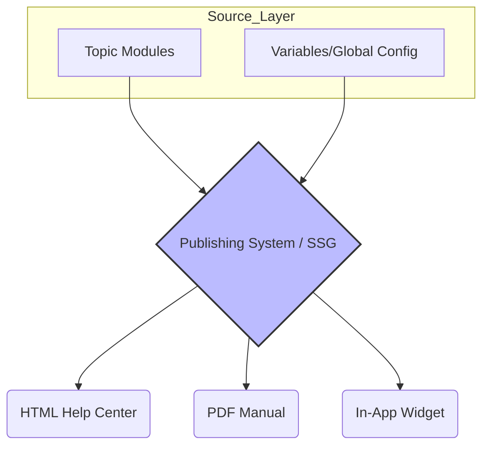

# Single sourcing

> *A documentation strategy for creating and managing content in a single location to be published across multiple formats, ensuring consistency and efficiency*

---

## What is single sourcing?

Single sourcing is a strategy where information is managed in a central repository but deployed to various platforms. Rather than duplicating text across different guides, writers build modular blocks of information that populate specific outputs. This follows the Do Not Repeat Yourself (DRY) principle common in software engineering, creating a lean [information architecture](https://en.wikipedia.org/wiki/Information_architecture).

Beyond efficiency, this approach reduces cognitive load. By using structured modules, procedures and concepts stay identical wherever they appear. When users move between a web portal and a PDF manual, consistent terminology and instructional steps help them recognize patterns and complete tasks without the friction caused by conflicting instructions.

---

## Mitigating content decay

Without a single source, documentation inevitably decays. When technical details change, such as an application programming interface (API) endpoint or a system requirement, manual updates across manuals, quick start guides, and user interface (UI) tooltips are prone to human error. Missing a single instance leads to contradictory information that erodes user trust and increases support volume.

Centralizing the source of truth prevents these silos. In a web context, this strategy also supports search engine optimization (SEO). By publishing a single authoritative web version and using canonical tags for variants, you prevent search engines from penalizing the site for duplicate content, ensuring users are directed to the correct topic.

---

## Core components

- Modular topics: Short, self-contained units of information focused on one task or concept.
- Variables: Dynamic placeholders for strings such as product names or version numbers. Updating the value in a central configuration file propagates the change globally.
- Conditional text: Logical attributes or tags used to include or exclude content blocks based on the target output, such as `if platform == 'ios'`.
- Reusable snippets (partials): Referenced files or blocks, such as a standard safety warning, maintained in one file and transcluded into larger topics.

---

## Design pattern: From source to output



### How the pattern functions

The diagram illustrates the flow from source modules and configuration files through a publishing engine, such as a static site generator (SSG) or a component content management system (CCMS). 

To implement variables, you define keys in a central configuration:

```yaml
# data/site_metadata.yaml
product_name: "CloudScale Engine"
release_version: "2.4.1"
```

Then, reference these placeholders in your Markdown using the syntax required by your engine (for example, [Liquid](https://shopify.github.io/liquid/) for Jekyll/Eleventy or [Hugo’s Shortcodes](https://gohugo.io/)):

```markdown
To install the {{ site.product_name }} application, run the installer for version {{ site.release_version }}.
```

To implement conditional text, you use logic gates to filter content for specific audiences:

```markdown

Run the following command: `sudo systemctl start cloudscale`

Open the application and click the **Start** button.

```

??? note "Developer-centric workflows"
    Single sourcing is a pillar of documentation as code. It treats documentation with the same modular discipline as software, typically moving from source file through a static site generator to a production server via a continuous integration and continuous delivery (CI/CD) pipeline.

---

## Implementation best practices

- Version control everything: Manage source modules in [Git](https://git-scm.com/). This aligns documentation with software release cycles and enables transparent peer reviews and rollbacks.
- Centralize variables: Avoid hardcoding names, dates, or versions. Keep a dedicated library to prevent hidden text that requires manual hunting.
- Write context-neutral content: Avoid directional phrases such as "as mentioned above" or "in the next chapter." These break when a snippet is reused in a different order or format.
- Prune near-duplicates: Regularly audit your repository for topics that are almost identical. Merge these into a single template with conditional logic to prevent content debt.

---

## Common pitfalls

- The single-source trap: Do not force reuse on topics that are only superficially similar. Over-using complex conditional logic makes the source code unreadable and convoluted.
- Contextual incoherency: Reusable paragraphs that depend on the preceding sentence for context will fail when moved. Ensure every reusable unit is truly self-contained.

---

## Validating usability

Before deploying, audit the generated formats to ensure conditional logic did not break the sentence structure (for example, double spaces or missing punctuation). Observe users interacting with the content; look for cognitive friction that might suggest a reuse boundary was placed poorly, resulting in disjointed documentation that lacks a logical flow.