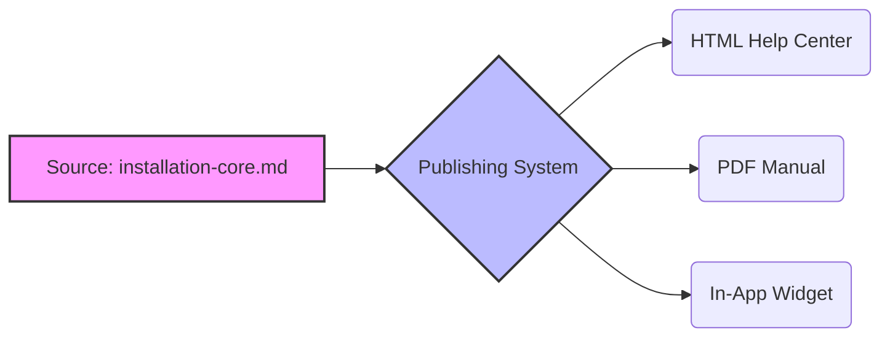

# Single sourcing

> Authoring content in a single location and publishing it across multiple formats to ensure consistency and minimize maintenance overhead

---

## What is single sourcing?

Single sourcing is a content strategy where you create and manage information in one location and publish it to multiple formats or platforms. Instead of copying and pasting text across various guides, you build modular blocks of information that dynamically populate different outputs. This practice follows the "Don't Repeat Yourself" (DRY) principle used in software engineering to create efficient [information architecture](https://en.wikipedia.org/wiki/Information_architecture){: target="_blank" rel="noopener" }.

This strategy reduces the mental effort required for users to understand your documentation. By managing content as structured modules, you ensure that procedures and concepts remain identical wherever they appear. When users navigate complex systems, this consistency helps them recognize patterns and complete tasks without the friction caused by conflicting descriptions.

---

## Why single sourcing matters

Without single sourcing, documentation often becomes outdated and inconsistent. When technical details change—such as an API endpoint or a system requirement—you must manually find and update every occurrence in manuals, quick start guides, and in-app help. Missing even one location leads to contradictory information. This inconsistency breaks user trust and increases the volume of support tickets.

Strategically, single sourcing establishes a "single source of truth." It improves search engine optimization (SEO) by preventing duplicate content, which helps search engines direct users to the most authoritative topic.

---

## Core principles and anatomy

- **Modular content design:** Write information as self-contained, reusable topics rather than long chapters. Each module focuses on one task or concept.
- **Variables and placeholders:** Use dynamic text strings for values that change based on context, such as product names or version numbers. Updating the value in one place updates all instances.
- **Conditional text:** Apply metadata tags to paragraphs or files to include or exclude content during the build process based on the target output.
- **Reusable snippets:** Create block-level content modules—such as a standard safety warning—that you can reference inside larger topics. These are also known as partials.

---

## Design pattern example



### Breakdown of the pattern

The diagram shows the core mechanism of single sourcing. A single source file contains the foundational procedure. When the publishing system builds the documentation, it processes the source file using specific metadata rules.

With this architecture, you can generate customized outputs from the same file. For example, a user manual might show GUI steps, while an administrator guide includes CLI commands—all managed by conditional tags within the original document. When a step changes, you edit the source file once, and the change propagates to all outputs during the next build.

Below is an example of how variables and snippets work together. First, define the variables in a configuration file:

```yaml
# variables.yaml
product_name: "CloudScale Engine"
release_version: "2.4.1"
```

Next, write the source snippet using placeholders (using [Liquid](https://shopify.github.io/liquid/){: target="_blank" rel="noopener" } or [Mustache](https://mustache.github.io/){: target="_blank" rel="noopener" } syntax):

```markdown
To install the {{product_name}} application, run the installer for version {{release_version}}.
```

Upon deployment, the system parses the variables and compiles the text:

`To install the CloudScale Engine application, run the installer for version 2.4.1.`

??? note "Why developers prefer single sourcing"
    In a "docs as code" environment, single sourcing treats documentation with the same modular discipline as software. The workflow typically follows this path: 
    **Source File** --> **Static Site Generator** --> **Production Server**.

---

## Benefits for the user experience

- **No conflicting advice:** Eliminates the frustration of finding different instructions on different pages, creating a reliable self-service environment.
- **Faster learning:** Consistent phrasing and formatting help users build accurate mental models of your product and workflows.

---

## Implementation best practices

- **Adopt a docs as code workflow:** Manage your source modules in a version control system like [Git](https://git-scm.com/){: target="_blank" rel="noopener" }. This enables collaborative reviews and keeps documentation aligned with software release cycles.
- **Maintain a variable library:** Organize all variables in a central file. Avoid hardcoding product names, dates, or version strings directly in the text.
- **Design for reuse:** Write content that is independent of its location. Avoid directional phrases like "as described in the chapter above," which break when a snippet appears in a different guide.
- **Use user-centered design (UCD):** Define your reuse boundaries based on user workflows rather than internal developer release logic.
- **Conduct regular content audits:** Scan your repository for near-duplicate topics. Merge them into single-sourced templates to prevent content debt.

---

## Common anti-patterns

- **The single-source trap (over-reuse):** Forcing reuse on topics that are only superficially similar. If two procedures diverge significantly, using heavy conditional logic makes the source code difficult to read and maintain.
- **Contextual incoherency:** Writing reusable paragraphs that rely on preceding sentences for context. This results in jarring transitions when the snippet is used in different locations.

---

## How to validate and test usability

- **Perform a comparative output audit:** Generate all target formats (such as HTML and PDF) and review the pages. Ensure conditional text compiled correctly and variables did not break the sentence structure.
- **Conduct task-based usability testing:** Observe users as they attempt to complete a task using the single-sourced articles. Look for cognitive friction or broken internal links caused by poorly managed reuse boundaries.