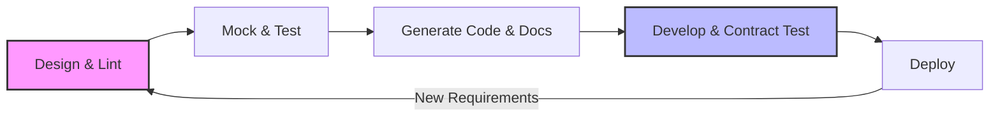

# Spec-driven development

> *A methodology using machine-readable specifications to align engineering and documentation, ensuring features match their technical contracts from design to deployment*

---

## What is spec-driven development?

Spec-driven development, also known as API design-first, shifts application programming interface (API) design to the earliest stages of the software development life cycle (SDLC). Rather than treating documentation as a post-release task, teams finalize a technical specification, which is typically an OpenAPI Specification (OAS) or AsyncAPI, before writing any application code. This file serves as a rigorous design contract.

The process bridges the gap between product managers, developers, and technical writers. While product managers define business requirements, software engineers design the schema and technical writers refine metadata, descriptions, and examples for clarity. This collaborative drafting produces a single source of truth used to automate mock servers, generate software development kits (SDKs), and build interactive reference documentation.

---

## Why it matters

This workflow targets documentation lag, which is the point where user guides fail to keep pace with engineering releases. When the specification is finalized upfront, technical writers can build the developer portal and draft tutorials during the development sprint. This parallel track ensures that the documentation is production-ready when the code is launched.

Beyond speed, a contract-first model mitigates documentation debt. Without a formal specification, APIs often suffer from mismatched endpoints and inconsistent naming, which leads to a fragmented developer experience (DX). By using the specification as a validator, teams can automate contract testing to prevent engineering drift. For writers, this replaces the process of auditing shifting code with the opportunity to focus on the user journey and high-level conceptual guides.

---

## When to adopt this workflow 

The transition to a spec-driven model is often necessary when engineering complexity outpaces communication. Consider making the switch if you recognize these indicators:

- Integration failures: Front-end and back-end teams frequently encounter payload mismatches and breaking changes during deployment. 
- Wasted engineering hours: Developers spend significant time manually writing and maintaining custom mock APIs for testing instead of generating them from a specification.
- Onboarding friction: New developers struggle to grasp service interactions, which indicates a need for the interactive testing environments, such as Try It Out consoles, that machine-readable specifications provide.

---

## How the workflow works

The spec-driven process functions as a continuous loop, in which the specification acts as the governing document for the implementation.

1. Design and lint: Stakeholders collaborate on the specification file. Automated linters, such as Spectral, enforce style guides, ensuring consistent naming conventions and parameter structures.
2. Mock and test: Developers spin up mock servers, such as Prism, based on the specification. This allows front-end teams to build interfaces and writers to test call patterns before the back-end implementation exists.
3. Generate code and docs: The specification automatically populates the reference documentation. Simultaneously, generators, such as OpenAPI Generator, build client SDKs and server stubs.
4. Develop and contract test: During development and continuous integration, the pipeline runs contract testing, such as Dredd or Pact. If the code behavior deviates from the specification, the build fails.
5. Deploy: Only code that satisfies the contract is deployed. Future changes require a return to the design phase to update the specification first.

---

## RACI and team roles

Efficiency in design-first workflows relies on clear ownership:

- Responsible: software engineers (defining data types, endpoint logic, and schema structure) and technical writers (metadata, descriptions, and examples).
- Accountable: engineering lead or architect (ensures the technical contract is performant, scalable, and follows architectural standards).
- Consulted: product managers (business logic requirements) and QA engineers (security rules and edge-case validation).
- Informed: marketing and support teams use the finalized specification to prepare for upcoming feature releases.

---

## Pipeline integration and tooling

Automation turns the specification into a functional tool. When a contributor submits a pull request for the specification file, the continuous integration and continuous delivery (CI/CD) pipeline should execute several automated checks:

- [x] Linting: Checks for design consistency and style guide adherence.
- [x] Security auditing: Scans the OAS file for authentication gaps or insecure parameter definitions by using tools such as 42Crunch.
- [x] Mock deployment: Provisions temporary mock servers for integration testing.
- [x] Preview documentation: Publishes interactive reference pages to a staging environment for stakeholder review.

Once merged, automated generators refresh SDK libraries in multiple languages, ensuring the tooling is never out of sync with the API.

---

## Troubleshooting common failures

- Specification drift: Developers might fix bugs in the code without updating the specification. The solution is strictly enforced contract testing in the CI/CD pipeline. If the code does not match the specification, the build fails.
- Analysis paralysis: Teams might over-engineer the schema. To maintain momentum, define a minimum viable strategy for the specification and handle refinements through iterative versioning.
- Manual SDK maintenance: If teams manually edit auto-generated SDKs, they create a maintenance challenge. Custom logic should be handled via decorators or wrapper classes, and never by editing generated code directly.

---

## Success criteria

- Time to First Hello (TTFH): The speed at which an external developer makes a successful call using a mock or sandbox environment.
- Breaking change rate: A reduction in unplanned breaking changes reaching production.
- Support ticket deflection: A decrease in integration-related queries due to accurate, auto-generated documentation and SDKs.