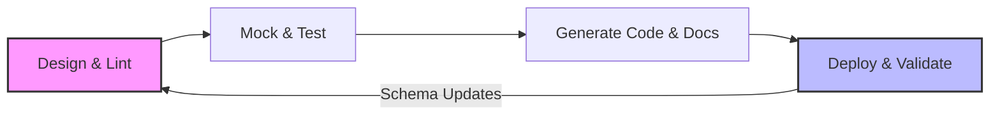

# Spec-driven development

> A collaborative workflow where machine-readable specifications guide engineering and documentation to ensure product alignment

---

## What is spec-driven development?

Spec-driven development is an engineering methodology where you design, review, and finalize a technical specification before you write application code. Instead of treating documentation as a final step, this approach establishes a contract—such as an **OpenAPI Specification (OAS)**—that serves as the source of truth for the project. This process moves the API design phase to the beginning of the **software development life cycle (SDLC)**.

The workflow relies on collaboration between product managers, developers, and technical writers. Product managers define business requirements, developers draft the schema to meet those requirements, and technical writers refine descriptions and parameter names. Refining the specification together creates a single source of truth that automates tasks like mock server creation, client library generation, and interactive reference documentation.

---

## Why it matters

This workflow helps solve **documentation lag**, which occurs when user guides fall behind engineering releases. Because the specification is finalized before coding starts, technical writers can create tutorials and structure the **developer portal** during the development sprint. This parallel work eliminates documentation bottlenecks and helps ensure public resources are ready on launch day.

Adopting a contract-first model also reduces **documentation debt**. Without a formal spec, teams might build mismatched endpoints, leading to inconsistent APIs and confusing documentation. Using the specification as a design contract allows you to automate validation, which prevents engineering drift and keeps the **developer experience (DX)** consistent. For writers, this means less time auditing inaccurate code and more time polishing the **user journey** and conceptual guides.

---

## When to adopt this workflow 

Transitioning to this methodology requires a change in team culture. Consider making the switch if you encounter these issues:

- **API design drift:** If front-end and back-end teams experience integration failures during releases because of unexpected payload changes, use a contract-first model to enforce schema validation.
- **Manual mock creation:** If developers spend hours writing manual mock APIs for testing, use automated mock servers generated from the specification.
- **Slow developer onboarding:** If new developers or partners struggle to understand how services interact, use a machine-readable specification to generate interactive testing environments.

---

## How the workflow works

The spec-driven process moves in a loop from design to automated validation and deployment.

1. **Design and lint:** Product teams, technical writers, and developers collaborate on the specification file. Automated linters check the file against style guides for naming conventions and parameter structure.
2. **Mock and test:** Developers run a mock server using the specification file. This server simulates API responses, which lets front-end teams build interfaces and technical writers test call patterns before the back-end logic exists.
3. **Generate code and docs:** The specification automatically generates interactive reference pages in the developer portal. SDK generators build helper libraries for software development teams.
4. **Deploy and validate:** During deployment, the build pipeline runs contract testing to verify that the compiled code matches the specification. The pipeline stops the release if it detects unauthorized changes.

---

## RACI and team roles

Clear responsibilities help design sprints move efficiently.

- **Responsible:** **Technical writers** (refine schema descriptions and structure) and **software engineers** (define technical data types and endpoints).
- **Accountable:** **Product managers** (verify that the specification addresses user personas and business goals).
- **Consulted:** **Subject matter experts (SMEs)** and **quality assurance (QA)** engineers (verify edge cases, security requirements, and validation rules).
- **Informed:** **Marketing and support teams** (prepare for upcoming feature releases).

---

## Pipeline integration and tooling

Automation is essential for spec-driven development. When a contributor submits a pull request with an updated specification file, the **continuous integration and continuous deployment (CI/CD)** pipeline should trigger these steps:

- [x] Run linting tools to check for design consistency.
- [x] Run security scans on schema properties.
- [x] Deploy a temporary mock server for testing.
- [x] Publish interactive reference pages to a staging environment.

After code changes merge, automated generators produce updated **software development kit (SDK)** libraries in multiple languages to keep them aligned with the API.

---

## Troubleshooting common failures

This model can reveal operational hurdles that require proactive management:

- **Specification drift:** Developers might make hotfixes in the application code and bypass the specification. 
    - **Solution:** Use strict contract testing in the build pipeline. If the application behavior deviates from the specification, fail the build.
- **Analysis paralysis:** Teams might spend too much time debating minor schema structures.
    - **Solution:** Set a time limit for the draft phase. Agree on a "Version 1.0" schema and manage future changes through iterative updates in the branching workflow.

---

## Key metrics and success criteria

To track the value of this workflow, monitor these indicators:

- **Time to First Hello (TTFH):** Measure how quickly a developer can make a successful simulated API call using mock environments.
- **Review cycle times:** Track the time required to approve a new feature. Specifications help teams align earlier, which can shorten development cycles.
- **Support ticket deflection:** Monitor API-related support requests. Accurate documentation generated from a specification should result in fewer integration issues.