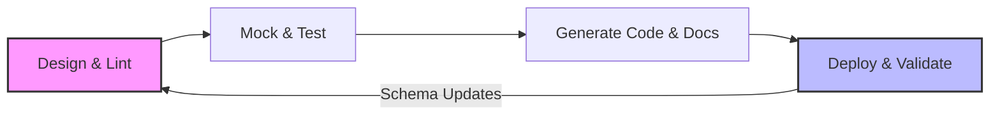

# Spec-driven development

> A methodology using machine-readable specifications to align engineering and documentation, ensuring features match their technical contracts from design to deploy

---

## What is spec-driven development?

Spec-driven development shifts API design to the earliest stages of the software development life cycle (SDLC). Rather than treating documentation as a post-release chore, teams finalize a technical specification—typically an **OpenAPI Specification (OAS)**—before writing any application code. This file serves as a rigorous design contract.

The process bridges the gap between product managers, developers, and technical writers. While product managers define the business logic, developers draft the schema and technical writers refine descriptions for clarity and consistency. This collaborative drafting produces a single source of truth used to automate mock servers, generate client libraries, and build interactive reference documentation.

---

## Why it matters

This workflow targets **documentation lag**, the common friction point where user guides fail to keep pace with engineering releases. When the specification is finalized upfront, technical writers can build out the **developer portal** and draft tutorials during the development sprint. This parallel track ensures that the documentation is as "production-ready" as the code on launch day.

Beyond speed, a contract-first model mitigates **documentation debt**. Without a formal spec, APIs often suffer from mismatched endpoints and inconsistent naming, leading to a fragmented **developer experience (DX)**. By using the specification as a validator, teams can automate checks that prevent engineering drift. For writers, this replaces the frustration of auditing shifting code with the opportunity to focus on the **user journey** and high-level conceptual guides.

---

## When to adopt this workflow 

Cultural shifts are difficult, but the transition to a spec-driven model is often necessary when engineering complexity outpaces communication. Consider making the switch if you recognize these red flags:

*   **Integration failures:** Front-end and back-end teams frequently encounter payload mismatches during releases. 
*   **Wasted engineering hours:** Developers spend significant time manually writing and maintaining mock APIs for testing.
*   **Onboarding friction:** New developers or partners struggle to grasp service interactions, indicating a need for the interactive testing environments that machine-readable specs provide.

---

## How the workflow works

The spec-driven process functions as a continuous loop, ensuring the code never deviates from the original design.

1.  **Design and lint:** Stakeholders collaborate on the specification file. Automated linters enforce style guides, ensuring consistent naming and parameter structures across all endpoints.
2.  **Mock and test:** Developers spin up mock servers based on the spec. This allows front-end teams to build interfaces and writers to test call patterns before the back-end logic is even written.
3.  **Generate code and docs:** The spec automatically populates the developer portal's reference pages. Simultaneously, SDK generators build the helper libraries required by internal and external software teams.
4.  **Deploy and validate:** During the build, the pipeline runs contract testing. If the compiled code deviates from the specification, the release is automatically blocked to prevent unauthorized changes.

---

## RACI and team roles

Efficiency in design sprints relies on clear ownership:

*   **Responsible:** **Technical writers** (schema structure and descriptions) and **software engineers** (data types and endpoint logic).
*   **Accountable:** **Product managers** ensure the specification meets business goals and user personas.
*   **Consulted:** **QA engineers** and **SMEs** provide input on security rules and edge-case validation.
*   **Informed:** **Marketing and support** use the finalized spec to prepare for upcoming feature releases.

---

## Pipeline integration and tooling

Automation turns the specification from a static document into a functional tool. When a contributor submits a pull request for the spec file, the **CI/CD pipeline** should execute several automated checks:

*   [x] Linting for design consistency and style guide adherence.
*   [x] Security scans on schema properties and sensitive data.
*   [x] Deployment of temporary mock servers for integration testing.
*   [x] Publishing of interactive reference pages to a staging environment.

Once merged, automated generators refresh **SDK libraries** in multiple languages, ensuring the tooling is never out of sync with the API.

---

## Troubleshooting common failures

A spec-driven model can fail if it isn't strictly enforced. Watch for these common pitfalls:

*   **Bypassing the spec:** Developers may try to fix bugs directly in the code, causing **specification drift**. The fix is strictly enforced contract testing; if the code doesn't match the spec, the build must fail.
*   **Analysis paralysis:** Teams can get bogged down in minor schema debates. To maintain momentum, set a hard deadline for the "Version 1.0" draft and handle refinements through iterative branching and updates.

---

## Success criteria

Monitor these metrics to evaluate the health of your spec-driven transition:

*   **Time to First Hello (TTFH):** How quickly a developer makes a successful simulated call using a mock environment.
*   **Review cycle times:** The speed of feature approval. Earlier alignment usually results in shorter, more focused development cycles.
*   **Support ticket deflection:** A decrease in API-related integration queries, indicating that the auto-generated documentation is providing the necessary clarity.