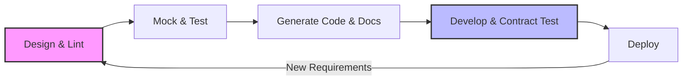

# Spec-driven development

> A methodology using machine-readable specifications to align engineering and documentation, ensuring features match their technical contracts from design to deploy

---

## What is spec-driven development?

Spec-driven development (also known as API Design-First) shifts API design to the earliest stages of the software development life cycle (SDLC). Rather than treating documentation as a post-release chore, teams finalize a technical specification—typically an **OpenAPI Specification (OAS)** or **AsyncAPI**—before writing any application code. This file serves as a rigorous design contract.

The process bridges the gap between product managers, developers, and technical writers. While product managers define business requirements, software engineers design the schema and technical writers refine metadata, descriptions, and examples for clarity. This collaborative drafting produces a single source of truth used to automate mock servers, generate client libraries (SDKs), and build interactive reference documentation.

---

## Why it matters

This workflow targets **documentation lag**, the common friction point where user guides fail to keep pace with engineering releases. When the specification is finalized upfront, technical writers can build out the **developer portal** and draft tutorials during the development sprint. This parallel track ensures that the documentation is as "production-ready" as the code on launch day.

Beyond speed, a contract-first model mitigates **documentation debt**. Without a formal spec, APIs often suffer from mismatched endpoints and inconsistent naming, leading to a fragmented **developer experience (DX)**. By using the specification as a validator, teams can automate **contract testing** to prevent engineering drift. For writers, this replaces the frustration of auditing shifting code with the opportunity to focus on the **user journey** and high-level conceptual guides.

---

## When to adopt this workflow 

The transition to a spec-driven model is often necessary when engineering complexity outpaces communication. Consider making the switch if you recognize these red flags:

*   **Integration failures:** Front-end and back-end teams frequently encounter payload mismatches (breaking changes) during deployment. 
*   **Wasted engineering hours:** Developers spend significant time manually writing and maintaining custom mock APIs for testing instead of generating them from a spec.
*   **Onboarding friction:** New developers struggle to grasp service interactions, indicating a need for the interactive testing environments (Try-it-out consoles) that machine-readable specs provide.

---

## How the workflow works

The spec-driven process functions as a continuous loop, where the specification acts as the gatekeeper for the implementation.

1.  **Design and lint:** Stakeholders collaborate on the specification file. Automated linters (e.g., Spectral) enforce style guides, ensuring consistent naming conventions and parameter structures.
2.  **Mock and test:** Developers spin up mock servers (e.g., Prism) based on the spec. This allows front-end teams to build interfaces and writers to test call patterns before the back-end implementation exists.
3.  **Generate code and docs:** The spec automatically populates the reference documentation. Simultaneously, generators (e.g., OpenAPI Generator) build client SDKs and server stubs.
4.  **Develop and contract test:** During development and CI, the pipeline runs **contract testing** (e.g., Dredd or Pact). If the code’s request/response behavior deviates from the specification, the build is blocked.
5.  **Deploy:** Only code that satisfies the contract is deployed. Future changes require a return to the Design phase to update the spec first.

---

## RACI and team roles

Efficiency in design-first workflows relies on clear ownership:

*   **Responsible:** **Software Engineers** (defining data types, endpoint logic, and schema structure) and **Technical Writers** (metadata, descriptions, and examples).
*   **Accountable:** **Engineering Lead or Architect** (ensures the technical contract is performant, scalable, and follows architectural standards).
*   **Consulted:** **Product Managers** (business logic requirements) and **QA Engineers** (security rules and edge-case validation).
*   **Informed:** **Marketing and Support** use the finalized spec to prepare for upcoming feature releases.

---

## Pipeline integration and tooling

Automation turns the specification into a functional tool. When a contributor submits a pull request for the spec file, the **CI/CD pipeline** should execute several automated checks:

*   [x] **Linting:** Checks for design consistency and style guide adherence.
*   [x] **Security Auditing:** Scans the OAS file for authentication gaps or insecure parameter definitions (e.g., using 42Crunch).
*   [x] **Mock Deployment:** Provisions temporary mock servers for integration testing.
*   [x] **Preview Documentation:** Publishes interactive reference pages to a staging environment for stakeholder review.

Once merged, automated generators refresh **SDK libraries** in multiple languages, ensuring the tooling is never out of sync with the API.

---

## Troubleshooting common failures

*   **Specification Drift:** Developers may fix bugs in the code without updating the spec. The solution is **strictly enforced contract testing** in the CI/CD pipeline; if the code does not match the spec, the build must fail.
*   **Analysis Paralysis:** Teams may over-engineer the schema. To maintain momentum, define a Minimum Viable Strategy for the spec and handle refinements through iterative versioning.
*   **Manual SDK Maintenance:** If teams manually edit auto-generated SDKs, they create a maintenance nightmare. Custom logic should be handled via decorators or wrapper classes, never by editing generated code directly.

---

## Success criteria

*   **Time to First Hello (TTFH):** The speed at which an external developer makes a successful call using a mock or sandbox environment.
*   **Breaking Change Rate:** A reduction in unplanned breaking changes reaching production.
*   **Support ticket deflection:** A decrease in integration-related queries due to accurate, auto-generated documentation and SDKs.