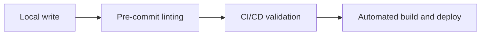
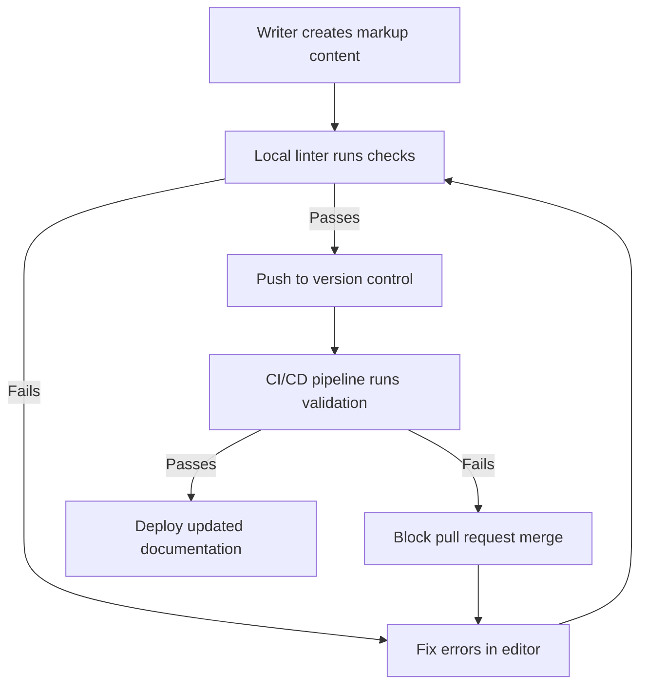

# Style guide as code

> Enforcing editorial standards automatically by integrating style rule checks directly into your version control pipelines

---

## What is style guide as code?

The **style guide as code** workflow automates editorial standards—such as word choice, formatting, and grammar—by translating them into programmable configuration files. Instead of relying on manual reviews, you can run automated checks against technical files within your repository. This process connects traditional publishing with automated software development, moving the task of syntax checking from human editors to automated systems.

This pipeline integrates into the software development life cycle (SDLC) during the code commit and build phases. While technical writers usually create and maintain the style rules, software engineers and DevOps teams help integrate these checks into local development environments and remote pipelines. Product and QA teams use this feedback loop to make sure public content meets organizational standards before release.

---

## Why it matters

Manual editorial reviews often create bottlenecks in engineering environments. Without automation, editors spend time correcting minor grammatical issues, passive voice, or forbidden terminology. This manual model increases technical debt as documentation falls behind software releases. Relying on memory to enforce a complex style guide often leads to inconsistent content, especially with multiple contributors.

Implementing a style guide as code workflow eliminates repetitive tasks. Writers and engineers receive instant feedback in their editing environment or when they submit a pull request. By automating basic quality checks, editors can focus on content structure, technical accuracy, and usability. This feedback loop speeds up the documentation lifecycle and ensures that subject matter expert reviews focus on substance rather than proofreading.

---

## When to adopt this workflow 

Decentralized content creation requires automated guardrails to maintain quality. Consider adopting this workflow if your team experiences any of the following:

- **Decentralized authoring:** When software engineers, product managers, and support teams write documentation in a docs-as-code model, maintaining a consistent tone is difficult without automated rules.
- **Slow editorial reviews:** If publication is delayed because editors are overwhelmed with proofreading grammar, punctuation, and formatting.
- **Frequent terminology regressions:** When deprecated brand names, incorrect product spellings, or forbidden jargon appear in public releases despite manual proofing.

---

## How the workflow works

This workflow integrates automated checks at both the local authoring stage and the remote integration stage to catch style violations early.





1. **Local authoring and linting:** You create or update documentation in an editor. As you write, a local linting extension checks the files against the defined style rules. It highlights issues such as passive voice or incorrect word usage in real time.
2. **Version control validation:** When you finish, you push the changes and open a pull request. This action triggers an automated validation suite in the version control system.
3. **Pipeline enforcement:** The remote pipeline runs the same linting tests. If the system detects critical errors, the pipeline fails and blocks the merge until you correct the violations.

---

## RACI and team roles

A clear division of responsibilities ensures the style configurations remain accurate and the checks are not overly restrictive.

- **Responsible:** Technical writers (to write the rules and fix style errors) and DevOps engineers (to configure pipeline integration).
- **Accountable:** Documentation lead or content operations lead.
- **Consulted:** Subject matter experts and product managers (to define terminology and spelling standards).
- **Informed:** Software engineers and QA teams.

---

## Pipeline integration and tooling

To automate your style guide as code workflow, use tools that parse markup files and compare them against rule configurations. Typical setups use tool-agnostic prose linters like **Vale** or **textlint**. 

These linters use YAML or JSON files to define rules. Store these configuration files in your repository. For example, a style rule configuration file might look like this:

```yaml hl_lines="2"
# .vale.ini configuration example
StylesPath = styles
MinAlertLevel = warning

[*.md]
BasedOnStyles = EditorialStandards
```

Integrate the linter into your CI/CD platform, such as **GitHub Actions**, **GitLab CI/CD**, or **Azure Pipelines**. When a developer submits a pull request, the runner executes the linting CLI tool. If the tool returns an exit code indicating critical errors, the pipeline stops and displays the exact file paths and line numbers of the style violations in the pull request interface.

---

## Troubleshooting and common points of failure

Automated pipelines can fail or cause friction if they are not maintained properly.

- **High false-positive rates:** Automated checks might flag valid technical terms or variable names as spelling errors.
    ??? note "See the solution"
        Establish a shared, project-specific spelling dictionary file (such as `accept.txt`) in your repository. Developers can add specialized terminology to this file to bypass automated spelling checks.
- **Pipeline bottlenecks during large migrations:** Running intensive style checks on thousands of legacy files during an import slows down deployment.
    ??? note "See the solution"
        Configure your CI/CD workflow to run the linter only on modified files. Use diff-checking flags, such as `git diff`, to isolate changes.
- **Linter bypasses:** Authors might bypass pre-commit hooks if local checks are too slow.
    !!! tip "Optimization tip"
        Keep local pre-commit checks lightweight. Run intensive structural validations on the remote server. Make sure writers can trigger local checks quickly in their editors using keyboard shortcuts like ++ctrl+shift+p++.

---

## Key metrics and success criteria

To measure the effectiveness of this automation, track the following metrics:

- **Review cycle duration:** The average time a document spends in manual editorial review should decrease once the system filters out mechanical errors automatically.
- **First-pass accept rate:** The percentage of pull requests that pass the remote style check on the first pipeline run. This indicates how well authors use local editor integrations.
- **Grammar and terminology regression rate:** The number of public documentation updates that require hotfixes due to typos or brand name errors.