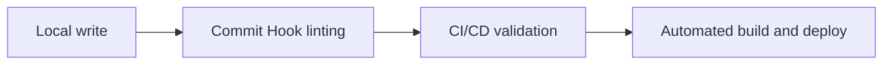
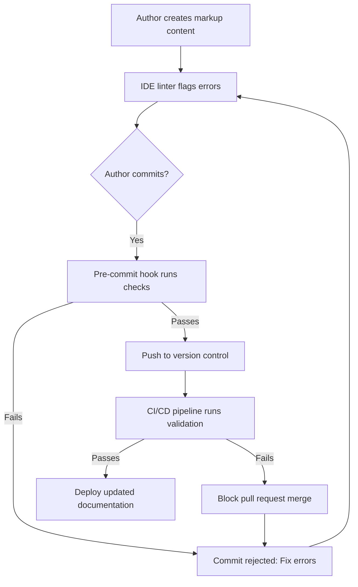

# Style guide as code

> A system for enforcing editorial standards by converting style rules into programmable configuration files integrated directly into development pipelines

---

## What is style guide as code?

Style guide as code transforms static editorial manuals into executable logic. By translating grammar, tone, and formatting rules into configuration files, teams can treat prose quality like code quality. This shift moves syntax and terminology enforcement from human editors to automated linters, catching errors before they reach a pull request.

While technical writers typically author and refine these rules, the workflow relies on a partnership with DevOps and engineering. These teams bake the checks into local Integrated Development Environments (IDEs) and Continuous Integration (CI) pipelines. This ensures that every contributor—from developers to product managers—receives instant feedback on their documentation as they write it.

---

## Why it matters

Manual editorial reviews are notorious bottlenecks. Editors often waste high-value time correcting recurring issues like passive voice, Oxford commas, or deprecated product names. When documentation relies on human memory alone, consistency fluctuates, and technical debt accumulates as releases outpace the editing queue.

Automating these checks shifts the editor’s focus from proofreading to high-level content strategy and technical accuracy. Instant feedback within the editing environment empowers authors to fix their own mistakes immediately. This results in a faster documentation lifecycle where human review is reserved for substance, not syntax.

---

## When to adopt this workflow 

Decentralized content creation works best with automated guardrails. You should consider this workflow if your documentation process suffers from:

- **Authoring fragmentation:** When contributors across different departments use the "docs-as-code" model, maintaining a unified brand voice without automation becomes nearly impossible.
- **Review fatigue:** If publication dates slip because editors are bogged down by basic punctuation and formatting checks.
- **Branding drift:** When retired terminology or incorrect spellings frequently leak into public releases despite manual oversight.

---

## How the workflow works

The process targets two specific stages: the author's local machine and the remote build server.





1. **Local authoring:** As you draft content, a local linter (running as an IDE extension) flags violations in real time. This immediate feedback loop coaches writers on style rules as they work.
2. **Commit validation:** When an author attempts to commit changes, a pre-commit hook executes the linter. If the linter returns a non-zero exit code, the commit is aborted, ensuring no non-compliant prose enters the local history.
3. **Pipeline enforcement:** Once a pull request is opened, the CI/CD platform executes the full linting suite. If critical errors are detected, the build fails, preventing the merge until the content is compliant.

---

## RACI and team roles

Effective automation requires clear ownership to prevent rules from becoming too restrictive or falling out of date.

- **Responsible:** **Authors** (resolving linting errors in their own content) and **Technical Writers** (authoring and maintaining linting rules).
- **Accountable:** Content operations lead or Documentation manager.
- **Consulted:** DevOps (pipeline integration), Product managers, and Subject matter experts (standardizing terminology).
- **Informed:** Software engineering and QA teams.

---

## Pipeline integration and tooling

Implementation requires a prose linter capable of parsing markup languages (Markdown, AsciiDoc, reStructuredText). Tools like **Vale** or **textlint** are industry standards because they allow for highly customizable rules stored directly in the project repository.

A typical configuration file (`.vale.ini`) is written in **INI format** and directs the linter to specific styles:

```ini
# .vale.ini configuration example
StylesPath = styles
MinAlertLevel = warning

[*.md]
BasedOnStyles = Vale, EditorialStandards
```

By integrating these tools into **GitHub Actions**, **GitLab CI/CD**, or **Azure Pipelines**, you turn your style guide into a quality gate. If the linter returns a non-zero exit code, the pipeline identifies the exact file and line number of the violation, allowing contributors to address issues directly in the PR interface.

---

## Troubleshooting and common points of failure

Automated pipelines require tuning to avoid friction between writers and the system.

- **The noise problem:** False positives—like valid technical jargon flagged as typos—can frustrate authors.
    ??? note "The solution"
        Use a **Vocab** definition in Vale. By adding terms to `styles/Vocab/Internal/accept.txt`, you globally resolve spelling errors for project-specific terminology without modifying the base dictionary.
- **Performance lags:** Linting thousands of legacy files on every commit slows down the development cycle.
    ??? note "The solution"
        Configure the CI pipeline or pre-commit hook to run only on changed files using `git diff --name-only` filtered by extension.
- **Tooling bypass:** If local checks are too slow or complex, authors may use `--no-verify` to skip hooks.
    !!! tip "Optimization tip"
        Keep pre-commit checks minimal (e.g., spelling and terminology). Reserve complex structural or style rules (e.g., sentence length, passive voice) for the remote CI server to keep the local "save-and-commit" cycle fast.

---

## Success metrics

Monitor these indicators to evaluate the impact of the automation:

- **Editorial lead time:** The time saved during manual reviews once mechanical errors are removed.
- **PR pass rate:** How often content passes the remote style check on the first attempt, indicating the effectiveness of local IDE feedback.
- **Regression frequency:** The drop in "hotfixes" needed for public documentation after launch.