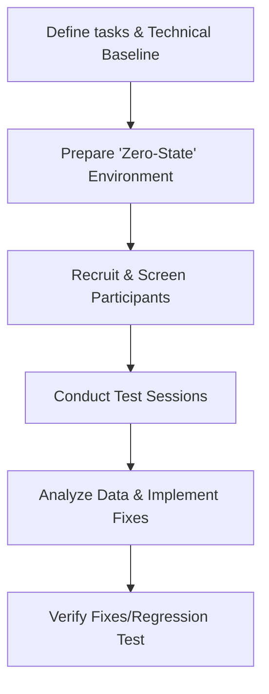

# Task-based testing

> A usability research method where participants perform specific goals using documentation to identify instruction gaps and findability issues

---

## What is task-based testing?

Task-based testing evaluates documentation by observing users as they attempt to reach specific milestones using only the provided guides and a controlled environment. While a content audit verifies technical accuracy (is the information correct?), this method verifies **procedural efficacy** (can the user successfully complete the workflow?). It treats documentation as a functional component of the product interface within the Document Development Life Cycle (DDLC).

Execution requires cross-functional input. Technical writers design the scenarios, while UX researchers or product managers recruit participants and facilitate the sessions. Subject Matter Experts (SMEs) provide the "technical baseline"—the verified set of steps and environment configurations required for a successful outcome—against which the user's performance is measured.

---

## Why it matters

Technical accuracy is a prerequisite, but it does not guarantee usability. If a user cannot locate a step or lacks the prerequisite environment context, the documentation fails. Internal teams often suffer from "the curse of knowledge," leading to **prerequisite gaps**—assumed knowledge or pre-configured settings that an external user will not have.

Prioritizing this workflow impacts support costs through support deflection. Furthermore, identifying structural flaws or technical blockers during the testing phase prevents the accumulation of "documentation debt" and reduces the need for emergency documentation patches following a release.

!!! tip "Validate the Docs, Not the User"
    If a participant fails a task, the documentation or the product UX is flawed, not the user. The goal is to identify breakdowns in content, information architecture, or environmental setup instructions.

---

## When to adopt this workflow 

Implement this testing process when documentation maintenance becomes reactive or during the following triggers:

- **Support ticket spikes:** High volume of queries regarding features that are technically documented but not being successfully implemented.
- **Major architectural changes:** Updates to APIs, UIs, or system logic (e.g., moving from API Keys to OAuth 2.0) that render existing onboarding guides obsolete.
- **Low onboarding conversion:** High drop-off rates during "Hello World" scenarios or environment initialization.

---

## How the workflow works

The process requires a "Clean Room" environment to ensure the user is not benefiting from pre-existing configurations.

1. **Scenario planning:** Draft objectives based on user personas. Tasks must be goal-oriented ("Enable Multi-Factor Authentication") rather than prescriptive ("Click the Security tab").
2. **Environment Baseline:** Establish a "zero-state" environment. If the documentation assumes a specific CLI tool is installed, the test must start with a machine that does not have that tool to verify the installation instructions.
3. **Observation:** Facilitators monitor participants. Observers track search queries, navigation paths, and "technical dead ends" (e.g., a user gets a 403 error because the documentation missed a permission step).
4. **Data synthesis:** The team reviews success rates and "Time on Task." These insights drive changes to Information Architecture (IA), content hierarchy, and technical prerequisites.

---

## RACI and team roles

*   **Responsible:** Technical writers (task design and content updates) and UX researchers (session facilitation).
*   **Accountable:** Documentation Lead or Product Manager (ensuring fixes are prioritized in the sprint).
*   **Consulted:** SMEs and Engineering (to define the technical "Happy Path" and provide environment support).
*   **Informed:** Support and QA teams (to align testing findings with known edge cases).

---

## Pipeline integration and tooling

Automate linguistic checks before human testing to remove noise. Use [Vale](https://vale.sh/) or similar linters to enforce style and catch typos. This ensures participants focus on the technical logic rather than syntax errors.

Findings must be logged as technical bugs in tools like Jira or GitHub. A failed task due to documentation should be treated with the same severity as a functional software bug.

---

## Troubleshooting common failures

- **The "Helper" bias:** Facilitators intervening when a user hits a technical wall. This obscures the fact that the documentation failed to provide the solution.
- **Environment contamination:** Testing on a machine that has global variables or dependencies already installed, which hides gaps in the "Getting Started" guide.
- **Internal echo chambers:** Testing with internal developers who have tribal knowledge of the API logic.

---

## Key metrics for success

*   **Task Success Rate (TSR):** Percentage of users who complete the goal. (Standard benchmark: >80%).
*   **Time on Task (ToT):** Duration from start to completion. High ToT often indicates poor "scannability" of documentation.
*   **Error Frequency:** Number of incorrect actions (e.g., wrong CLI flags, incorrect API endpoints) per task.
*   **Search-to-Goal Ratio:** Number of search queries/page navigations required before finding the relevant instruction.